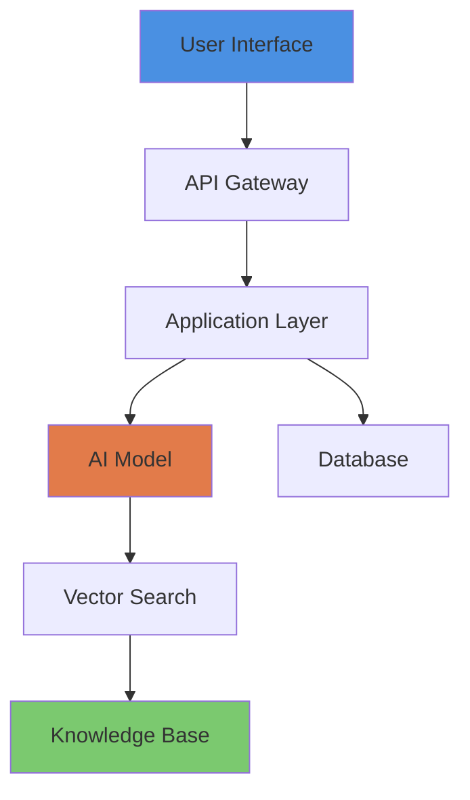
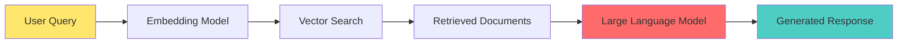
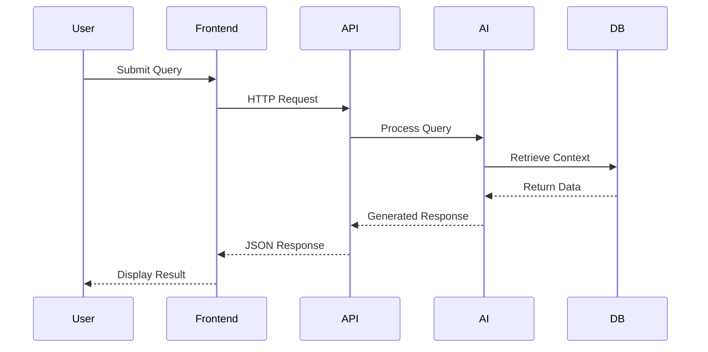

# Project Documentation Generation Guidelines

**Purpose:** This guide provides comprehensive standards for creating academic-quality technical documentation for AI projects in the THEDIFY portfolio. These guidelines ensure consistency, professionalism, and accessibility for prestigious academic institutions and collaborators.

**Last Updated:** December 17, 2025  
**Version:** 1.0

---

## Table of Contents

1. [Overview](#overview)
2. [Required Documentation Files](#required-documentation-files)
3. [README.md Structure](#readmemd-structure)
4. [ABSTRACT.md Guidelines](#abstractmd-guidelines)
5. [STATUS.md Guidelines](#statusmd-guidelines)
6. [Reproducibility Guide](#reproducibility-guide)
7. [Visual Assets Standards](#visual-assets-standards)
8. [Writing Style Guide](#writing-style-guide)
9. [Technical Diagrams](#technical-diagrams)
10. [Metrics and Results](#metrics-and-results)
11. [Documentation Checklist](#documentation-checklist)

---

## Overview

### Core Principles

1. **Academic Rigor:** Documentation must meet research standards while remaining accessible
2. **Visual Engagement:** Use diagrams, screenshots, and metrics to communicate effectively
3. **Reproducibility:** Provide clear steps for validating claims and results
4. **Professional Presentation:** Consistent formatting and structure across all projects
5. **Impact Focus:** Clearly articulate the problem, solution, and real-world impact

### Target Audience

- **Primary:** Admissions committees at MIT, Stanford, Imperial College, and similar institutions
- **Secondary:** Technical collaborators, researchers, and potential contributors
- **Tertiary:** Industry partners and investors

---

## Required Documentation Files

Every project MUST include the following files in its root directory:

```
project/
├── README.md              # Main project documentation (primary file)
├── ABSTRACT.md            # One-paragraph executive summary
├── STATUS.md              # Current development status and roadmap
├── reproducibility/
│   ├── reproduce.md       # Step-by-step validation guide
│   └── notebook.ipynb     # Interactive demonstration (optional)
├── assets/
│   ├── screenshots/       # UI screenshots (PNG, high-res)
│   ├── diagrams/          # Architecture diagrams (SVG preferred, PNG acceptable)
│   ├── videos/            # Demo videos (MP4, 1080p)
│   └── graphs/            # Performance metrics (PNG with CSV data)
├── code/
│   ├── requirements.txt   # Dependencies with versions
│   └── Dockerfile         # Container configuration
└── paper/                 # Optional: Research paper and citations
    ├── paper.pdf
    └── bibtex.bib
```

---

## README.md Structure

The README.md is the **flagship document** and must follow this structure:

### 1. Header Section

```markdown
# 🎯 PROJECT_NAME - Descriptive Tagline

<div align="center">


</div>
```

**Guidelines:**
- Use an emoji that represents the project domain (🎓 education, 🔥 wildfire, 🤖 AI, etc.)
- Tagline should be 5-10 words describing the core innovation
- Badges should reflect actual project status, tech stack, and metrics
- Use visual dividers for professional appearance

### 2. TL;DR / Abstract Section

```markdown
## 📋 TL;DR / Abstract

**PROJECT_NAME** is [1-2 sentences summarizing the novel approach and measurable impact]. 
The system [key technical achievement] while [performance metric] with [reliability metric].
```

**Guidelines:**
- Maximum 3 sentences
- Must include: innovation, performance, and scale/impact
- Use specific numbers (e.g., "sub-2-second", "1,000+ users", "99.9% uptime")

### 3. Problem Statement Section

```markdown
## 🎯 Problem Statement

**Challenge:** [2-3 bullet points describing the core problem]
- Specific pain point 1
- Specific pain point 2
- Quantifiable impact of the problem

**Why It Matters:** [1-2 paragraphs on societal/scientific significance]
```

**Guidelines:**
- Focus on real-world impact, not just technical challenges
- Include underserved communities or equity considerations where applicable
- Use concrete examples or statistics to illustrate importance

### 4. Key Contributions Section

```markdown
## 💡 Key Contributions / Claims

- 🔬 **Novel Technique:** [Description of innovation]
- 🎯 **Adaptive System:** [Description of intelligent component]
- ⚡ **Performance Achievement:** [Measurable outcome]
- 📊 **Transparency/Trust Feature:** [Explainability component]
- 🔄 **Scalability Proof:** [Production-ready evidence]
```

**Guidelines:**
- 3-5 bullet points maximum
- Each must be verifiable/reproducible
- Use emojis consistently for visual organization
- Focus on novelty and measurable improvements

### 5. Role & Team Section

```markdown
## 👥 Role & Team

**Project Lead:** [Name] ([GitHub Username]) — [Title]  
**Role:** [Specific technical contributions]  
**Institution:** [University/Organization]  
**Collaborators:** [Names and roles]  
**Advisors:** [Names and affiliations]
```

**Guidelines:**
- Be specific about your contributions
- Credit all collaborators appropriately
- Include institutional affiliations for credibility

### 6. Impact Metrics Section

```markdown
## 📈 Impact Metrics / Results

| Metric | Value | Baseline | Improvement |
|--------|-------|----------|-------------|
| **Primary KPI** | X | Y | **Z% gain** |
| **Performance** | X | Y | **Z% faster** |
| **Reliability** | X% | Y% | **Z% higher** |
| **User Metric** | X | Y | **Z% increase** |


```

**Guidelines:**
- Always include baseline comparisons
- Use bold for impressive improvements
- Include at least one visualization
- Provide context for what constitutes "good" performance

### 7. Tech Stack Section

```markdown
## 🛠️ Tech Stack & Dependencies

**Backend:**
- Language/Framework (version)
- AI/ML Libraries (versions)
- Databases (versions)

**Frontend:**
- Framework (version)
- Key libraries

**Infrastructure:**
- Deployment platform
- Scaling tools
- Monitoring

**Full Dependencies:** See [`code/requirements.txt`](code/requirements.txt)
```

**Guidelines:**
- Always include version numbers
- Link to requirements/package files
- Justify non-standard or cutting-edge choices

### 8. Demo & Visuals Section

```markdown
## 🎥 Demo & Visuals

### Hero Screenshot

**Caption:** [1-sentence description of what's shown]

### System Architecture

**Caption:** [Brief explanation of data flow]

### Demo Video
[Watch Demo](assets/videos/demo.mp4) *(60-90 seconds)*
```

**Guidelines:**
- Hero screenshot should show the most impressive feature
- Architecture diagram must be clear and professional
- Demo video should be concise (60-90 seconds max)
- All visuals must have descriptive captions

### 9. Reproducibility Section

```markdown
## 🔬 Reproducibility

**Quick Validation:** Follow [`reproducibility/reproduce.md`](reproducibility/reproduce.md)

**Summary:**
1. Clone repository
2. Install dependencies: `pip install -r requirements.txt`
3. Configure environment variables
4. Run validation: `python demo.py`
5. Expected output: [Specific measurable result]

**Artifacts:**
- Interactive notebook: [`notebook.ipynb`](reproducibility/notebook.ipynb)
- Configuration: [`seed.txt`](reproducibility/seed.txt)
```

**Guidelines:**
- Must be completable in <1 hour
- Provide both quick validation and full reproduction paths
- Include expected outputs with tolerance ranges

### 10. Installation Section

```markdown
## ⚡ Installation / Quick Start

\`\`\`bash
# Clone repository
git clone https://github.com/THEDIFY/THEDIFY.git
cd THEDIFY/projects/PROJECT_NAME/code

# Install dependencies
pip install -r requirements.txt

# Configure environment
cp .env.example .env
# Edit .env with your credentials

# Run
python app.py
\`\`\`

**Docker Quick Start:**
\`\`\`bash
docker build -t project:latest .
docker run -p 8000:8000 --env-file .env project:latest
\`\`\`
```

**Guidelines:**
- Must be copy-paste ready
- Include both native and Docker options
- Specify exact versions if critical

### 11. Data & Ethics Section

```markdown
## 🔐 Data & Ethics

**Data Sources:**
- Source 1 (license, access method)
- Source 2 (anonymization approach)

**Privacy & Consent:**
- Data handling procedures
- Retention policies
- User rights (deletion, access)

**Ethics Review:**
- IRB status (if applicable)
- Compliance frameworks (GDPR, etc.)

**License:** [License type] for code | [License type] for data/content
```

**Guidelines:**
- Be transparent about data sources
- Address privacy proactively
- Include license information clearly

### 12. Publications Section

```markdown
## 📚 Publications & Citation

**Paper:** [Link to PDF](paper/paper.pdf)  
**arXiv:** [arXiv:XXXX.XXXXX](https://arxiv.org/abs/XXXX.XXXXX)  
**DOI:** `10.XXXX/XXXXX`

**BibTeX:**
\`\`\`bibtex
@article{project2025,
  title={Project Title},
  author={Author Names},
  journal={Journal Name},
  year={2025},
  url={https://github.com/THEDIFY/THEDIFY}
}
\`\`\`
```

**Guidelines:**
- Include all publication venues
- Provide ready-to-use BibTeX
- Link to preprints if paper is under review

### 13. Status & Roadmap Section

```markdown
## 🚀 Status & Roadmap

**Current Status:** ✅ **Production** (v1.0.0)

**Roadmap:**
1. **Q1 2026:** Feature X and Y
2. **Q2 2026:** Integration with Z
3. **Q3 2026:** Research publication

See detailed status: [`STATUS.md`](STATUS.md)
```

**Guidelines:**
- Use clear status indicators (✅, 🟡, 🔴)
- Be realistic about timelines
- Link to detailed STATUS.md

### 14. Contact & Acknowledgments

```markdown
## 📧 Contact

**Project Lead:** [Name]  
**Email:** [email]  
**GitHub:** [@username](https://github.com/username)  
**LinkedIn:** [Profile](https://linkedin.com/in/profile)

---

## 🙏 Acknowledgments

- Funding sources
- Institutional support
- Key collaborators
- Open-source dependencies
```

**Guidelines:**
- Make contact info easily accessible
- Credit all supporters appropriately
- Link to funding organizations

### 15. Footer

```markdown
---

<div align="center">


**⭐ Star this project if it inspires you | 🔔 Follow for updates | 💬 Open an issue for questions**

*Made with 💙 by THEDIFY | [Tagline about mission]*

</div>
```

---

## ABSTRACT.md Guidelines

The ABSTRACT.md provides a **single-paragraph executive summary** (150-250 words) suitable for quick scanning.

### Structure

```markdown
# PROJECT_NAME - Abstract

**PROJECT_NAME** is [one comprehensive paragraph covering: 
- What it is (system type)
- Novel approach/technique
- Technical implementation
- Measurable outcomes
- Target impact/audience
- Why it matters (societal significance)
- Key technologies used
- Validation/deployment status
]

---

**Keywords:** Keyword1, Keyword2, Keyword3, Keyword4, Keyword5, Keyword6
```

### Best Practices

1. **First Sentence:** Project name + type + core innovation
2. **Technical Details:** 2-3 sentences on approach and implementation
3. **Impact Statement:** 1-2 sentences on real-world significance
4. **Validation:** 1 sentence on results/deployment status
5. **Keywords:** 5-8 relevant terms for searchability

### Example Template

```markdown
# [PROJECT] - Abstract

**[PROJECT]** is a [system type] that [core innovation]. By [technique 1], 
[technique 2], and [technique 3], the system achieves [measurable outcome] 
while [performance metric]. The platform [deployment/scale evidence], 
demonstrating [reliability/quality metric]. Unlike [baseline/competitor], 
[PROJECT]'s [unique feature] enables [capability]. Built on [key technologies], 
the system [validation results]. This work addresses [societal problem], 
ensuring [equity/access statement] have access to [solution benefit].

---

**Keywords:** Primary Technology, Application Domain, Key Method, Target Impact, 
Related Field, Innovation Type
```

---

## STATUS.md Guidelines

STATUS.md provides a **living document** tracking current development state, metrics, and roadmap.

### Required Sections

```markdown
# PROJECT_NAME - Project Status

**Last Updated:** [Date]  
**Current Version:** v[X.Y.Z]  
**Status:** [🔴 Research | 🟡 Beta | ✅ Production]

---

## 🚀 Development Stage

- [x] **Phase 1:** Brief description (Q1 2024)
- [x] **Phase 2:** Brief description (Q2 2024)
- [ ] **Phase 3:** Brief description (Q3 2024)
- [ ] **Future Phase:** Brief description (Q4 2024)

---

## 📊 Current Metrics

| Metric | Current | Target | Status |
|--------|---------|--------|--------|
| **Key Metric 1** | X | Y | 🟢 On Track |
| **Key Metric 2** | X | Y | 🟡 In Progress |
| **Key Metric 3** | X | Y | 🔴 Needs Work |

---

## ✅ Completed Milestones

- ✅ Major feature 1
- ✅ Major feature 2
- ✅ Integration X
- ✅ Testing phase Y

---

## 🔄 In Progress

- 🔄 Feature A - **XX% complete**
- 🔄 Feature B - **XX% complete**
- 🔄 Integration C - **XX% complete**

---

## 📋 Roadmap

### Q1 YYYY
- [ ] Planned feature 1
- [ ] Planned feature 2

### Q2 YYYY
- [ ] Future enhancement 1
- [ ] Future enhancement 2

---

## 🐛 Known Issues

- ⚠️ Issue description - **Priority - Status**
- ⚠️ Issue description - **Priority - Status**

---

## 📞 Feedback & Contributions

[Contact information and contribution guidelines]

---

**Project Lead:** [Name]  
**Repository:** [GitHub URL]
```

### Status Indicators

- **🔴 Research:** Experimental phase, no deployments
- **🟡 Beta:** Testing with limited users
- **✅ Production:** Stable, publicly available
- **🟢 On Track:** Meeting goals
- **🟡 In Progress:** Active development
- **🔴 Blocked:** Needs attention

### Update Frequency

- **Research Phase:** Monthly
- **Beta Phase:** Bi-weekly
- **Production:** After each release

---

## Reproducibility Guide

The `reproducibility/reproduce.md` file enables independent validation of all claims.

### Essential Components

1. **Prerequisites:** System requirements, accounts, credentials
2. **Setup Steps:** Environment configuration, dependency installation
3. **Validation Tests:** Scripts to verify core claims
4. **Expected Results:** Metrics with tolerance ranges
5. **Troubleshooting:** Common issues and solutions

### Template Structure

```markdown
# PROJECT_NAME - Reproducibility Guide

**Goal:** Validate [specific claims]

**Estimated Time:** XX-XX minutes  
**Requirements:** [List]

---

## 📋 Prerequisites

### 1. System Requirements
- OS, Python/language version, RAM, disk

### 2. External Services
- API keys, cloud accounts, databases

---

## 🚀 Step-by-Step Reproduction

### Step 1: [Action]
\`\`\`bash
# Commands
\`\`\`

### Step 2: [Action]
\`\`\`bash
# Commands
\`\`\`

[Continue for all steps]

---

## 📊 Expected Results

| Metric | Expected | Tolerance |
|--------|----------|-----------|
| Metric 1 | X | ±Y |
| Metric 2 | X | ±Y% |

### Validation Checks

- ✅ Check 1
- ✅ Check 2

---

## 🐛 Troubleshooting

### Issue: [Problem]
**Solution:** [Fix]

---

## 🔐 Reproducibility Checklist

- [ ] Prerequisites installed
- [ ] Environment configured
- [ ] Tests passing
- [ ] Results within tolerance
```

### Best Practices

1. **Time Estimates:** Be realistic, add 20% buffer
2. **Mock Data:** Provide alternatives to paid services
3. **Screenshots:** Show expected outputs
4. **Automation:** Provide scripts where possible
5. **Validation:** Include unit and integration tests

---

## Visual Assets Standards

### File Organization

```
assets/
├── screenshots/
│   ├── hero.png           # Main showcase (1920x1080+)
│   ├── feature-1.png      # Individual features
│   └── ui-overview.png    # Full interface
├── diagrams/
│   ├── architecture.svg   # System architecture (SVG preferred)
│   ├── dataflow.svg       # Data flow diagram
│   └── components.svg     # Component interactions
├── videos/
│   └── demo.mp4           # Walkthrough (60-90s, 1080p)
└── graphs/
    ├── performance.png    # With corresponding .csv data
    └── comparison.png     # Baseline vs. improved
```

### Screenshot Guidelines

- **Resolution:** Minimum 1920x1080 for hero, 1280x720 for others
- **Format:** PNG (lossless) for UI, JPEG for photos
- **Content:** Clear, well-lit, professional
- **Annotations:** Use arrows/boxes for clarity, not clutter
- **Consistency:** Same color scheme, font sizes across screenshots

### Diagram Guidelines

- **Format:** SVG preferred (scalable), PNG acceptable
- **Tools:** Mermaid (code-based), draw.io, Figma, Lucidchart
- **Style:** Clean, professional, consistent color scheme
- **Labels:** Large enough to read when embedded
- **Complexity:** One clear concept per diagram

### Mermaid Diagram Examples

#### System Architecture



#### Data Flow



#### Sequence Diagram



### Graph/Chart Guidelines

- **Always Provide Data:** Include CSV/JSON source data
- **Clear Labels:** X-axis, Y-axis, legend, units
- **Error Bars:** Show variance/confidence intervals
- **Colors:** Colorblind-friendly palette
- **Export:** PNG at 300 DPI minimum

---

## Writing Style Guide

### Tone & Voice

- **Professional but Accessible:** Avoid jargon without dumbing down
- **Active Voice:** "The system processes queries" not "Queries are processed"
- **Precise:** Use specific numbers, not "many" or "significant"
- **Confident:** "Achieves 95% accuracy" not "May achieve up to 95%"

### Technical Writing Best Practices

1. **Acronyms:** Define on first use: "RAG (Retrieval-Augmented Generation)"
2. **Numbers:** Use numerals for technical specs: "3 models", "99.9% uptime"
3. **Code:** Inline code in backticks: `python app.py`
4. **Links:** Descriptive text: "[Setup guide](link)" not "[Click here](link)"
5. **Lists:** Parallel structure, consistent punctuation

### Common Phrases to Avoid

❌ **Avoid:**
- "Cutting-edge" (show, don't tell)
- "Revolutionary" (unless proven)
- "State-of-the-art" (provide benchmarks)
- "Leverages" (use "uses")
- "Robust" (be specific)

✅ **Use Instead:**
- "Novel [specific technique]"
- "First implementation of X for Y"
- "Outperforms baseline by Z%"
- "Uses [technology]"
- "Handles X concurrent users with Y% uptime"

### Formatting Standards

- **Headers:** Use sentence case, not title case
- **Bold:** For emphasis and key metrics
- **Italics:** For terms being defined
- **Code Blocks:** Always specify language for syntax highlighting
- **Tables:** Use for structured comparisons
- **Emojis:** Consistently for section headers (optional)

---

## Technical Diagrams

### Architecture Diagram Requirements

Every project MUST include a system architecture diagram showing:

1. **User Interface Layer:** Web, mobile, API clients
2. **Application Layer:** Backend services, business logic
3. **AI/ML Layer:** Models, embeddings, inference
4. **Data Layer:** Databases, caches, storage
5. **External Services:** Third-party APIs, cloud services
6. **Data Flow:** Arrows showing request/response paths

### Diagram Types by Purpose

| Purpose | Diagram Type | Tool |
|---------|-------------|------|
| **System Overview** | Component diagram | Mermaid, draw.io |
| **Data Pipeline** | Flowchart | Mermaid flowchart |
| **User Journey** | Sequence diagram | Mermaid sequence |
| **Model Architecture** | Neural network diagram | draw.io, Figma |
| **Deployment** | Infrastructure diagram | Terraform graph, draw.io |

### Color Palette for Diagrams

Use a consistent, professional color scheme:

```
Primary Blue:   #4A90E2 (User interfaces)
Accent Orange:  #E27B4A (AI/ML components)
Success Green:  #7BC96F (Data stores)
Warning Yellow: #FFE66D (External services)
Error Red:      #FF6B6B (Error paths)
Neutral Gray:   #95A5A6 (Infrastructure)
```

---

## Metrics and Results

### Reporting Standards

#### Required Metrics for Each Domain

**AI/ML Projects:**
- Accuracy, Precision, Recall, F1 Score
- Inference latency (P50, P95, P99)
- Training time and cost
- Model size and memory usage
- Baseline comparison

**Web Applications:**
- Response time (average, P95, P99)
- Throughput (requests per second)
- Uptime percentage
- Concurrent user capacity
- Error rate

**Data Systems:**
- Processing throughput
- Query performance
- Storage efficiency
- Data quality metrics
- Pipeline reliability

### Presentation Format

```markdown
| Metric | This Work | Baseline | Improvement |
|--------|-----------|----------|-------------|
| **Accuracy** | 95.2% | 87.3% | **+7.9pp** |
| **Latency** | 1.8s | 5.2s | **65% faster** |
| **Uptime** | 99.9% | 95.0% | **4.9pp higher** |
```

### Visualization Requirements

1. **Comparison Charts:** Show your work vs. baseline(s)
2. **Trend Graphs:** Performance over time or scale
3. **Distribution Plots:** Latency histograms, error distributions
4. **Confusion Matrices:** For classification tasks
5. **Error Analysis:** Types and frequencies of failures

### Statistical Rigor

- **Significance Testing:** Report p-values for claims
- **Confidence Intervals:** Include error bars on graphs
- **Sample Sizes:** State N for all experiments
- **Reproducibility:** Provide random seeds and configurations
- **Outlier Handling:** Explain how outliers were treated

---

## Documentation Checklist

### Pre-Submission Review

Use this checklist before finalizing documentation:

#### README.md Completeness

- [ ] Title with clear project name and tagline
- [ ] Status badges (accurate and functional)
- [ ] TL;DR with specific metrics
- [ ] Problem statement (2-3 paragraphs)
- [ ] 3-5 key contributions with emojis
- [ ] Role & team section (complete)
- [ ] Impact metrics table with baseline comparisons
- [ ] Tech stack with versions
- [ ] At least one screenshot
- [ ] System architecture diagram
- [ ] Reproducibility summary with link
- [ ] Installation instructions (tested)
- [ ] Data & ethics section
- [ ] Publications/citation (if applicable)
- [ ] Status & roadmap
- [ ] Contact information
- [ ] Project structure diagram
- [ ] Professional footer

#### ABSTRACT.md Quality

- [ ] 150-250 word count
- [ ] Complete single paragraph
- [ ] Mentions novel technique
- [ ] Includes measurable outcomes
- [ ] Addresses societal impact
- [ ] Lists 5-8 keywords
- [ ] No typos or grammatical errors

#### STATUS.md Currency

- [ ] Updated within last 30 days
- [ ] Current version number
- [ ] Accurate development stage
- [ ] Current metrics table
- [ ] Completed milestones list
- [ ] In-progress items with percentages
- [ ] Roadmap with realistic dates
- [ ] Known issues with priorities
- [ ] Contact information

#### Reproducibility Guide

- [ ] Clear time estimate
- [ ] Complete prerequisites list
- [ ] Step-by-step instructions (tested)
- [ ] Expected results with tolerances
- [ ] Troubleshooting section
- [ ] Reproducibility checklist
- [ ] Mock data or public datasets
- [ ] Works in fresh environment

#### Visual Assets

- [ ] Hero screenshot (1920x1080+)
- [ ] Architecture diagram (clear, professional)
- [ ] At least 3 additional visuals
- [ ] All images have captions
- [ ] Consistent style across images
- [ ] SVG or high-res PNG
- [ ] Accessible alt text (if applicable)

#### Code Quality

- [ ] requirements.txt with versions
- [ ] Dockerfile that builds successfully
- [ ] .env.example with all variables
- [ ] Code comments for complex logic
- [ ] Consistent code style
- [ ] No hardcoded secrets
- [ ] README-referenced files exist

#### Writing Quality

- [ ] No typos or grammatical errors
- [ ] Consistent tense and voice
- [ ] Technical terms defined
- [ ] Links are functional
- [ ] Formatting is consistent
- [ ] Headings follow hierarchy
- [ ] Code blocks have language tags

#### Academic Standards

- [ ] Proper citations for techniques
- [ ] BibTeX entry provided
- [ ] Ethical considerations addressed
- [ ] Data provenance documented
- [ ] Reproducibility artifacts included
- [ ] Limitations acknowledged
- [ ] Future work outlined

### Quality Metrics

**Excellent Documentation:**
- ✅ All checklist items complete
- ✅ Multiple visualizations
- ✅ Reproducibility tested by third party
- ✅ Professional visual design
- ✅ Comprehensive metrics with baselines

**Good Documentation:**
- ✅ 90%+ checklist items complete
- ✅ Key visualizations present
- ✅ Reproducibility guide functional
- ✅ Clear technical explanation

**Needs Improvement:**
- ❌ <80% checklist items complete
- ❌ Missing critical visuals
- ❌ Untested reproducibility steps
- ❌ Vague or missing metrics

---

## Examples and Templates

### Quick Start Template

For rapid documentation creation, use the template in `/templates/project-documentation-template.md`:

```bash
# Copy template to your project
cp templates/project-documentation-template.md projects/YOUR_PROJECT/README.md

# Fill in placeholders marked with <!-- ✏️ FILL: ... -->
# Customize sections as needed
# Add visuals to assets/
# Test reproducibility guide
# Run through checklist
```

### Reference Projects

Study these exemplary projects for inspiration:

1. **EDIFY** (`projects/EDIFY/`) - Enterprise AI application
2. **GUIRA** (`projects/GUIRA/`) - Multi-modal AI system
3. **[Add more as developed]**

### Common Patterns

#### Pattern: Before/After Comparison

```markdown
## Problem vs. Solution

| Aspect | Before (Baseline) | After (Our Work) | Impact |
|--------|-------------------|------------------|---------|
| Latency | 5.2s | 1.8s | **65% reduction** |
| Accuracy | 87% | 95% | **+8pp improvement** |
| Cost | $500/month | $150/month | **70% savings** |
```

#### Pattern: Feature Showcase

```markdown
## Key Features

### 🎯 Feature 1: Personalization

**Description:** [How it works and why it matters]

### ⚡ Feature 2: Performance

**Description:** [Specific improvements with metrics]
```

#### Pattern: Technology Justification

```markdown
## Technology Choices

**Why Azure OpenAI?**
- Enterprise-grade reliability (99.9% SLA)
- GDPR compliance for educational data
- Cost-effective at scale ($0.002/1K tokens)

**Why React over Vue?**
- Larger ecosystem for educational components
- Better TypeScript integration
- Team expertise
```

---

## Maintenance and Updates

### Update Frequency

- **README.md:** After major releases or significant changes
- **ABSTRACT.md:** Only for fundamental project pivots
- **STATUS.md:** Monthly minimum, bi-weekly recommended
- **Reproducibility:** After any dependency or setup changes

### Version Control

- Tag documentation versions with git tags: `git tag docs-v1.0`
- Include "Last Updated" dates in STATUS.md
- Maintain changelog for major documentation updates

### Feedback Integration

- Add "Documentation Issues" label in GitHub
- Monthly review of documentation-related issues
- Annual comprehensive documentation audit

---

## Additional Resources

### Recommended Tools

- **Markdown Editors:** Typora, VS Code with Markdown Preview Enhanced
- **Screenshot Tools:** ShareX, Snagit, macOS Screenshot
- **Diagram Tools:** draw.io, Mermaid Live Editor, Figma
- **Video Recording:** OBS Studio, Loom, QuickTime
- **Image Optimization:** TinyPNG, ImageOptim

### Learning Resources

- [GitHub Markdown Guide](https://guides.github.com/features/mastering-markdown/)
- [Mermaid Documentation](https://mermaid-js.github.io/mermaid/)
- [Technical Writing Style Guide - Google](https://developers.google.com/tech-writing)
- [Scientific Paper Structure - Nature](https://www.nature.com/articles/d41586-019-02918-5)

### Accessibility

- Use semantic HTML in markdown
- Provide alt text for images
- Ensure sufficient color contrast
- Test with screen readers for critical docs

---

## Conclusion

Following these guidelines ensures that THEDIFY project documentation:

1. **Meets Academic Standards:** Rigorous, reproducible, well-cited
2. **Communicates Impact:** Clear problem statement and measurable outcomes
3. **Enables Collaboration:** Comprehensive setup and contribution guides
4. **Showcases Professionalism:** Consistent, polished, visually engaging
5. **Supports Applications:** Ideal for academic portfolios and research collaborations

**Remember:** Documentation is not an afterthought—it's how your work makes an impact.

---

**Maintained by:** THEDIFY Documentation Team  
**Questions?** Open an issue or contact rasanti2008@gmail.com  
**Last Updated:** December 17, 2025

