```mermaid
graph TD
    A[<b>THEDIFY</b><br/>Santiago<br/>AI Innovation Architect]
    
    A -->|Founder & CEO| B[<b>EDIFY</b><br/>Enterprise Education<br/>Novel RAG System]
    A -->|Creator| C[<b>Axolotl</b><br/>Sports Analytics<br/>CV Platform]
    A -->|Developer| D[<b>GUIRA</b><br/>Fire Prevention<br/>Disaster AI]
    A -->|Builder| E[<b>MenTora</b><br/>EdTech PWA<br/>AI Learning]
    
    B --> B1[📚 Custom RAG<br/>Technique]
    B1 --> B1A[Hybrid Search]
    B1 --> B1B[Smart Citations]
    
    B --> B2[⚡ Enterprise<br/>Scale]
    B2 --> B2A[1K+ Users]
    B2 --> B2B[Sub-2s Latency]
    
    B --> B3[🎓 Personalized<br/>Learning]
    B3 --> B3A[Your Goals]
    B3 --> B3B[Your Data]
    
    C --> C1[👁️ Computer<br/>Vision]
    C1 --> C1A[Performance<br/>Tracking]
    C1 --> C1B[Real-time<br/>Analysis]
    
    C --> C2[⚽ Athlete<br/>Empowerment]
    C2 --> C2A[Technical<br/>Metrics]
    C2 --> C2B[Physical<br/>Metrics]
    
    C --> C3[🏗️ Microservices]
    C3 --> C3A[Docker]
    C3 --> C3B[Redis Queue]
    
    D --> D1[🛰️ Multi-Modal<br/>Detection]
    D1 --> D1A[YOLOv8<br/>Fire/Smoke]
    D1 --> D1B[TimeSFormer<br/>Temporal]
    
    D --> D2[🌍 Community<br/>Protection]
    D2 --> D2A[Early Warning]
    D2 --> D2B[Risk Mapping]
    
    D --> D3[🔮 Prediction]
    D3 --> D3A[Fire Spread<br/>Simulation]
    D3 --> D3B[GIS Projection]
    
    E --> E1[📱 PWA<br/>Platform]
    E1 --> E1A[Accessible<br/>Anywhere]
    E1 --> E1B[Offline Ready]
    
    E --> E2[🎯 AI Prep]
    E2 --> E2A[Modern<br/>Curriculum]
    E2 --> E2B[Interactive<br/>Learning]
    
    E --> E3[💳 Accessible<br/>Pricing]
    E3 --> E3A[Stripe<br/>Integration]
    E3 --> E3B[Global<br/>Reach]
    
    A --> F[<b>CORE TECH</b>]
    F --> F1[🐍 Python<br/>Expert]
    F1 --> F1A[PyTorch]
    F1 --> F1B[TensorFlow]
    
    F --> F2[☁️ Azure<br/>Cloud]
    F2 --> F2A[OpenAI]
    F2 --> F2B[AI Search]
    
    F --> F3[⚡ JavaScript<br/>TypeScript]
    F3 --> F3A[React 18]
    F3 --> F3B[Node.js]
    
    F --> F4[🏗️ Backend]
    F4 --> F4A[FastAPI]
    F4 --> F4B[Flask]
    
    A --> G[<b>PHILOSOPHY</b>]
    G --> G1[🌍 Equal<br/>Opportunities]
    G1 --> G1A[Same Starting<br/>Line]
    
    G --> G2[📖 Open<br/>Source]
    G2 --> G2A[Knowledge<br/>Sharing]
    
    G --> G3[💡 Social<br/>Impact]
    G3 --> G3A[Community<br/>First]
    
    style A fill:#00F5FF,stroke:#0099CC,stroke-width:4px,color:#000,font-size:16px
    style B fill:#667eea,stroke:#5568D3,stroke-width:3px,color:#fff,font-size:14px
    style C fill:#8B5CF6,stroke:#7C3AED,stroke-width:3px,color:#fff,font-size:14px
    style D fill:#A855F7,stroke:#9333EA,stroke-width:3px,color:#fff,font-size:14px
    style E fill:#C084FC,stroke:#A855F7,stroke-width:3px,color:#fff,font-size:14px
    style F fill:#00F5FF,stroke:#0099CC,stroke-width:3px,color:#000,font-size:14px
    style G fill:#667eea,stroke:#5568D3,stroke-width:3px,color:#fff,font-size:14px
    
    style B1 fill:#4338CA,stroke:#667eea,stroke-width:2px,color:#fff
    style B2 fill:#4338CA,stroke:#667eea,stroke-width:2px,color:#fff
    style B3 fill:#4338CA,stroke:#667eea,stroke-width:2px,color:#fff
    style C1 fill:#6D28D9,stroke:#8B5CF6,stroke-width:2px,color:#fff
    style C2 fill:#6D28D9,stroke:#8B5CF6,stroke-width:2px,color:#fff
    style C3 fill:#6D28D9,stroke:#8B5CF6,stroke-width:2px,color:#fff
    style D1 fill:#7E22CE,stroke:#A855F7,stroke-width:2px,color:#fff
    style D2 fill:#7E22CE,stroke:#A855F7,stroke-width:2px,color:#fff
    style D3 fill:#7E22CE,stroke:#A855F7,stroke-width:2px,color:#fff
    style E1 fill:#9333EA,stroke:#C084FC,stroke-width:2px,color:#fff
    style E2 fill:#9333EA,stroke:#C084FC,stroke-width:2px,color:#fff
    style E3 fill:#9333EA,stroke:#C084FC,stroke-width:2px,color:#fff
    style F1 fill:#0EA5E9,stroke:#00F5FF,stroke-width:2px,color:#000
    style F2 fill:#0EA5E9,stroke:#00F5FF,stroke-width:2px,color:#000
    style F3 fill:#0EA5E9,stroke:#00F5FF,stroke-width:2px,color:#000
    style F4 fill:#0EA5E9,stroke:#00F5FF,stroke-width:2px,color:#000
    style G1 fill:#4338CA,stroke:#667eea,stroke-width:2px,color:#fff
    style G2 fill:#4338CA,stroke:#667eea,stroke-width:2px,color:#fff
    style G3 fill:#4338CA,stroke:#667eea,stroke-width:2px,color:#fff
    
    style B1A fill:#312E81,stroke:#4338CA,stroke-width:1px,color:#fff
    style B1B fill:#312E81,stroke:#4338CA,stroke-width:1px,color:#fff
    style B2A fill:#312E81,stroke:#4338CA,stroke-width:1px,color:#fff
    style B2B fill:#312E81,stroke:#4338CA,stroke-width:1px,color:#fff
    style B3A fill:#312E81,stroke:#4338CA,stroke-width:1px,color:#fff
    style B3B fill:#312E81,stroke:#4338CA,stroke-width:1px,color:#fff
    style C1A fill:#4C1D95,stroke:#6D28D9,stroke-width:1px,color:#fff
    style C1B fill:#4C1D95,stroke:#6D28D9,stroke-width:1px,color:#fff
    style C2A fill:#4C1D95,stroke:#6D28D9,stroke-width:1px,color:#fff
    style C2B fill:#4C1D95,stroke:#6D28D9,stroke-width:1px,color:#fff
    style C3A fill:#4C1D95,stroke:#6D28D9,stroke-width:1px,color:#fff
    style C3B fill:#4C1D95,stroke:#6D28D9,stroke-width:1px,color:#fff
    style D1A fill:#581C87,stroke:#7E22CE,stroke-width:1px,color:#fff
    style D1B fill:#581C87,stroke:#7E22CE,stroke-width:1px,color:#fff
    style D2A fill:#581C87,stroke:#7E22CE,stroke-width:1px,color:#fff
    style D2B fill:#581C87,stroke:#7E22CE,stroke-width:1px,color:#fff
    style D3A fill:#581C87,stroke:#7E22CE,stroke-width:1px,color:#fff
    style D3B fill:#581C87,stroke:#7E22CE,stroke-width:1px,color:#fff
    style E1A fill:#6B21A8,stroke:#9333EA,stroke-width:1px,color:#fff
    style E1B fill:#6B21A8,stroke:#9333EA,stroke-width:1px,color:#fff
    style E2A fill:#6B21A8,stroke:#9333EA,stroke-width:1px,color:#fff
    style E2B fill:#6B21A8,stroke:#9333EA,stroke-width:1px,color:#fff
    style E3A fill:#6B21A8,stroke:#9333EA,stroke-width:1px,color:#fff
    style E3B fill:#6B21A8,stroke:#9333EA,stroke-width:1px,color:#fff
    style F1A fill:#0369A1,stroke:#0EA5E9,stroke-width:1px,color:#fff
    style F1B fill:#0369A1,stroke:#0EA5E9,stroke-width:1px,color:#fff
    style F2A fill:#0369A1,stroke:#0EA5E9,stroke-width:1px,color:#fff
    style F2B fill:#0369A1,stroke:#0EA5E9,stroke-width:1px,color:#fff
    style F3A fill:#0369A1,stroke:#0EA5E9,stroke-width:1px,color:#fff
    style F3B fill:#0369A1,stroke:#0EA5E9,stroke-width:1px,color:#fff
    style F4A fill:#0369A1,stroke:#0EA5E9,stroke-width:1px,color:#fff
    style F4B fill:#0369A1,stroke:#0EA5E9,stroke-width:1px,color:#fff
    style G1A fill:#312E81,stroke:#4338CA,stroke-width:1px,color:#fff
    style G2A fill:#312E81,stroke:#4338CA,stroke-width:1px,color:#fff
    style G3A fill:#312E81,stroke:#4338CA,stroke-width:1px,color:#fff
```

<!-- ══════════════════════════════════════════════════════════════════════════════════════════════════ -->
<!-- HYPER-FUTURISTIC ANIMATED WAVE HEADER -->
<!-- ══════════════════════════════════════════════════════════════════════════════════════════════════ -->

<div align="center">


<!-- DYNAMIC HOLOGRAPHIC TYPING EFFECT -->
<p align="center">
  
</p>

<!-- FLOWING GRADIENT DIVIDER -->


<!-- MISSION STATEMENT -->
<table>
<tr>
<td align="center" width="900">

### 🌟 **SANTIAGO** 🌟

**Founder & CEO of EDIFY** | **AI Innovation Architect** | **High School Student**

> *"My mission is to empower others to achieve their dreams,*  
> *giving everyone the same starting line."*


🎓 **High School Student**  
🚀 **Building Enterprise AI Solutions**  
💡 **Pioneer of Novel RAG Techniques**

</td>
</tr>
</table>

<!-- HOLOGRAPHIC BADGES -->
<p align="center">
  
  
  
  
</p>


</div>

<!-- ══════════════════════════════════════════════════════════════════════════════════════════════════ -->
<!-- ABOUT ME SECTION -->
<!-- ══════════════════════════════════════════════════════════════════════════════════════════════════ -->

##  **About Me**

<div align="center">

```python
class THEDIFY:
    def __init__(self):
        self.name = "Santiago"
        self.role = "Founder & CEO of EDIFY"
        self.title = "AI Engineer & Innovation Architect"
        self.location = "🇲🇽 Mexico"
        self.education = "(High School) and autodidact"
        self.mission = "Empowering others to achieve their dreams"
        
    def get_expertise(self):
        return {
            "🧠 AI/ML": {
                "Specialties": ["Fine-tuning", "AI Agents", "LLMs"],
                "Innovation": ["Novel RAG Technique (EDIFY)", "Hybrid Search"],
                "Frameworks": ["PyTorch", "TensorFlow", "Hugging Face"]
            },
            "👁️ Computer Vision": {
                "Skills": ["Object Detection", "Image Segmentation", "Video Analysis"],
                "Projects": ["Axolotl Sports Analytics", "Fire Detection Systems"]
            },
            "💻 Languages": ["Python", "JavaScript", "C++", "TypeScript"],
            "☁️ Cloud": ["Azure OpenAI", "Azure AI Search", "Azure Cosmos DB"],
            "🏗️ Backend": ["REST APIs", "Microservices", "FastAPI", "Flask"],
            "🎨 Design": ["UI/UX Concepts", "System Architecture", "Pencil Sketching"]
        }
    
    def get_current_focus(self):
        return [
            "🎓 Scaling EDIFY for educational institutions",
            "⚽ Advanced CV for Axolotl sports analytics",
            "🔥 Multi-model AI for environmental monitoring",
            "🧠 Research: Novel RAG approaches"
        ]
    
    def philosophy(self):
        return "Giving everyone the same starting line 🚀"
```

</div>


<!-- ══════════════════════════════════════════════════════════════════════════════════════════════════ -->
<!-- KNOWLEDGE GRAPH VISUALIZATION - TALLER & MORE VISIBLE -->
<!-- ══════════════════════════════════════════════════════════════════════════════════════════════════ -->

##  **Knowledge Graph**

<div align="center">



</div>


<!-- ══════════════════════════════════════════════════════════════════════════════════════════════════ -->
<!-- FLAGSHIP PROJECTS - MISSION-DRIVEN FLOW -->
<!-- ══════════════════════════════════════════════════════════════════════════════════════════════════ -->

##  **Flagship Projects**

<div align="center">


<!-- ═══════════════════════════════════════════════════════════════════════════════════════ -->
<!-- EDIFY - BLUE GRADIENT -->
<!-- ═══════════════════════════════════════════════════════════════════════════════════════ -->

<table>
<tr>
<td align="center" width="100%">

### 🎓 **[EDIFY](https://github.com/THEDIFY/EDIFY)** - Enterprise AI Education Platform


---

#### 💎 **Mission: Your Goals. Your Data. Your Dreams.**

> *"Empowering everyone through personalized education.  
> EDIFY democratizes AI-powered learning, making world-class  
> education accessible to all—regardless of background or resources."*

**🔥 Revolutionary Innovation: Custom RAG Technique**

As **Founder & CEO**, I pioneered a novel Retrieval-Augmented Generation approach that transforms education. EDIFY doesn't just answer questions—it learns YOUR goals, adapts to YOUR data, and helps YOU achieve YOUR dreams through personalized AI tutoring.

#### ✨ **Key Innovations**

🧠 **Novel RAG Technique** → Breakthrough personalized learning algorithm  
🔍 **Hybrid Vector Search** → Semantic understanding + keyword precision  
💬 **Multi-turn Conversations** → Context-aware, student-centric dialogue  
📊 **Enterprise Scale** → 10,000+ concurrent learners, production-ready  
🎯 **Smart Citations** → Transparent sources build trust in learning  
⚡ **Real-time Streaming** → Instant responses, sub-2 second latency  
🎓 **Adaptive Learning** → Your data trains YOUR personalized AI tutor

#### 🛠️ **Tech Stack**

<p align="center">


</p>

**🌍 Impact:** Transforming education globally, one personalized interaction at a time.


</td>
</tr>
</table>

<!-- ═══════════════════════════════════════════════════════════════════════════════════════ -->
<!-- AXOLOTL - CYAN GRADIENT -->
<!-- ═══════════════════════════════════════════════════════════════════════════════════════ -->

<table>
<tr>
<td align="center" width="100%">

### ⚽ **[Axolotl](https://github.com/THEDIFY/axolotl)** - AI Football Analysis Platform


---

#### 💎 **Mission: Empowering Athletes. Personal Project. Passion-Driven.**

> *"Every athlete deserves professional-level analytics.  
> Axolotl democratizes sports science, bringing AI insights  
> to grassroots football—empowering athletes to reach their full potential."*

**🎯 Born from Passion**

This is my personal project—where my love for football meets AI innovation. Axolotl levels the playing field, giving every athlete access to the same cutting-edge analytics that elite teams use. No athlete should be held back by lack of resources.

#### ✨ **Game-Changing Features**

🎥 **AI Performance Analysis** → Track every move, every metric  
📈 **Custom Technical & Physical Metrics** → Personalized athlete profiling  
🔄 **GPU-Accelerated Processing** → Real-time analysis with Redis queuing  
🏗️ **Microservices Architecture** → Scalable, production-grade system  
⚡ **Instant Tactical Insights** → Live feedback during training  
📊 **Progress Tracking** → Visualize improvement journey  
🎯 **Match Analysis** → Gain competitive edge through data

#### 🛠️ **Tech Stack**

<p align="center">


</p>

**🌍 Impact:** Empowering athletes worldwide with professional analytics, regardless of budget.


</td>
</tr>
</table>

<!-- ═══════════════════════════════════════════════════════════════════════════════════════ -->
<!-- GUIRA - GREEN/VIOLET GRADIENT -->
<!-- ═══════════════════════════════════════════════════════════════════════════════════════ -->

<table>
<tr>
<td align="center" width="100%">

### 🔥 **[GUIRA](https://github.com/THEDIFY/FIREPREVENTION)** - Fire Prevention & Disaster AI


---

#### 💎 **Mission: Using Technology to Protect Small Communities.**

> *"Natural disasters strike without warning, but technology can help us prepare.  
> GUIRA uses cutting-edge AI to predict and prevent wildfires,  
> protecting vulnerable communities that need it most."*

**🌍 Technology for Social Good**

GUIRA represents my commitment to using AI for environmental justice. Small communities often lack resources for advanced warning systems. By combining 5 specialized AI models, GUIRA predicts fire spread, detects early warnings, and helps communities prepare—often before danger arrives.

#### ✨ **Revolutionary Capabilities**

🛰️ **YOLOv8 Fire/Smoke Detection** → Real-time wildfire identification  
🎬 **TimeSFormer Temporal Analysis** → Predict fire behavior patterns  
🦌 **Fauna Monitoring (CSRNet)** → Protect wildlife from danger  
🌿 **Vegetation Health (ResNet50)** → Identify high-risk fire zones  
🔮 **Physics Fire Spread Simulation** → Model fire movement accurately  
🗺️ **Geospatial DEM Projection** → Map risk zones with precision  
📡 **Early Warning System** → Alert communities before disaster

#### 🛠️ **Tech Stack**

<p align="center">


</p>

**🌍 Impact:** Protecting vulnerable communities through AI-powered disaster prevention.


</td>
</tr>
</table>

<!-- ═══════════════════════════════════════════════════════════════════════════════════════ -->
<!-- MENTORA - PURPLE GRADIENT -->
<!-- ═══════════════════════════════════════════════════════════════════════════════════════ -->

<table>
<tr>
<td align="center" width="100%">

### 🎓 **[MenTora](https://github.com/AI-EDIFY/MenTora)** - EdTech for AI-Ready World


---

#### 💎 **Mission: Enabling Anyone to Have Access to Prep for AI-Changing World.**

> *"The AI revolution is here—but is everyone prepared?  
> MenTora ensures no one gets left behind,  
> providing accessible education for the AI-powered future we're building."*

**🚀 Preparing the Next Generation**

MenTora is my answer to the AI skills gap. As artificial intelligence reshapes every industry, quality AI education shouldn't be a privilege—it's a necessity. This Progressive Web App democratizes cutting-edge AI learning, reaching anyone with internet access.

#### ✨ **Platform Features**

📱 **Progressive Web App** → Access anywhere, any device, works offline  
💳 **Accessible Pricing** → Stripe integration for global affordability  
⚡ **Real-time Learning** → Interactive, engaging coursework  
🔐 **Secure Authentication** → JWT-protected personalized journeys  
🎨 **Beautiful Interface** → Modern React UI, intuitive design  
🚀 **Fast Backend** → Lightning-quick FastAPI architecture  
🎓 **AI Curriculum** → Skills that matter for 2025 and beyond

#### 🛠️ **Tech Stack**

<p align="center">


</p>

**🌍 Impact:** Democratizing AI education, preparing everyone for an AI-powered future.


</td>
</tr>
</table>

</div>

<!-- ══════════════════════════════════════════════════════════════════════════════════════════════════ -->
<!-- SPECIALIZATIONS - HEXAGONAL FUTURISTIC DESIGN -->
<!-- ══════════════════════════════════════════════════════════════════════════════════════════════════ -->

##  **Specializations & Expertise**

<div align="center">


### 🎯 **Core Technologies**

<table>
<tr>
<td align="center" width="20%">

<br><strong>Python</strong>
<br><sub>⚡ Expert</sub>
</td>
<td align="center" width="20%">

<br><strong>JavaScript</strong>
<br><sub>🔥 Advanced</sub>
</td>
<td align="center" width="20%">

<br><strong>C++</strong>
<br><sub>💪 Proficient</sub>
</td>
<td align="center" width="20%">

<br><strong>TypeScript</strong>
<br><sub>✨ Advanced</sub>
</td>
<td align="center" width="20%">

<br><strong>React</strong>
<br><sub>⚛️ Advanced</sub>
</td>
</tr>
</table>

### 🧠 **AI/ML Specializations**

<table>
<tr>
<td align="center" width="25%">

**🔬 Fine-tuning**

LLM Optimization  
Domain Adaptation  
Transfer Learning  
Custom Models

</td>
<td align="center" width="25%">

**🤖 AI Agents**

Multi-step Reasoning  
Tool Integration  
Autonomous Systems  
Orchestration

</td>
<td align="center" width="25%">

**📚 RAG Systems**

Novel Techniques  
Hybrid Search  
Citation Tracking  
Context Management

</td>
<td align="center" width="25%">

**👁️ Computer Vision**

Object Detection  
Video Analysis  
Real-time Processing  
Segmentation

</td>
</tr>
</table>

### ☁️ **Cloud & Frameworks**

<table>
<tr>
<td align="center" width="16.66%">

<br><strong>Azure</strong>
</td>
<td align="center" width="16.66%">

<br><strong>PyTorch</strong>
</td>
<td align="center" width="16.66%">

<br><strong>TensorFlow</strong>
</td>
<td align="center" width="16.66%">

<br><strong>Docker</strong>
</td>
<td align="center" width="16.66%">

<br><strong>Redis</strong>
</td>
<td align="center" width="16.66%">

<br><strong>Git</strong>
</td>
</tr>
</table>

### 📊 **Skill Mastery Levels**

```
AI/ML Engineering    ████████████████████ 100%  🔥 Expert (Novel RAG, Fine-tuning, Agents)
Computer Vision      ██████████████████░░  90%  👁️ Advanced (Detection, Segmentation, Video)
Backend Development  ██████████████████░░  90%  🏗️ Advanced (APIs, Microservices, Cloud)
Python Programming   ████████████████████ 100%  🐍 Expert (PyTorch, TensorFlow, FastAPI)
Cloud (Azure)        ████████████████░░░░  80%  ☁️ Proficient (OpenAI, Search, Cosmos DB)
JavaScript/TS        ████████████████░░░░  80%  ⚡ Proficient (React, Node.js, TypeScript)
UI/UX Design         ██████████████░░░░░░  70%  🎨 Intermediate (Concepts, Sketching)
C++                  ████████████░░░░░░░░  60%  💻 Intermediate (Algorithms, Performance)
```


</div>


<!-- ══════════════════════════════════════════════════════════════════════════════════════════════════ -->
<!-- BEYOND CODE - LAMBORGHINI & JOSÉ JOSÉ -->
<!-- ══════════════════════════════════════════════════════════════════════════════════════════════════ -->

##  **Beyond Code: My Passions**

<div align="center">


<!-- LAMBORGHINI EGOISTA -->
<table>
<tr>
<td width="50%" align="center" valign="center">


</td>
<td width="50%" align="left" valign="center">

### 🚗 **Automotive Passion**

#### **Lamborghini Egoista** 
*The Fighter Jet of the Road*

> *"Where engineering perfection meets artistic rebellion.  
> The Egoista embodies pure, uncompromising performance—  
> a single-seat masterpiece that rejects all compromise."*

**Why it inspires me:**
- ⚡ **600 HP V10 Engine** - Raw, unbridled power
- 🛫 **Fighter Jet Design** - Aerodynamics as art form
- 🎯 **Single Seat Philosophy** - Built for one purpose: speed
- 💎 **Carbon Fiber Sculpture** - Engineering as high art
- 🏎️ **Zero Compromise** - Every element serves performance

*The Egoista represents my coding philosophy:*  
**Bold. Efficient. Uncompromising Quality.**

*Just as the Egoista pushes boundaries in automotive design,  
my code pushes boundaries in AI innovation.*

</td>
</tr>
</table>


<!-- JOSÉ JOSÉ -->
<table>
<tr>
<td width="50%" align="right" valign="center">

### 🎵 **Musical Heritage**

#### **José José**
*"El Príncipe de la Canción" - The Prince of Song*

> *"His voice transcends generations, carrying the soul  
> of Mexican music through every note. José José's  
> emotional depth and technical mastery inspire me  
> to bring that same passion to every line of code."*

**Why he matters to me:**
- 🎤 **Unmatched Vocal Artistry** - Technical perfection
- 💫 **Emotional Storytelling** - Every song tells a universal truth
- 🇲🇽 **Cultural Pride** - Mexican excellence recognized worldwide
- 🎼 **Timeless Legacy** - Music that transcends time
- ❤️ **Passion in Every Note** - 100% commitment to craft

**Legendary tracks that fuel my innovation:**  
*"El Triste" | "Gavilán o Paloma" | "Almohada" | "40 y 20"*

*His dedication mirrors my approach:*  
**Every Detail Matters. Every Note Counts. Perfection is the Standard.**

*From his emotional depth to my code's precision—  
passion drives excellence in every field.*

</td>
<td width="50%" align="center" valign="center">


</td>
</tr>
</table>


<!-- DESIGN PHILOSOPHY -->
<table>
<tr>
<td align="center" width="100%">

### ✏️ **DESIGN** 

#### *Pencil & Paper: Where Innovation Begins*

> *"Every breakthrough starts with a simple sketch.  
> Before algorithms, before architectures, before a single line of code—  
> there's pencil and paper. This is where ideas flow freely,  
> unconstrained by syntax or frameworks."*

**My Design Process:**

📝 **1. Sketch the Vision** - Ideas flow fastest on paper  
🎨 **2. Refine the Concept** - Visual thinking unlocks creativity  
💻 **3. Architect the System** - Transform sketches into structure  
⚙️ **4. Code the Reality** - Implement with precision  
✨ **5. Iterate & Perfect** - Back to paper, refine, repeat

**Why Analog Design Matters:**

- 🧠 **Engages Different Brain Regions** - Creativity flows differently on paper
- ⚡ **Faster Ideation** - No technical constraints during brainstorming
- 🎯 **Forces Simplicity** - Complexity reveals itself immediately
- 💡 **Unexpected Connections** - Visual thinking creates novel solutions
- 🌊 **Natural Flow** - Hand movements mirror thought patterns

*This approach shapes every system I build:*  
**Clean. Elegant. Purposeful. Human-Centered.**

*From pencil sketches to production code—  
the journey of innovation always starts with a single line on paper.*

</td>
</tr>
</table>


</div>

<!-- ══════════════════════════════════════════════════════════════════════════════════════════════════ -->
<!-- KEY ACHIEVEMENTS -->
<!-- ══════════════════════════════════════════════════════════════════════════════════════════════════ -->

##  **Key Achievements**

<div align="center">


| 🏆 Achievement | 📝 Details |
|:---:|:---|
| **🚀 Founder & CEO** | Created EDIFY - Enterprise AI education platform serving 1k+ users |
| **🔬 RAG Innovation** | Pioneered novel retrieval technique for personalized learning |
| **⚡ Enterprise Scale** | Built production system with sub-2s latency, 99.9% uptime |
| **🎯 Multi-Modal AI** | Integrated 5+ specialized models (YOLO, TimeSFormer, ResNet, CSRNet) |
| **🏗️ Architecture Expert** | Designed scalable microservices with Docker orchestration |
| **📚 Open Source Advocate** | Contributing to democratized AI education |
| **🎓 Student Innovator** | Building enterprise-grade solutions while in high school |
| **🌍 Social Impact** | Using AI for community protection and equal opportunities |


</div>

<!-- ══════════════════════════════════════════════════════════════════════════════════════════════════ -->
<!-- CONNECT & CURRENT FOCUS -->
<!-- ══════════════════════════════════════════════════════════════════════════════════════════════════ -->

##  **Let's Connect**

<div align="center">


<p align="center">
  <a href="https://github.com/THEDIFY">
    
  </a>
  <a href="mailto:rasanti2008@gmail.com">
    
  </a>
  <a href="[https://linkedin.com/in/santiago-ramirez-0a5073292/"]>
    
  </a>
</p>

> *Open to collaborations, discussions, and opportunities*  
> *Let's build something amazing together!*


</div>

<!-- ══════════════════════════════════════════════════════════════════════════════════════════════════ -->
<!-- CURRENT FOCUS -->
<!-- ══════════════════════════════════════════════════════════════════════════════════════════════════ -->

##  **Current Focus**

<div align="center">


```typescript
interface CurrentJourney {
    flagship: string[];
    research: string[];
    learning: string[];
    impact: string;
}

const myMission: CurrentJourney = {
    flagship: [
        "🎓 EDIFY: Scaling personalized AI education platform",
        "⚽ Axolotl: Empowering athletes with advanced CV analytics",
        "🔥 GUIRA: Protecting communities from natural disasters",
        "🎯 MenTora: Preparing everyone for the AI-powered future"
    ],
    research: [
        "🧠 Novel RAG techniques for personalized learning",
        "🔍 Hybrid search optimization for semantic retrieval",
        "👁️ Real-time video processing for sports analytics",
        "🌍 Multi-modal AI for environmental protection"
    ],
    learning: [
        "⚡ Advanced LLM fine-tuning & domain adaptation",
        "☁️ Production MLOps on Azure at enterprise scale",
        "🎬 GPU-accelerated real-time video processing",
        "🏗️ Scalable microservices architecture patterns"
    ],
    impact: "Giving everyone the same starting line 🚀"
};

console.log("Always building. Always learning. Always innovating.");
console.log("Mission: Empowering dreams through technology ✨");
```


</div>

<!-- ══════════════════════════════════════════════════════════════════════════════════════════════════ -->
<!-- PHILOSOPHY & FOOTER -->
<!-- ══════════════════════════════════════════════════════════════════════════════════════════════════ -->

<div align="center">


### 💭 **My Philosophy**

> *"The best way to predict the future is to build it.  
> But the best way to build it is to ensure everyone  
> has the same starting line to achieve their dreams."*


### ⚡ **In My Own Words**

*"I sketch with pencil and paper first, then architect the future in code"* ✏️🚀

*"From José José to AI algorithms—passion and precision drive innovation"* 🎵🤖

*"The Egoista inspires my work: bold, efficient, zero compromise"* 🏎️💻

*"Every project serves a mission: giving everyone equal opportunity"* 🌍✨


<p align="center">
  
</p>

**⭐ Star my repos if they inspire you | 🔔 Follow for AI innovation | 💬 Let's build the future together**


<!-- FOOTER WAVE -->


---

*Made with 💙 by THEDIFY | Founder & CEO of EDIFY*

*"Empowering dreams through code, one innovation at a time"* 🌟

</div>
