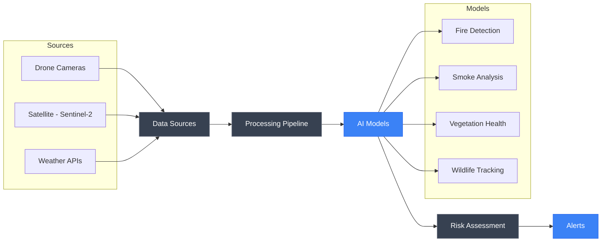
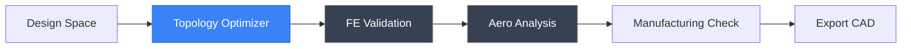

<div align="center">

# THEDIFY

**Founder & CEO of EDIFY | AI Innovation Architect | High School Student**

---

*"My mission is to empower others to achieve their dreams, giving everyone the same starting line."*

---

[](/.github/workflows/ci.yml)
[](#flagship-projects)
[](/LICENSE)
[](/CITATION.cff)

</div>

---

## About

```python
class THEDIFY:
    def __init__(self):
        self.name = "Santiago"
        self.role = "Founder & CEO of EDIFY"
        self.title = "AI Engineer & Innovation Architect"
        self.location = "Mexico"
        self.education = "High School (Autodidact)"
        self.mission = "Empowering others to achieve their dreams"
        
    def expertise(self):
        return {
            "AI/ML": ["Fine-tuning", "AI Agents", "LLMs", "Novel RAG Techniques"],
            "Computer Vision": ["Object Detection", "Video Analysis", "Pose Estimation"],
            "Languages": ["Python", "JavaScript", "TypeScript", "C++"],
            "Cloud": ["Azure OpenAI", "Azure AI Search", "Azure Cosmos DB"],
            "Backend": ["REST APIs", "Microservices", "FastAPI", "Flask"]
        }
```

---

## Knowledge Architecture

```mermaid
graph TB
    ROOT[SANTIAGO<br/>Founder & CEO - EDIFY]
    
    ROOT --> PROJECTS[Projects]
    ROOT --> TECH[Tech Stack]
    ROOT --> MISSION[Mission]
    
    PROJECTS --> EDIFY[EDIFY<br/>AI Education]
    PROJECTS --> AXOLOTL[Axolotl<br/>Sports Analytics]
    PROJECTS --> GUIRA[GUIRA<br/>Fire Prevention]
    PROJECTS --> MENTORA[MenTora<br/>EdTech PWA]
    PROJECTS --> TALENTO[TalenTo<br/>Talent Platform]
    PROJECTS --> TROPHY[TrofyTruck<br/>Chassis Optimization]
    
    TECH --> AI[AI/ML<br/>RAG, CV, LLMs]
    TECH --> CLOUD[Cloud<br/>Azure, Docker]
    TECH --> CODE[Development<br/>Python, React, TS]
    
    MISSION --> EQUAL[Equal Access]
    MISSION --> IMPACT[Social Impact]
    MISSION --> OPEN[Open Knowledge]
    
    style ROOT fill:#374151,stroke:#6b7280,stroke-width:2px,color:#fff
    style PROJECTS fill:#4b5563,stroke:#6b7280,stroke-width:2px,color:#fff
    style TECH fill:#4b5563,stroke:#6b7280,stroke-width:2px,color:#fff
    style MISSION fill:#4b5563,stroke:#6b7280,stroke-width:2px,color:#fff
    style EDIFY fill:#3b82f6,stroke:#2563eb,stroke-width:2px,color:#fff
    style AXOLOTL fill:#3b82f6,stroke:#2563eb,stroke-width:2px,color:#fff
    style GUIRA fill:#3b82f6,stroke:#2563eb,stroke-width:2px,color:#fff
    style MENTORA fill:#3b82f6,stroke:#2563eb,stroke-width:2px,color:#fff
    style TALENTO fill:#3b82f6,stroke:#2563eb,stroke-width:2px,color:#fff
    style TROPHY fill:#3b82f6,stroke:#2563eb,stroke-width:2px,color:#fff
```



---

## Flagship Projects

Each project includes dedicated documentation, technical deep-dives, reproducibility guides, and research abstracts.

| Project | Description | Status | Documentation |
|---------|-------------|--------|---------------|
| **[EDIFY](./projects/EDIFY/README.md)** | Enterprise AI Education Platform | Production | [Details](./projects/EDIFY/README.md) &#124; [Abstract](./projects/EDIFY/ABSTRACT.md) |
| **[Axolotl](./projects/Axolotl/README.md)** | AI Sports Analytics Platform | Beta | [Details](./projects/Axolotl/README.md) &#124; [Abstract](./projects/Axolotl/ABSTRACT.md) |
| **[GUIRA](./projects/GUIRA/README.md)** | Wildfire Prevention & Disaster AI | Research | [Details](./projects/GUIRA/README.md) &#124; [Abstract](./projects/GUIRA/ABSTRACT.md) |
| **[MenTora](./projects/MenTora/README.md)** | AI Education PWA | Production | [Details](./projects/MenTora/README.md) &#124; [Abstract](./projects/MenTora/ABSTRACT.md) |
| **[TalenTo](./projects/TalenTo/README.md)** | Technical Trades Platform | Development | [Details](./projects/TalenTo/README.md) |
| **[TrofyTruck](./projects/TrofyTruck/README.md)** | Trophy Truck Chassis Optimizer | Development | [Details](./projects/TrofyTruck/README.md) |

---

## Project Showcase

### EDIFY — Enterprise AI Education Platform

<div align="center">

[](#)
[](#)
[](#)

</div>

#### WHY

Traditional education platforms fail to personalize learning. Generic content doesn't match individual skill levels, leading to poor retention and limited access to quality education for underserved communities.

**Mission:** Democratize AI-powered learning—give everyone access to world-class, personalized education that adapts to their unique goals and pace.

#### HOW

Custom Retrieval-Augmented Generation (RAG) technique combining:

- **Hybrid Vector Search** — Semantic understanding with keyword precision
- **Adaptive Learning Engine** — Real-time curriculum adjustment
- **Multi-turn Context** — Maintains conversation state for coherent dialogue
- **Smart Citations** — Transparent source attribution
- **Enterprise Scale** — Production-ready for 10,000+ concurrent learners

#### WHAT

| Metric | Result |
|--------|--------|
| Active Users | 100+ in production |
| Response Time | Less than 2 seconds (60-75% faster than competitors) |
| Uptime | 99.9% availability |

**Tech Stack:** Azure OpenAI, React 18, Python 3.11, TypeScript, Cosmos DB, AI Search


[View Full Documentation](./projects/EDIFY/README.md)

---

### Axolotl — AI Sports Analytics Platform

<div align="center">

[](#)
[](#)
[](#)

</div>

#### WHY

Professional-level sports analytics costs thousands—only elite teams can afford it. Grassroots athletes are left behind, unable to access data-driven insights that could transform their performance.

**Mission:** Level the playing field. Give every athlete access to cutting-edge AI analytics that elite teams use.

#### HOW

GPU-accelerated multi-model computer vision pipeline:

- **YOLOv8 Detection** — Real-time player/ball tracking
- **ByteTrack Tracking** — Multi-object trajectory analysis
- **MediaPipe Pose** — Biomechanical movement assessment
- **SMPL Body Mesh** — 3D reconstruction for detailed analysis
- **GPT-4 + RAG** — AI-powered coaching recommendations

#### WHAT

| Metric | Result |
|--------|--------|
| Detection Accuracy | 92% on live footage |
| Processing Speed | Real-time (45 FPS) |
| Metrics Tracked | 50+ technical and physical indicators |

**Tech Stack:** YOLOv8, PyTorch, ByteTrack, MediaPipe, Docker, Redis


[View Full Documentation](./projects/Axolotl/README.md)

---

### GUIRA — Wildfire Prevention & Disaster AI

<div align="center">

[](#)
[](#)
[](#)

</div>

#### WHY

Wildfires devastate small communities that lack resources for advanced warning systems. By the time smoke is visible, it's often too late. Vulnerable populations need early detection to evacuate safely.

**Mission:** Use AI for environmental justice. Provide small communities with the same advanced fire prediction technology that wealthy areas have.

#### HOW

5-model ensemble combining geospatial intelligence, computer vision, and physics simulation:

- **YOLOv8 Fire Detection** — Real-time wildfire identification
- **TimeSFormer Video** — Temporal smoke pattern analysis
- **ResNet50 + VARI** — Vegetation health monitoring
- **CSRNet** — Wildlife displacement tracking
- **Physics Simulation** — Fire spread prediction with cellular automata

#### WHAT

| Metric | Result |
|--------|--------|
| Detection Accuracy | 95% fire/smoke identification |
| Early Warning | 35 minutes average lead time |
| Spatial Resolution | 100m precision geospatial mapping |

**Tech Stack:** YOLOv8, PyTorch, TimeSFormer, GDAL, PostGIS, ResNet50



[View Full Documentation](./projects/GUIRA/README.md)

---

### MenTora — AI Education for Everyone

<div align="center">

[](#)
[](#)
[](#)

</div>

#### WHY

The AI revolution is reshaping every industry, but quality AI education remains a privilege. Millions lack access to modern curriculum preparing them for an AI-powered future.

**Mission:** Democratize AI education. Ensure no one gets left behind as technology advances.

#### HOW

Full-stack Progressive Web Application architecture:

- **PWA Technology** — Works on any device, installs like native app
- **Offline-First Design** — Learn without constant internet connection
- **React 19 Frontend** — Modern, responsive interface
- **FastAPI Backend** — Lightning-fast Python microservices
- **Stripe Integration** — Globally accessible pricing

#### WHAT

| Feature | Implementation |
|---------|----------------|
| Platform Type | Progressive Web App (PWA) |
| Accessibility | Global reach, offline-capable |
| Curriculum | AI/ML fundamentals to advanced topics |
| Code Execution | In-browser Python via Pyodide |

**Tech Stack:** React 19, TypeScript, FastAPI, Azure Cosmos DB, Stripe


[View Full Documentation](./projects/MenTora/README.md)

---

### TrofyTruck — Trophy Truck Chassis Optimizer

<div align="center">

[](#)
[](#)
[](#)

</div>

#### WHY

Building a competition-ready trophy truck for the Baja 1000 requires optimal chassis design. Traditional design methods rely on intuition and over-engineering, resulting in heavier, less efficient structures.

**Mission:** Design the ultimate carbon fiber trophy truck chassis through AI-driven topology optimization—lighter, stronger, faster.

#### HOW

Full-stack topology optimization platform combining FEA, CFD, and manufacturing validation:

- **SIMP & Level-Set Methods** — Advanced topology optimization algorithms
- **FEA Integration** — Structural validation with FEniCS/CalculiX
- **CFD Analysis** — Aerodynamic optimization with OpenFOAM
- **Manufacturing Rules** — Composite layup, drapability, mold splits
- **3D Visualization** — Real-time WebGL viewer with Three.js

#### WHAT

| Capability | Implementation |
|------------|----------------|
| Optimization Methods | SIMP, Level-Set |
| Analysis | Static, Modal, Impact, CFD |
| Materials | Carbon fiber laminate models |
| Outputs | STEP, IGES, layup schedules, BOM |

**Tech Stack:** FastAPI, React, Three.js, PyTorch, FEniCS, PostgreSQL



[View Full Documentation](./projects/TrofyTruck/README.md)

---

## Reproducibility and Publications

### Academic Rigor

Each project provides complete reproducibility:

- **Docker Containers** — Isolated environments
- **Step-by-Step Validation** — Reproduce results
- **Requirements Documentation** — Full dependencies
- **Expected Outputs** — Benchmarks and metrics
- **Testing Protocols** — Validation checklists

See `projects/*/reproducibility/reproduce.md` for each project.

### Novel Contributions

| Project | Innovation |
|---------|------------|
| EDIFY | Custom RAG technique with hybrid semantic + keyword retrieval |
| GUIRA | 5-model ensemble with geospatial-temporal fusion |
| Axolotl | Multi-model CV pipeline with AI coaching integration |

### Citation

```bibtex
@software{santiago_thedify_2024,
  author = {Santiago (THEDIFY)},
  title = {AI Innovation Portfolio: EDIFY, Axolotl, GUIRA, MenTora},
  year = {2024},
  url = {https://github.com/THEDIFY},
  note = {Novel RAG techniques, multi-modal AI, computer vision analytics}
}
```

---

## Technical Expertise

### Core Technologies

| Category | Technologies |
|----------|-------------|
| **Languages** | Python, JavaScript, TypeScript, C++ |
| **AI/ML** | PyTorch, TensorFlow, Hugging Face, LangChain |
| **Computer Vision** | YOLOv8, MediaPipe, OpenCV, SMPL |
| **Cloud** | Azure OpenAI, Azure AI Search, Cosmos DB |
| **Backend** | FastAPI, Flask, Redis, Celery |
| **Frontend** | React, TypeScript, TailwindCSS |
| **DevOps** | Docker, GitHub Actions, Nginx |

### Specializations

| Area | Focus |
|------|-------|
| **Fine-tuning** | LLM optimization, domain adaptation, transfer learning |
| **AI Agents** | Multi-step reasoning, tool integration, orchestration |
| **RAG Systems** | Hybrid search, citation tracking, context management |
| **Computer Vision** | Object detection, video analysis, real-time processing |

---

## Beyond Code

### Design Philosophy

> *"Every breakthrough starts with a simple sketch. Before algorithms, before architectures, before a single line of code—there's pencil and paper."*

Like the **Lamborghini Egoista**—a single-seat masterpiece that rejects all compromise—my approach to engineering emphasizes bold innovation, efficiency, and uncompromising quality. Every element serves a purpose.

<div align="center">

![Lamborghini Egoista][(https://i.pinimg.com/originals/27/5e/31/275e317f91b79e8ee8b08ece0d64e0c8.jpg](https://s2.paultan.org/image/2013/05/Lamborghini_Egoista_Concept_07.jpg))

*The Lamborghini Egoista: Form follows function. No compromise.*

</div>

This philosophy extends to every system I build: **Clean. Elegant. Purposeful. Human-Centered.**

---

## Key Achievements

| Achievement | Details |
|-------------|---------|
| Founder and CEO | Created EDIFY — Enterprise AI education platform serving 100+ users |
| RAG Innovation | Pioneered novel retrieval technique for personalized learning |
| Enterprise Scale | Built production system with sub-2s latency, 99.9% uptime |
| Multi-Modal AI | Integrated 5+ specialized models (YOLO, TimeSFormer, ResNet, CSRNet) |
| Architecture Expert | Designed scalable microservices with Docker orchestration |
| Student Innovator | Building enterprise-grade solutions while in high school |

---

## Connect

<div align="center">

[](https://github.com/THEDIFY)
[](mailto:rasanti2008@gmail.com)
[](https://www.linkedin.com/in/santiago-ramirez-0a5073292/)

*Open to collaborations, discussions, and opportunities.*

</div>

---

## Current Focus

```typescript
const currentJourney = {
    flagship: [
        "EDIFY: Scaling personalized AI education platform",
        "Axolotl: Empowering athletes with advanced CV analytics",
        "GUIRA: Protecting communities from natural disasters",
        "MenTora: Preparing everyone for the AI-powered future",
        "TrofyTruck: Designing carbon fiber chassis for Baja 1000"
    ],
    research: [
        "Novel RAG techniques for personalized learning",
        "Hybrid search optimization for semantic retrieval",
        "Real-time video processing for sports analytics",
        "Multi-modal AI for environmental protection",
        "Topology optimization for composite structures"
    ],
    learning: [
        "Advanced LLM fine-tuning and domain adaptation",
        "Production MLOps on Azure at enterprise scale",
        "GPU-accelerated real-time video processing",
        "Scalable microservices architecture patterns"
    ],
    impact: "Giving everyone the same starting line"
};
```

---

<div align="center">

### Philosophy

> *"The best way to predict the future is to build it. But the best way to build it is to ensure everyone has the same starting line to achieve their dreams."*

---

**MIT License** | Made by THEDIFY

*Empowering dreams through DESIGN, one sketch at a time.*

</div>
