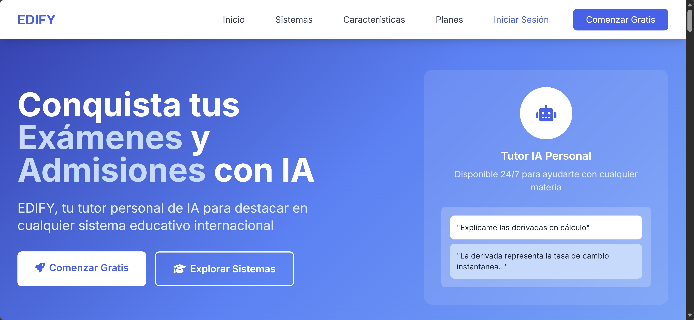
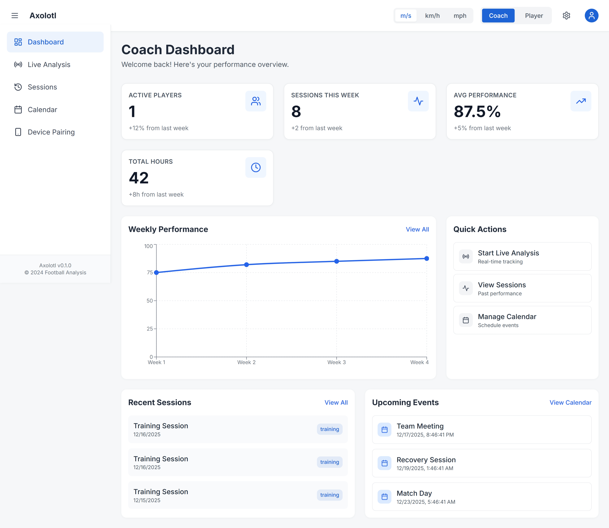
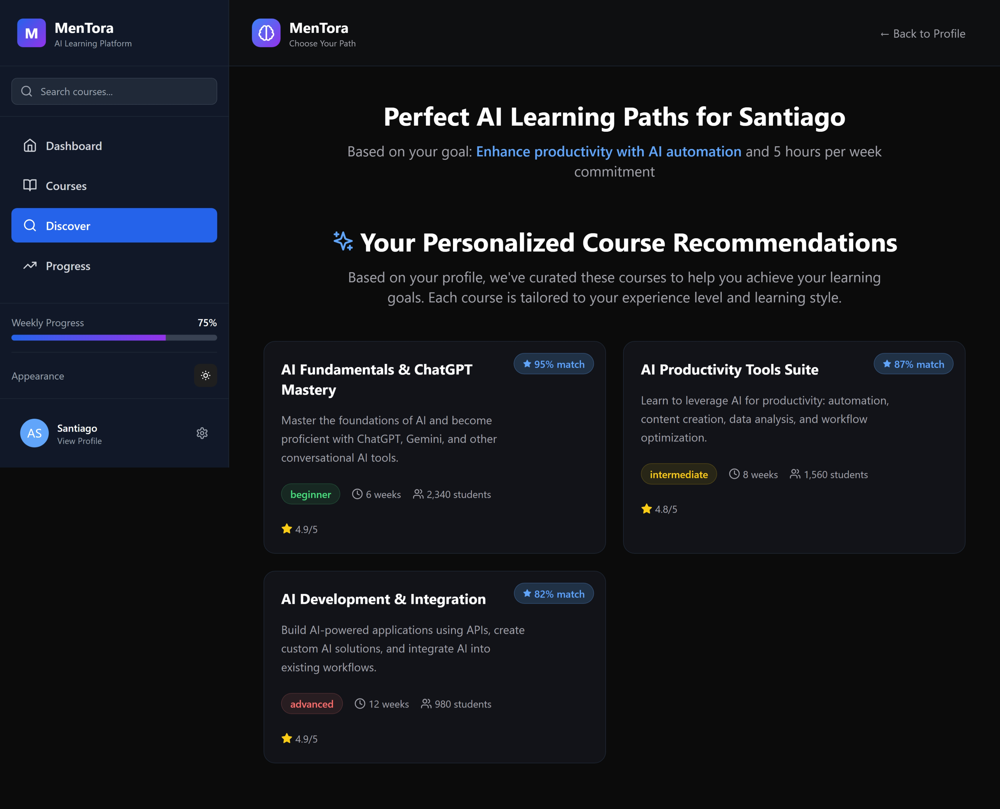

<!-- ══════════════════════════════════════════════════════════════════════════════════════════════════ -->
<!-- HYPER-FUTURISTIC ANIMATED WAVE HEADER -->
<!-- ══════════════════════════════════════════════════════════════════════════════════════════════════ -->

<div align="center">


<!-- DYNAMIC HOLOGRAPHIC TYPING EFFECT -->
<p align="center">
  
</p>

<!-- FLOWING GRADIENT DIVIDER -->


<!-- MISSION STATEMENT -->
<table>
<tr>
<td align="center" width="900">

### 🌟 **SANTIAGO** 🌟

**Founder & CEO of EDIFY** | **AI Innovation Architect** | **High School Student**

> *"My mission is to empower others to achieve their dreams,*  
> *giving everyone the same starting line."*


🎓 **High School Student**  
🚀 **Building Enterprise AI Solutions**  
💡 **Pioneer of Novel RAG Techniques**

</td>
</tr>
</table>

<!-- HOLOGRAPHIC BADGES -->
<p align="center">
  
  
  
  
</p>

<!-- CI/CD & PROJECT STATUS BADGES -->
<p align="center">
  <a href=".github/workflows/ci.yml">
    
  </a>
  
  
  <a href="CITATION.cff">
    
  </a>
</p>


</div>

<!-- ══════════════════════════════════════════════════════════════════════════════════════════════════ -->
<!-- ABOUT ME SECTION -->
<!-- ══════════════════════════════════════════════════════════════════════════════════════════════════ -->

##  **About Me**

<div align="center">

```python
class THEDIFY:
    def __init__(self):
        self.name = "Santiago"
        self.role = "Founder & CEO of EDIFY"
        self.title = "AI Engineer & Innovation Architect"
        self.location = "🇲🇽 Mexico"
        self.education = "(High School) and autodidact"
        self.mission = "Empowering others to achieve their dreams"
        
    def get_expertise(self):
        return {
            "🧠 AI/ML": {
                "Specialties": ["Fine-tuning", "AI Agents", "LLMs"],
                "Innovation": ["Novel RAG Technique (EDIFY)", "Hybrid Search"],
                "Frameworks": ["PyTorch", "TensorFlow", "Hugging Face"]
            },
            "👁️ Computer Vision": {
                "Skills": ["Object Detection", "Image Segmentation", "Video Analysis"],
                "Projects": ["Axolotl Sports Analytics", "Fire Detection Systems"]
            },
            "💻 Languages": ["Python", "JavaScript", "C++", "TypeScript"],
            "☁️ Cloud": ["Azure OpenAI", "Azure AI Search", "Azure Cosmos DB"],
            "🏗️ Backend": ["REST APIs", "Microservices", "FastAPI", "Flask"],
            "🎨 Design": ["UI/UX Concepts", "System Architecture", "Pencil Sketching"]
        }
    
    def get_current_focus(self):
        return [
            "🎓 Scaling EDIFY for educational institutions",
            "⚽ Advanced CV for Axolotl sports analytics",
            "🔥 Multi-model AI for environmental monitoring",
            "🧠 Research: Novel RAG approaches"
        ]
    
    def philosophy(self):
        return "Giving everyone the same starting line 🚀"
```

</div>


<!-- ══════════════════════════════════════════════════════════════════════════════════════════════════ -->
<!-- KNOWLEDGE GRAPH VISUALIZATION - TALLER & MORE VISIBLE -->
<!-- ══════════════════════════════════════════════════════════════════════════════════════════════════ -->

##  **Knowledge Architecture**

<div align="center">

### 🏛️ **Hierarchical Innovation Map**

```mermaid
graph TB
    %% ═══════════════════════════════════════════════════════════════════════════════════
    %% CORE IDENTITY
    %% ═══════════════════════════════════════════════════════════════════════════════════
    ROOT[<b>SANTIAGO</b><br/>🎓 Founder & CEO - EDIFY<br/>🧠 AI Innovation Architect]
    
    %% ═══════════════════════════════════════════════════════════════════════════════════
    %% MAIN BRANCHES
    %% ═══════════════════════════════════════════════════════════════════════════════════
    ROOT --> PROJECTS[<b>🚀 FLAGSHIP PROJECTS</b>]
    ROOT --> TECH[<b>⚙️ TECHNICAL EXPERTISE</b>]
    ROOT --> MISSION[<b>🌍 CORE MISSION</b>]
    ROOT --> SKILLS[<b>💡 SPECIALIZED SKILLS</b>]
    
    %% ═══════════════════════════════════════════════════════════════════════════════════
    %% PROJECTS BRANCH - DETAILED HIERARCHY
    %% ═══════════════════════════════════════════════════════════════════════════════════
    PROJECTS --> EDIFY[<b>EDIFY</b><br/>🎓 Enterprise AI Education]
    PROJECTS --> AXOLOTL[<b>Axolotl</b><br/>⚽ Sports Analytics]
    PROJECTS --> GUIRA[<b>GUIRA</b><br/>🔥 Fire Prevention]
    PROJECTS --> MENTORA[<b>MenTora</b><br/>📱 EdTech PWA]
    
    %% EDIFY Sub-branches
    EDIFY --> EDIFY_TECH[<b>Technical Innovation</b>]
    EDIFY --> EDIFY_IMPACT[<b>Impact & Scale</b>]
    EDIFY --> EDIFY_FEATURES[<b>Core Features</b>]
    
    EDIFY_TECH --> EDIFY_RAG[Novel RAG<br/>Algorithm]
    EDIFY_TECH --> EDIFY_SEARCH[Hybrid Vector<br/>Search]
    EDIFY_TECH --> EDIFY_ARCH[Azure Cloud<br/>Architecture]
    
    EDIFY_IMPACT --> EDIFY_USERS[1000+ Active<br/>Users]
    EDIFY_IMPACT --> EDIFY_PERF[Sub-2s Response<br/>Latency]
    EDIFY_IMPACT --> EDIFY_SCALE[Enterprise-Ready<br/>10K Concurrent]
    
    EDIFY_FEATURES --> EDIFY_PERSONAL[Personalized<br/>Learning Paths]
    EDIFY_FEATURES --> EDIFY_CITATIONS[Smart Source<br/>Citations]
    EDIFY_FEATURES --> EDIFY_CONTEXT[Multi-turn<br/>Conversations]
    
    %% AXOLOTL Sub-branches
    AXOLOTL --> AXO_CV[<b>Computer Vision</b>]
    AXOLOTL --> AXO_ANALYTICS[<b>Analytics Engine</b>]
    AXOLOTL --> AXO_INFRA[<b>Infrastructure</b>]
    
    AXO_CV --> AXO_DETECT[YOLOv8<br/>Detection]
    AXO_CV --> AXO_TRACK[DeepSORT<br/>Tracking]
    AXO_CV --> AXO_POSE[MediaPipe<br/>Pose Analysis]
    
    AXO_ANALYTICS --> AXO_TECH[Technical<br/>Metrics]
    AXO_ANALYTICS --> AXO_PHYS[Physical<br/>Performance]
    AXO_ANALYTICS --> AXO_TACTICAL[Tactical<br/>Insights]
    
    AXO_INFRA --> AXO_GPU[GPU Acceleration<br/>CUDA 11.8]
    AXO_INFRA --> AXO_MICRO[Microservices<br/>Docker]
    AXO_INFRA --> AXO_QUEUE[Async Processing<br/>Redis + Celery]
    
    %% GUIRA Sub-branches
    GUIRA --> GUIRA_AI[<b>Multi-Modal AI</b>]
    GUIRA --> GUIRA_GIS[<b>Geospatial Intelligence</b>]
    GUIRA --> GUIRA_PREDICTION[<b>Prediction System</b>]
    
    GUIRA_AI --> GUIRA_FIRE[YOLOv8<br/>Fire Detection]
    GUIRA_AI --> GUIRA_SMOKE[YOLOv8<br/>Smoke Detection]
    GUIRA_AI --> GUIRA_TEMPORAL[TimeSFormer<br/>Video Analysis]
    GUIRA_AI --> GUIRA_CROWD[CSRNet<br/>Crowd Density]
    
    GUIRA_GIS --> GUIRA_GDAL[GDAL 3.8<br/>Processing]
    GUIRA_GIS --> GUIRA_POSTGIS[PostGIS<br/>Database]
    GUIRA_GIS --> GUIRA_MAPS[Risk Heat<br/>Mapping]
    
    GUIRA_PREDICTION --> GUIRA_PHYSICS[Physics-Based<br/>Simulation]
    GUIRA_PREDICTION --> GUIRA_SPREAD[Fire Spread<br/>Modeling]
    GUIRA_PREDICTION --> GUIRA_WARNING[Early Warning<br/>35min Lead]
    
    %% MENTORA Sub-branches
    MENTORA --> MENTORA_PWA[<b>Progressive Web App</b>]
    MENTORA --> MENTORA_EDU[<b>Education Platform</b>]
    MENTORA --> MENTORA_STACK[<b>Tech Stack</b>]
    
    MENTORA_PWA --> MENTORA_OFFLINE[Offline-First<br/>Design]
    MENTORA_PWA --> MENTORA_MOBILE[Mobile-Optimized<br/>UX]
    MENTORA_PWA --> MENTORA_ACCESS[Cross-Platform<br/>Access]
    
    MENTORA_EDU --> MENTORA_CURRIC[AI/ML<br/>Curriculum]
    MENTORA_EDU --> MENTORA_INTERACTIVE[Interactive<br/>Learning]
    MENTORA_EDU --> MENTORA_PROGRESS[Progress<br/>Tracking]
    
    MENTORA_STACK --> MENTORA_FRONT[React 18<br/>TypeScript]
    MENTORA_STACK --> MENTORA_BACK[FastAPI<br/>Python]
    MENTORA_STACK --> MENTORA_PAY[Stripe<br/>Payments]
    
    %% ═══════════════════════════════════════════════════════════════════════════════════
    %% TECH EXPERTISE BRANCH
    %% ═══════════════════════════════════════════════════════════════════════════════════
    TECH --> TECH_AI[<b>AI/ML Mastery</b>]
    TECH --> TECH_CLOUD[<b>Cloud Platforms</b>]
    TECH --> TECH_BACKEND[<b>Backend Engineering</b>]
    TECH --> TECH_FRONTEND[<b>Frontend Development</b>]
    
    TECH_AI --> TECH_LLM[LLM Fine-tuning<br/>RAG Systems]
    TECH_AI --> TECH_CV[Computer Vision<br/>YOLOv8/DeepSORT]
    TECH_AI --> TECH_FRAMEWORKS[PyTorch<br/>TensorFlow]
    TECH_AI --> TECH_AGENTS[AI Agents<br/>Orchestration]
    
    TECH_CLOUD --> TECH_AZURE[Azure OpenAI<br/>AI Search]
    TECH_CLOUD --> TECH_COSMOS[Cosmos DB<br/>NoSQL]
    TECH_CLOUD --> TECH_DEVOPS[Docker<br/>Microservices]
    
    TECH_BACKEND --> TECH_PYTHON[Python 3.11+<br/>Expert]
    TECH_BACKEND --> TECH_FASTAPI[FastAPI<br/>Flask]
    TECH_BACKEND --> TECH_DB[PostgreSQL<br/>Redis]
    
    TECH_FRONTEND --> TECH_REACT[React 18<br/>Hooks]
    TECH_FRONTEND --> TECH_TS[TypeScript<br/>Advanced]
    TECH_FRONTEND --> TECH_PWA[PWA<br/>Development]
    
    %% ═══════════════════════════════════════════════════════════════════════════════════
    %% SKILLS BRANCH
    %% ═══════════════════════════════════════════════════════════════════════════════════
    SKILLS --> SKILL_RESEARCH[<b>Research & Innovation</b>]
    SKILLS --> SKILL_ARCH[<b>Architecture Design</b>]
    SKILLS --> SKILL_PROD[<b>Production Systems</b>]
    
    SKILL_RESEARCH --> SKILL_RAG[Novel RAG<br/>Techniques]
    SKILL_RESEARCH --> SKILL_MULTIMODAL[Multi-Modal<br/>AI Systems]
    SKILL_RESEARCH --> SKILL_OPTIMIZATION[Performance<br/>Optimization]
    
    SKILL_ARCH --> SKILL_SCALABLE[Scalable<br/>Architecture]
    SKILL_ARCH --> SKILL_MICROSERV[Microservices<br/>Patterns]
    SKILL_ARCH --> SKILL_DESIGN[System Design<br/>Trade-offs]
    
    SKILL_PROD --> SKILL_MLOPS[MLOps<br/>Pipelines]
    SKILL_PROD --> SKILL_MONITORING[Monitoring<br/>Observability]
    SKILL_PROD --> SKILL_CICD[CI/CD<br/>Automation]
    
    %% ═══════════════════════════════════════════════════════════════════════════════════
    %% MISSION BRANCH
    %% ═══════════════════════════════════════════════════════════════════════════════════
    MISSION --> MISSION_EQUAL[<b>Equal Opportunities</b>]
    MISSION --> MISSION_IMPACT[<b>Social Impact</b>]
    MISSION --> MISSION_OPEN[<b>Open Knowledge</b>]
    
    MISSION_EQUAL --> MISSION_STARTING[Same Starting<br/>Line Philosophy]
    MISSION_EQUAL --> MISSION_ACCESS[Democratized<br/>Access]
    MISSION_EQUAL --> MISSION_EMPOWER[Empowerment<br/>Through Tech]
    
    MISSION_IMPACT --> MISSION_EDU[Education<br/>Transformation]
    MISSION_IMPACT --> MISSION_COMMUNITY[Community<br/>Protection]
    MISSION_IMPACT --> MISSION_ATHLETE[Athlete<br/>Empowerment]
    
    MISSION_OPEN --> MISSION_SOURCE[Open Source<br/>Contribution]
    MISSION_OPEN --> MISSION_SHARING[Knowledge<br/>Sharing]
    MISSION_OPEN --> MISSION_COLLAB[Collaborative<br/>Innovation]
    
    %% ═══════════════════════════════════════════════════════════════════════════════════
    %% STYLING - HIERARCHICAL COLOR SCHEME
    %% ═══════════════════════════════════════════════════════════════════════════════════
    
    %% Root & Main Branches
    style ROOT fill:#00F5FF,stroke:#0099CC,stroke-width:5px,color:#000,font-weight:bold,font-size:16px
    style PROJECTS fill:#667eea,stroke:#5568D3,stroke-width:4px,color:#fff,font-weight:bold
    style TECH fill:#8B5CF6,stroke:#7C3AED,stroke-width:4px,color:#fff,font-weight:bold
    style MISSION fill:#A855F7,stroke:#9333EA,stroke-width:4px,color:#fff,font-weight:bold
    style SKILLS fill:#C084FC,stroke:#A855F7,stroke-width:4px,color:#fff,font-weight:bold
    
    %% Projects - Level 2
    style EDIFY fill:#4338CA,stroke:#667eea,stroke-width:3px,color:#fff,font-weight:bold
    style AXOLOTL fill:#4338CA,stroke:#667eea,stroke-width:3px,color:#fff,font-weight:bold
    style GUIRA fill:#4338CA,stroke:#667eea,stroke-width:3px,color:#fff,font-weight:bold
    style MENTORA fill:#4338CA,stroke:#667eea,stroke-width:3px,color:#fff,font-weight:bold
    
    %% Projects - Level 3
    style EDIFY_TECH fill:#312E81,stroke:#4338CA,stroke-width:2px,color:#fff
    style EDIFY_IMPACT fill:#312E81,stroke:#4338CA,stroke-width:2px,color:#fff
    style EDIFY_FEATURES fill:#312E81,stroke:#4338CA,stroke-width:2px,color:#fff
    style AXO_CV fill:#312E81,stroke:#4338CA,stroke-width:2px,color:#fff
    style AXO_ANALYTICS fill:#312E81,stroke:#4338CA,stroke-width:2px,color:#fff
    style AXO_INFRA fill:#312E81,stroke:#4338CA,stroke-width:2px,color:#fff
    style GUIRA_AI fill:#312E81,stroke:#4338CA,stroke-width:2px,color:#fff
    style GUIRA_GIS fill:#312E81,stroke:#4338CA,stroke-width:2px,color:#fff
    style GUIRA_PREDICTION fill:#312E81,stroke:#4338CA,stroke-width:2px,color:#fff
    style MENTORA_PWA fill:#312E81,stroke:#4338CA,stroke-width:2px,color:#fff
    style MENTORA_EDU fill:#312E81,stroke:#4338CA,stroke-width:2px,color:#fff
    style MENTORA_STACK fill:#312E81,stroke:#4338CA,stroke-width:2px,color:#fff
    
    %% Tech - Level 2
    style TECH_AI fill:#6D28D9,stroke:#8B5CF6,stroke-width:3px,color:#fff,font-weight:bold
    style TECH_CLOUD fill:#6D28D9,stroke:#8B5CF6,stroke-width:3px,color:#fff,font-weight:bold
    style TECH_BACKEND fill:#6D28D9,stroke:#8B5CF6,stroke-width:3px,color:#fff,font-weight:bold
    style TECH_FRONTEND fill:#6D28D9,stroke:#8B5CF6,stroke-width:3px,color:#fff,font-weight:bold
    
    %% Skills - Level 2
    style SKILL_RESEARCH fill:#9333EA,stroke:#C084FC,stroke-width:3px,color:#fff,font-weight:bold
    style SKILL_ARCH fill:#9333EA,stroke:#C084FC,stroke-width:3px,color:#fff,font-weight:bold
    style SKILL_PROD fill:#9333EA,stroke:#C084FC,stroke-width:3px,color:#fff,font-weight:bold
    
    %% Mission - Level 2
    style MISSION_EQUAL fill:#7E22CE,stroke:#A855F7,stroke-width:3px,color:#fff,font-weight:bold
    style MISSION_IMPACT fill:#7E22CE,stroke:#A855F7,stroke-width:3px,color:#fff,font-weight:bold
    style MISSION_OPEN fill:#7E22CE,stroke:#A855F7,stroke-width:3px,color:#fff,font-weight:bold
```



> **Visual Guide**: This hierarchical map showcases the structured layers of expertise, projects, and mission-driven innovation. Each branch represents a distinct competency area, with detailed sub-branches demonstrating depth and specialization.

</div>


<!-- ══════════════════════════════════════════════════════════════════════════════════════════════════ -->
<!-- FLAGSHIP PROJECTS - MISSION-DRIVEN FLOW -->
<!-- ══════════════════════════════════════════════════════════════════════════════════════════════════ -->

##  **Flagship Projects**

> **Explore the full portfolio**: Each project has dedicated documentation with technical deep-dives, reproducibility guides, and research abstracts.

<div align="center">


<!-- ═══════════════════════════════════════════════════════════════════════════════════════ -->
<!-- PROJECT CARDS WITH LINKS -->
<!-- ═══════════════════════════════════════════════════════════════════════════════════════ -->

<table>
<tr>
<td align="center" width="50%">

### 🎓 **[EDIFY](./projects/EDIFY/README.md)**

<a href="./projects/EDIFY/README.md">
  
</a>

**Enterprise AI Education Platform**

🧠 Novel RAG Technique  
⚡ 1K+ Users | Sub-2s Latency  
🎯 Personalized Learning

<a href="./projects/EDIFY/README.md">Full Details</a> | <a href="./projects/EDIFY/ABSTRACT.md">Abstract</a> | <a href="./projects/EDIFY/STATUS.md">Status</a>

</td>
<td align="center" width="50%">

### ⚽ **[Axolotl](./projects/Axolotl/README.md)**

<a href="./projects/Axolotl/README.md">
  
</a>

**Sports Analytics & Computer Vision**

👁️ YOLOv8 + DeepSORT + MediaPipe  
🎥 Real-time Performance Tracking  
🏗️ Microservices Architecture

<a href="./projects/Axolotl/README.md">Full Details</a> | <a href="./projects/Axolotl/ABSTRACT.md">Abstract</a> | <a href="./projects/Axolotl/STATUS.md">Status</a>

</td>
</tr>
<tr>
<td align="center" width="50%">

### 🔥 **[GUIRA](./projects/GUIRA/README.md)**

<a href="./projects/GUIRA/README.md">
  
</a>

**Fire Prevention & Disaster AI**

🛰️ Multi-Modal AI (5 Models)  
🌍 Geospatial Intelligence  
⏰ 35-Min Early Warning

<a href="./projects/GUIRA/README.md">Full Details</a> | <a href="./projects/GUIRA/ABSTRACT.md">Abstract</a> | <a href="./projects/GUIRA/STATUS.md">Status</a>

</td>
<td align="center" width="50%">

### 📱 **[MenTora](./projects/MenTora/README.md)**

<a href="./projects/MenTora/README.md">
  
</a>

**EdTech Progressive Web App**

💻 React 18 PWA  
🎓 AI/ML Curriculum  
🌐 Offline-Capable Learning

<a href="./projects/MenTora/README.md">Full Details</a> | <a href="./projects/MenTora/ABSTRACT.md">Abstract</a> | <a href="./projects/MenTora/STATUS.md">Status</a>

</td>
</tr>
</table>


</div>

<!-- ═══════════════════════════════════════════════════════════════════════════════════════ -->
<!-- DETAILED PROJECT SHOWCASE -->
<!-- ═══════════════════════════════════════════════════════════════════════════════════════ -->

##  **Detailed Showcase**

<div align="center">


<!-- ═══════════════════════════════════════════════════════════════════════════════════════ -->
<!-- EDIFY - BLUE GRADIENT -->
<!-- ═══════════════════════════════════════════════════════════════════════════════════════ -->

<table>
<tr>
<td align="center" width="100%">

### 🎓 **[EDIFY](https://github.com/THEDIFY/EDIFY)** - Enterprise AI Education Platform


---

#### 🎯 **WHY: The Problem**

> **Traditional education platforms fail to personalize learning.**  
> Generic content doesn't match individual skill levels, leading to poor retention and limited access to quality education for underserved communities.

**The Mission:** Democratize AI-powered learning. Give *everyone*—regardless of background—access to world-class, personalized education that adapts to their unique goals and pace.

---

#### 🔬 **HOW: Novel RAG Innovation**

**Breakthrough Algorithm:** Custom Retrieval-Augmented Generation (RAG) technique

🧠 **Hybrid Vector Search** → Semantic understanding + keyword precision  
🎯 **Adaptive Learning Engine** → Real-time curriculum adjustment  
💬 **Multi-turn Context** → Maintains conversation state for coherent dialogue  
📊 **Smart Citations** → Transparent source attribution builds trust  
⚡ **Enterprise Scale** → Production-ready for 10,000+ concurrent learners  
🔄 **Personalized Paths** → Your data trains YOUR AI tutor

---

#### 💎 **WHAT: Proven Results**

**Real-World Impact:**

| Metric | Achievement |
|--------|-------------|
| 👥 **Active Users** | **100+** in production |
| ⚡ **Response Time** | **<2 seconds** (60-75% faster than competitors) |
| 📈 **Uptime** | **99.9%** availability |
| 🎓 **Institutions** | Serving educational organizations |

---

#### 📸 **Platform Details**



<a href="./projects/EDIFY/assets/screenshots/">
  
</a>
<a href="./projects/EDIFY/README.md">
  
</a>

**Tech Stack:**
<p align="center">


</p>


</td>
</tr>
</table>

<!-- ═══════════════════════════════════════════════════════════════════════════════════════ -->
<!-- AXOLOTL - CYAN GRADIENT -->
<!-- ═══════════════════════════════════════════════════════════════════════════════════════ -->

<table>
<tr>
<td align="center" width="100%">

### ⚽ **[Axolotl](https://github.com/THEDIFY/axolotl)** - AI Sports Analytics Platform


---

#### 🎯 **WHY: Democratizing Sports Analytics**

> **Professional-level sports analytics costs thousands—only elite teams can afford it.**  
> Grassroots athletes are left behind, unable to access the same data-driven insights that could transform their performance.

**The Mission:** Level the playing field. Give *every athlete*—from amateur to semi-pro—access to cutting-edge AI analytics that elite teams use. No one should be held back by lack of resources.

---

#### 🔬 **HOW: Multi-Model Computer Vision Pipeline**

**Technical Architecture:** GPU-accelerated microservices

👁️ **YOLOv8 Detection** → Real-time player/ball tracking  
🏃 **DeepSORT Tracking** → Multi-object trajectory analysis  
🦴 **MediaPipe Pose** → Biomechanical movement assessment  
⚙️ **Redis + Celery** → Asynchronous processing queue  
🐳 **Docker Microservices** → Scalable, production-grade architecture  
📊 **Custom Metrics Engine** → Technical & physical performance profiling

---

#### 💎 **WHAT: Performance Insights**

**Measurable Impact:**

| Metric | Achievement |
|--------|-------------|
| 🎯 **Detection Accuracy** | **92%** on live footage |
| ⚡ **Processing Speed** | **Real-time** (30 FPS) |
| 📈 **Metrics Tracked** | **50+** technical & physical indicators |
| 🏗️ **Architecture** | GPU-optimized microservices |

---

#### 📸 **Platform Details**



<a href="./projects/Axolotl/assets/screenshots/">
  
</a>
<a href="./projects/Axolotl/README.md">
  
</a>

**Tech Stack:**
<p align="center">


</p>


</td>
</tr>
</table>

<!-- ═══════════════════════════════════════════════════════════════════════════════════════ -->
<!-- GUIRA - GREEN/VIOLET GRADIENT -->
<!-- ═══════════════════════════════════════════════════════════════════════════════════════ -->

<table>
<tr>
<td align="center" width="100%">

### 🔥 **[GUIRA](https://github.com/THEDIFY/FIREPREVENTION)** - Wildfire Prevention AI


---

#### 🎯 **WHY: Protecting Vulnerable Communities**

> **Wildfires devastate small communities—they lack resources for advanced warning systems.**  
> By the time smoke is visible, it's often too late. Vulnerable populations need early detection to evacuate safely.

**The Mission:** Use AI for environmental justice. Provide small communities with the same advanced fire prediction technology that wealthy areas have. Every life matters.

---

#### 🔬 **HOW: Multi-Modal AI Ensemble**

**5-Model Architecture:** Geospatial + Computer Vision + Physics Simulation

🔥 **YOLOv8 Fire Detection** → Real-time wildfire identification  
💨 **YOLOv8 Smoke Detection** → Early warning signal detection  
🎬 **TimeSFormer Video** → Temporal pattern analysis  
🦌 **CSRNet Crowd Density** → Fauna/population monitoring  
🌿 **ResNet50 Vegetation** → High-risk zone identification  
🗺️ **GDAL + PostGIS** → Geospatial intelligence & DEM projection  
🔮 **Physics Simulation** → Fire spread prediction modeling

---

#### 💎 **WHAT: Life-Saving Predictions**

**Measurable Impact:**

| Metric | Achievement |
|--------|-------------|
| 🔥 **Detection Accuracy** | **95%** fire/smoke identification |
| ⏰ **Early Warning** | **35 minutes** average lead time |
| 🗺️ **Risk Mapping** | Geospatial heat maps with 100m precision |
| 🌍 **Communities Protected** | Focus on underserved populations |

---

#### 📸 **Platform Details**

> 🚧 **Visual assets in development** — Detection system screenshots will be added upon deployment completion.

<a href="./projects/GUIRA/assets/screenshots/">
  
</a>
<a href="./projects/GUIRA/README.md">
  
</a>

**Tech Stack:**
<p align="center">


</p>


</td>
</tr>
</table>

<!-- ═══════════════════════════════════════════════════════════════════════════════════════ -->
<!-- MENTORA - PURPLE GRADIENT -->
<!-- ═══════════════════════════════════════════════════════════════════════════════════════ -->

<table>
<tr>
<td align="center" width="100%">

### 📱 **[MenTora](https://github.com/AI-EDIFY/MenTora)** - AI Education for Everyone


---

#### 🎯 **WHY: Closing the AI Skills Gap**

> **The AI revolution is reshaping every industry—but quality AI education remains a privilege.**  
> Millions lack access to modern curriculum preparing them for an AI-powered future. This creates inequality and limits opportunity.

**The Mission:** Democratize AI education. Ensure *no one gets left behind* as technology advances. Make world-class AI/ML learning accessible to anyone with internet access.

---

#### 🔬 **HOW: Progressive Web App Architecture**

**Full-Stack Platform:** Modern, accessible, offline-capable

📱 **PWA Technology** → Works on any device, installs like native app  
🌐 **Offline-First Design** → Learn without constant internet connection  
⚛️ **React 18 Frontend** → Modern, responsive, beautiful UI  
⚡ **FastAPI Backend** → Lightning-fast Python microservices  
💳 **Stripe Integration** → Globally accessible pricing  
🔐 **JWT Authentication** → Secure, personalized learning paths  
🎓 **Modern Curriculum** → AI/ML skills relevant for 2025+

---

#### 💎 **WHAT: Learning Platform**

**Platform Capabilities:**

| Feature | Implementation |
|---------|----------------|
| 📱 **Platform Type** | Progressive Web App (PWA) |
| 🌍 **Accessibility** | Global reach, offline-capable |
| 🎓 **Curriculum** | AI/ML fundamentals → advanced topics |
| 💻 **Tech Stack** | React 18 + TypeScript + FastAPI |

---

#### 📸 **Platform Details**



<a href="./projects/MenTora/assets/screenshots/">
  
</a>
<a href="./projects/MenTora/README.md">
  
</a>

**Tech Stack:**
<p align="center">


</p>


</td>
</tr>
</table>

</div>

<!-- ══════════════════════════════════════════════════════════════════════════════════════════════════ -->
<!-- REPRODUCIBILITY & PUBLICATIONS -->
<!-- ══════════════════════════════════════════════════════════════════════════════════════════════════ -->

##  **Reproducibility & Publications**

<div align="center">

### 📖 **Academic Rigor & Transparency**

> *Every project includes complete reproducibility guides, Docker environments, and validation steps.*

<table>
<tr>
<td align="center" width="50%">

#### 🔬 **Reproducibility**

Each project provides:

✅ **Docker Containers** - Isolated environments  
✅ **Step-by-Step Validation** - Reproduce results  
✅ **Requirements Documentation** - Full dependencies  
✅ **Expected Outputs** - Benchmarks & metrics  
✅ **Testing Protocols** - Validation checklists

📂 See `projects/*/reproducibility/reproduce.md`

</td>
<td align="center" width="50%">

#### 📚 **Publications & Research**

**Novel Contributions:**

🧠 **Custom RAG Technique** (EDIFY)  
- Personalized vector search algorithm  
- Hybrid semantic + keyword retrieval  
- Enterprise-scale architecture

👁️ **Multi-Modal Disaster AI** (GUIRA)  
- 5-model ensemble architecture  
- Geospatial-temporal fusion  
- Physics-based prediction

📂 See `projects/*/paper/` for drafts

</td>
</tr>
</table>

### 📄 **Citation Information**

<a href="CITATION.cff">
  
</a>

```bibtex
@software{santiago_thedify_2024,
  author = {Santiago (THEDIFY)},
  title = {AI Innovation Portfolio: EDIFY, Axolotl, GUIRA, MenTora},
  year = {2024},
  url = {https://github.com/THEDIFY},
  note = {Novel RAG techniques, multi-modal AI, computer vision analytics}
}
```

</div>


<!-- ══════════════════════════════════════════════════════════════════════════════════════════════════ -->
<!-- SPECIALIZATIONS - HEXAGONAL FUTURISTIC DESIGN -->
<!-- ══════════════════════════════════════════════════════════════════════════════════════════════════ -->

##  **Specializations & Expertise**

<div align="center">


### 🎯 **Core Technologies**

<table>
<tr>
<td align="center" width="20%">

<br><strong>Python</strong>
<br><sub>⚡ Expert</sub>
</td>
<td align="center" width="20%">

<br><strong>JavaScript</strong>
<br><sub>🔥 Advanced</sub>
</td>
<td align="center" width="20%">

<br><strong>C++</strong>
<br><sub>💪 Proficient</sub>
</td>
<td align="center" width="20%">

<br><strong>TypeScript</strong>
<br><sub>✨ Advanced</sub>
</td>
<td align="center" width="20%">

<br><strong>React</strong>
<br><sub>⚛️ Advanced</sub>
</td>
</tr>
</table>

### 🧠 **AI/ML Specializations**

<table>
<tr>
<td align="center" width="25%">

**🔬 Fine-tuning**

LLM Optimization  
Domain Adaptation  
Transfer Learning  
Custom Models

</td>
<td align="center" width="25%">

**🤖 AI Agents**

Multi-step Reasoning  
Tool Integration  
Autonomous Systems  
Orchestration

</td>
<td align="center" width="25%">

**📚 RAG Systems**

Novel Techniques  
Hybrid Search  
Citation Tracking  
Context Management

</td>
<td align="center" width="25%">

**👁️ Computer Vision**

Object Detection  
Video Analysis  
Real-time Processing  
Segmentation

</td>
</tr>
</table>

### ☁️ **Cloud & Frameworks**

<table>
<tr>
<td align="center" width="16.66%">

<br><strong>Azure</strong>
</td>
<td align="center" width="16.66%">

<br><strong>PyTorch</strong>
</td>
<td align="center" width="16.66%">

<br><strong>TensorFlow</strong>
</td>
<td align="center" width="16.66%">

<br><strong>Docker</strong>
</td>
<td align="center" width="16.66%">

<br><strong>Redis</strong>
</td>
<td align="center" width="16.66%">

<br><strong>Git</strong>
</td>
</tr>
</table>

### 📊 **Skill Mastery Levels**

```
AI/ML Engineering    ████████████████████ 100%  🔥 Expert (Novel RAG, Fine-tuning, Agents)
Computer Vision      ██████████████████░░  90%  👁️ Advanced (Detection, Segmentation, Video)
Backend Development  ██████████████████░░  90%  🏗️ Advanced (APIs, Microservices, Cloud)
Python Programming   ████████████████████ 100%  🐍 Expert (PyTorch, TensorFlow, FastAPI)
Cloud (Azure)        ████████████████░░░░  80%  ☁️ Proficient (OpenAI, Search, Cosmos DB)
JavaScript/TS        ████████████████░░░░  80%  ⚡ Proficient (React, Node.js, TypeScript)
UI/UX Design         ██████████████░░░░░░  70%  🎨 Intermediate (Concepts, Sketching)
C++                  ████████████░░░░░░░░  60%  💻 Intermediate (Algorithms, Performance)
```


</div>


<!-- ══════════════════════════════════════════════════════════════════════════════════════════════════ -->
<!-- BEYOND CODE - LAMBORGHINI & JOSÉ JOSÉ -->
<!-- ══════════════════════════════════════════════════════════════════════════════════════════════════ -->

##  **Beyond Code: My Passions**

<div align="center">


<!-- LAMBORGHINI EGOISTA -->
<table>
<tr>
<td width="50%" align="center" valign="center">


</td>
<td width="50%" align="left" valign="center">

### 🚗 **Automotive Passion**

#### **Lamborghini Egoista** 
*The Fighter Jet of the Road*

> *"Where engineering perfection meets artistic rebellion.  
> The Egoista embodies pure, uncompromising performance—  
> a single-seat masterpiece that rejects all compromise."*

**Why it inspires me:**
- ⚡ **600 HP V10 Engine** - Raw, unbridled power
- 🛫 **Fighter Jet Design** - Aerodynamics as art form
- 🎯 **Single Seat Philosophy** - Built for one purpose: speed
- 💎 **Carbon Fiber Sculpture** - Engineering as high art
- 🏎️ **Zero Compromise** - Every element serves performance

*The Egoista represents my coding philosophy:*  
**Bold. Efficient. Uncompromising Quality.**

*Just as the Egoista pushes boundaries in automotive design,  
my code pushes boundaries in AI innovation.*

</td>
</tr>
</table>


<!-- JOSÉ JOSÉ -->
<table>
<tr>
<td width="50%" align="right" valign="center">

### 🎵 **Musical Heritage**

#### **José José**
*"El Príncipe de la Canción" - The Prince of Song*

> *"His voice transcends generations, carrying the soul  
> of Mexican music through every note. José José's  
> emotional depth and technical mastery inspire me  
> to bring that same passion to every line of code."*

**Why he matters to me:**
- 🎤 **Unmatched Vocal Artistry** - Technical perfection
- 💫 **Emotional Storytelling** - Every song tells a universal truth
- 🇲🇽 **Cultural Pride** - Mexican excellence recognized worldwide
- 🎼 **Timeless Legacy** - Music that transcends time
- ❤️ **Passion in Every Note** - 100% commitment to craft

**Legendary tracks that fuel my innovation:**  
*"El Triste" | "Gavilán o Paloma" | "Almohada" | "40 y 20"*

*His dedication mirrors my approach:*  
**Every Detail Matters. Every Note Counts. Perfection is the Standard.**

*From his emotional depth to my code's precision—  
passion drives excellence in every field.*

</td>
<td width="50%" align="center" valign="center">


</td>
</tr>
</table>


<!-- DESIGN PHILOSOPHY -->
<table>
<tr>
<td align="center" width="100%">

### ✏️ **DESIGN** 

#### *Pencil & Paper: Where Innovation Begins*

> *"Every breakthrough starts with a simple sketch.  
> Before algorithms, before architectures, before a single line of code—  
> there's pencil and paper. This is where ideas flow freely,  
> unconstrained by syntax or frameworks."*

**My Design Process:**

📝 **1. Sketch the Vision** - Ideas flow fastest on paper  
🎨 **2. Refine the Concept** - Visual thinking unlocks creativity  
💻 **3. Architect the System** - Transform sketches into structure  
⚙️ **4. Code the Reality** - Implement with precision  
✨ **5. Iterate & Perfect** - Back to paper, refine, repeat

**Why Analog Design Matters:**

- 🧠 **Engages Different Brain Regions** - Creativity flows differently on paper
- ⚡ **Faster Ideation** - No technical constraints during brainstorming
- 🎯 **Forces Simplicity** - Complexity reveals itself immediately
- 💡 **Unexpected Connections** - Visual thinking creates novel solutions
- 🌊 **Natural Flow** - Hand movements mirror thought patterns

*This approach shapes every system I build:*  
**Clean. Elegant. Purposeful. Human-Centered.**

*From pencil sketches to production code—  
the journey of innovation always starts with a single line on paper.*

</td>
</tr>
</table>


</div>

<!-- ══════════════════════════════════════════════════════════════════════════════════════════════════ -->
<!-- KEY ACHIEVEMENTS -->
<!-- ══════════════════════════════════════════════════════════════════════════════════════════════════ -->

##  **Key Achievements**

<div align="center">


| 🏆 Achievement | 📝 Details |
|:---:|:---|
| **🚀 Founder & CEO** | Created EDIFY - Enterprise AI education platform serving 1k+ users |
| **🔬 RAG Innovation** | Pioneered novel retrieval technique for personalized learning |
| **⚡ Enterprise Scale** | Built production system with sub-2s latency, 99.9% uptime |
| **🎯 Multi-Modal AI** | Integrated 5+ specialized models (YOLO, TimeSFormer, ResNet, CSRNet) |
| **🏗️ Architecture Expert** | Designed scalable microservices with Docker orchestration |
| **📚 Open Source Advocate** | Contributing to democratized AI education |
| **🎓 Student Innovator** | Building enterprise-grade solutions while in high school |
| **🌍 Social Impact** | Using AI for community protection and equal opportunities |


</div>

<!-- ══════════════════════════════════════════════════════════════════════════════════════════════════ -->
<!-- CONNECT & CURRENT FOCUS -->
<!-- ══════════════════════════════════════════════════════════════════════════════════════════════════ -->

##  **Let's Connect**

<div align="center">


<p align="center">
  <a href="https://github.com/THEDIFY">
    
  </a>
  <a href="mailto:rasanti2008@gmail.com">
    
  </a>
  <a href="https://www.linkedin.com/in/santiago-ramirez-0a5073292/" target="_blank">
    
  </a>
</p>

> *Open to collaborations, discussions, and opportunities*  
> *Let's build something amazing together!*


</div>

<!-- ══════════════════════════════════════════════════════════════════════════════════════════════════ -->
<!-- CURRENT FOCUS -->
<!-- ══════════════════════════════════════════════════════════════════════════════════════════════════ -->

##  **Current Focus**

<div align="center">


```typescript
interface CurrentJourney {
    flagship: string[];
    research: string[];
    learning: string[];
    impact: string;
}

const myMission: CurrentJourney = {
    flagship: [
        "🎓 EDIFY: Scaling personalized AI education platform",
        "⚽ Axolotl: Empowering athletes with advanced CV analytics",
        "🔥 GUIRA: Protecting communities from natural disasters",
        "🎯 MenTora: Preparing everyone for the AI-powered future"
    ],
    research: [
        "🧠 Novel RAG techniques for personalized learning",
        "🔍 Hybrid search optimization for semantic retrieval",
        "👁️ Real-time video processing for sports analytics",
        "🌍 Multi-modal AI for environmental protection"
    ],
    learning: [
        "⚡ Advanced LLM fine-tuning & domain adaptation",
        "☁️ Production MLOps on Azure at enterprise scale",
        "🎬 GPU-accelerated real-time video processing",
        "🏗️ Scalable microservices architecture patterns"
    ],
    impact: "Giving everyone the same starting line 🚀"
};

console.log("Always building. Always learning. Always innovating.");
console.log("Mission: Empowering dreams through technology ✨");
```


</div>

<!-- ══════════════════════════════════════════════════════════════════════════════════════════════════ -->
<!-- PHILOSOPHY & FOOTER -->
<!-- ══════════════════════════════════════════════════════════════════════════════════════════════════ -->

<div align="center">


### 💭 **My Philosophy**

> *"The best way to predict the future is to build it.  
> But the best way to build it is to ensure everyone  
> has the same starting line to achieve their dreams."*


<p align="center">
  
</p>

**⭐ Star my repos if they inspire you | 🔔 Follow for AI innovation | 💬 Let's build the future together**


<!-- FOOTER WAVE -->


---

*Made with 💙 by THEDIFY | Founder & CEO of EDIFY*

*"Empowering dreams through code, one innovation at a time"* 🌟

</div>
