# Architecture Documentation

## Table of Contents
- [System Architecture Overview](#system-architecture-overview)
- [Component Architecture](#component-architecture)
- [Data Flow](#data-flow)
- [Technology Stack](#technology-stack)
- [Design Patterns](#design-patterns)
- [Scalability](#scalability)
- [Security Architecture](#security-architecture)
- [Performance Optimization](#performance-optimization)

---

## System Architecture Overview

Axolotl is built on a modern microservices-inspired architecture with GPU-accelerated AI/ML processing, enabling real-time football performance analysis.

### High-Level Architecture

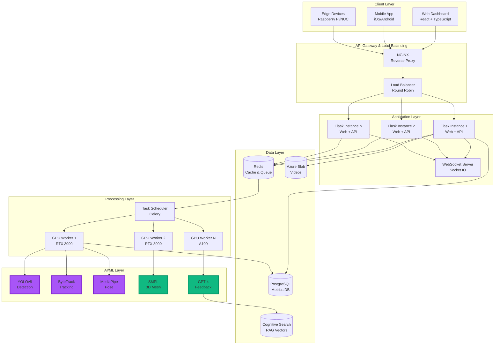

### Deployment Architecture

#### Development Environment

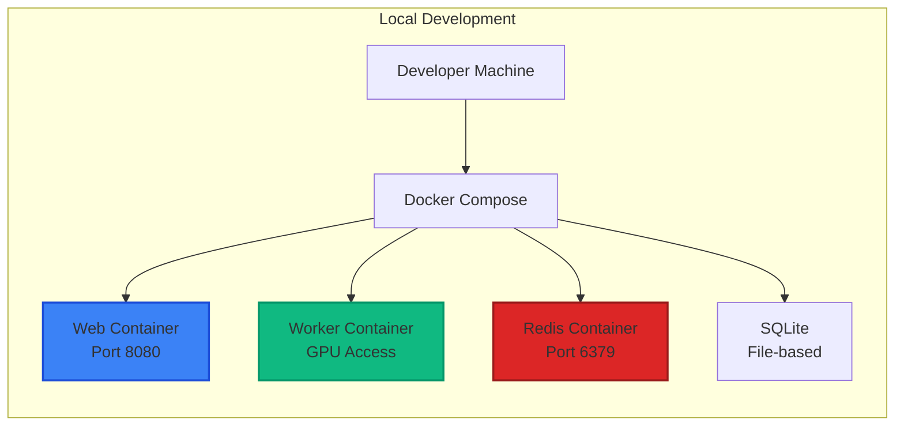

#### Production Environment (Azure)

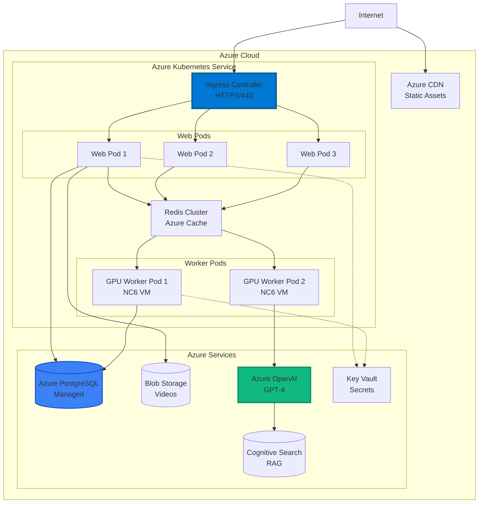

---

## Component Architecture

### Backend Architecture - Flask Application

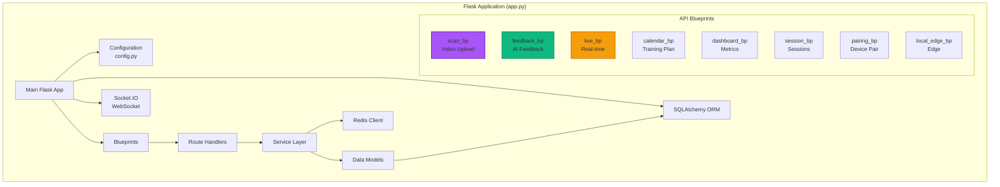

### Frontend Architecture - React Application

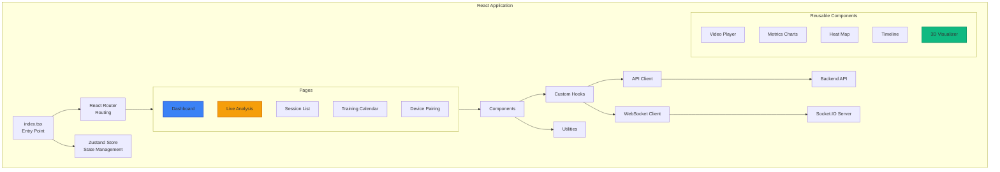

### AI/ML Pipeline Architecture

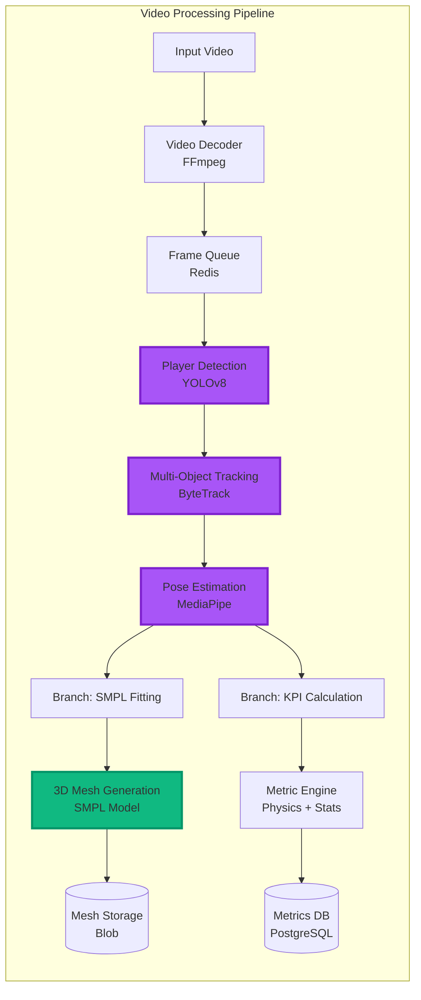

---

## Data Flow

### Video Upload and Analysis Flow

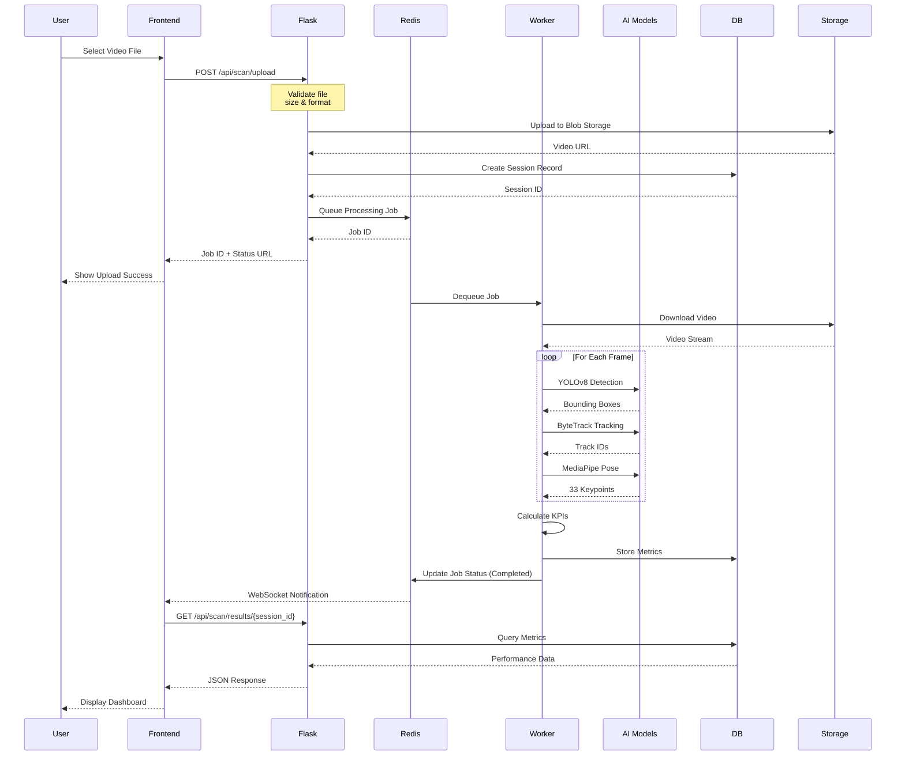

### AI Feedback Generation Flow

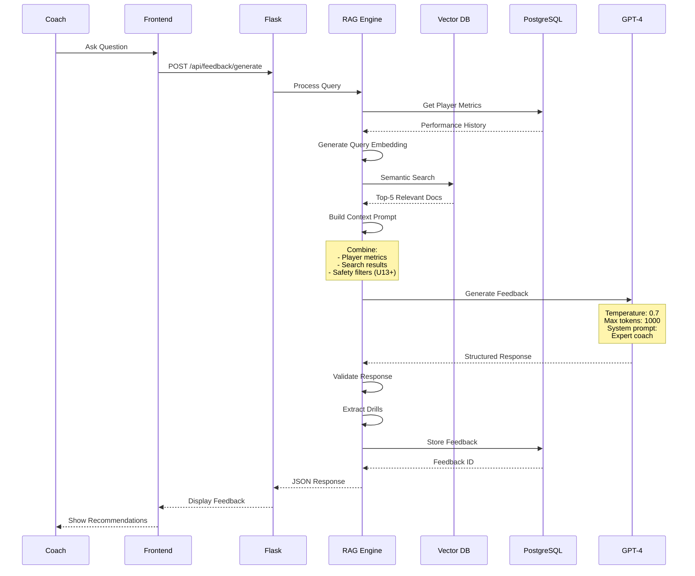

### Real-Time Analysis Flow

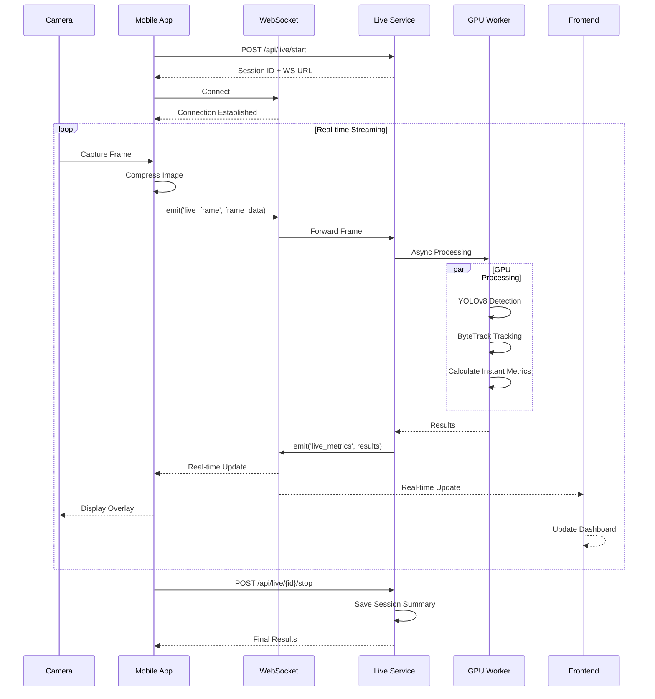

---

## Technology Stack

### Complete Technology Matrix

| Layer | Component | Technology | Version | Purpose |
|-------|-----------|------------|---------|---------|
| **Frontend** | Framework | React | 18.x | UI library |
| | Language | TypeScript | 5.x | Type safety |
| | Build Tool | Vite | 4.x | Fast dev builds |
| | Styling | TailwindCSS | 3.x | Utility CSS |
| | State | Zustand | 4.x | State management |
| | Router | React Router | 6.x | Client routing |
| | 3D Graphics | Three.js + R3F | 0.157+ | 3D visualization |
| | Charts | Recharts | 2.8+ | Data viz |
| | Calendar | FullCalendar | 6.1+ | Scheduling |
| | Icons | Lucide React | 0.290+ | Icons |
| **Backend** | Web Framework | Flask | 3.0+ | HTTP server |
| | ASGI Server | Uvicorn | 0.27+ | Production server |
| | WebSocket | Flask-SocketIO | Latest | Real-time |
| | Task Queue | Celery | 5.3+ | Background jobs |
| | ORM | SQLAlchemy | 2.0+ | Database |
| **AI/ML** | Deep Learning | PyTorch | 2.1+ | Neural networks |
| | Detection | YOLOv8 | 8.0+ | Object detection |
| | Pose | MediaPipe | 0.10+ | Skeletal tracking |
| | Tracking | ByteTrack | Custom | Multi-object |
| | Body Model | SMPL | Custom | 3D mesh |
| | LLM | Azure OpenAI | GPT-4 | AI feedback |
| | Embeddings | text-embedding-3-large | Latest | RAG vectors |
| | Computer Vision | OpenCV | 4.8+ | Video processing |
| **Data** | Cache/Queue | Redis | 7.x | In-memory store |
| | Database (Prod) | PostgreSQL | 15+ | Relational DB |
| | Database (Dev) | SQLite | 3.x | File-based DB |
| | Object Storage | Azure Blob | Latest | Video storage |
| | Vector DB | Azure Cognitive Search | Latest | RAG search |
| **Infrastructure** | Containers | Docker | 20.10+ | Packaging |
| | Orchestration | Docker Compose | 2.0+ | Local dev |
| | Production | Kubernetes (AKS) | 1.28+ | Cloud deploy |
| | CI/CD | GitHub Actions | Latest | Automation |
| | Monitoring | Prometheus + Grafana | Latest | Observability |

---

## Design Patterns

### 1. Repository Pattern (Data Access)

```python
# app/backend/repositories/session_repository.py

class SessionRepository:
    def __init__(self, db_session):
        self.db = db_session
    
    def create(self, session_data):
        session = Session(**session_data)
        self.db.add(session)
        self.db.commit()
        return session
    
    def get_by_id(self, session_id):
        return self.db.query(Session).filter_by(id=session_id).first()
    
    def get_by_player(self, player_id, limit=20):
        return self.db.query(Session)\
            .filter_by(player_id=player_id)\
            .order_by(Session.created_at.desc())\
            .limit(limit).all()
```

### 2. Service Layer Pattern (Business Logic)

```python
# app/backend/services/analysis_service.py

class AnalysisService:
    def __init__(self, session_repo, redis_client):
        self.session_repo = session_repo
        self.redis = redis_client
    
    def analyze_video(self, video_path, player_data):
        # Create session
        session = self.session_repo.create(player_data)
        
        # Queue background job
        job_id = self.queue_analysis_job(session.id, video_path)
        
        return {
            "session_id": session.id,
            "job_id": job_id,
            "status": "queued"
        }
    
    def queue_analysis_job(self, session_id, video_path):
        job_data = {
            "session_id": session_id,
            "video_path": video_path,
            "timestamp": datetime.utcnow()
        }
        return self.redis.rpush("video_processing", json.dumps(job_data))
```

### 3. Factory Pattern (Model Loading)

```python
# src/axolotl/detection/model_factory.py

class DetectionModelFactory:
    _models = {}
    
    @classmethod
    def get_model(cls, model_name, device='cuda'):
        key = f"{model_name}_{device}"
        
        if key not in cls._models:
            if model_name == "yolov8n":
                cls._models[key] = YOLO('yolov8n.pt').to(device)
            elif model_name == "yolov8s":
                cls._models[key] = YOLO('yolov8s.pt').to(device)
            else:
                raise ValueError(f"Unknown model: {model_name}")
        
        return cls._models[key]
```

### 4. Observer Pattern (WebSocket Updates)

```python
# app/backend/observers/job_observer.py

class JobObserver:
    def __init__(self, socketio):
        self.socketio = socketio
        self.subscribers = {}
    
    def subscribe(self, job_id, client_sid):
        if job_id not in self.subscribers:
            self.subscribers[job_id] = []
        self.subscribers[job_id].append(client_sid)
    
    def notify(self, job_id, update_data):
        if job_id in self.subscribers:
            for client_sid in self.subscribers[job_id]:
                self.socketio.emit(
                    'analysis_update',
                    update_data,
                    room=client_sid
                )
```

### 5. Strategy Pattern (Metric Calculation)

```python
# app/backend/metrics/strategies.py

class MetricStrategy(ABC):
    @abstractmethod
    def calculate(self, tracking_data):
        pass

class SpeedMetricStrategy(MetricStrategy):
    def calculate(self, tracking_data):
        # Calculate speed from position changes
        speeds = []
        for i in range(1, len(tracking_data)):
            distance = euclidean_distance(
                tracking_data[i-1]['position'],
                tracking_data[i]['position']
            )
            time_delta = tracking_data[i]['timestamp'] - tracking_data[i-1]['timestamp']
            speeds.append(distance / time_delta)
        
        return {
            "max_speed": max(speeds),
            "avg_speed": sum(speeds) / len(speeds)
        }

class DistanceMetricStrategy(MetricStrategy):
    def calculate(self, tracking_data):
        total_distance = 0
        for i in range(1, len(tracking_data)):
            total_distance += euclidean_distance(
                tracking_data[i-1]['position'],
                tracking_data[i]['position']
            )
        return {"total_distance": total_distance}
```

---

## Scalability

### Horizontal Scaling Strategy

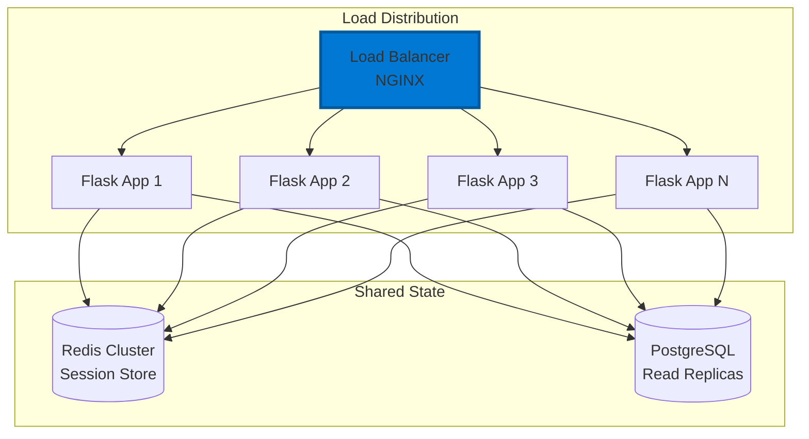

### GPU Worker Scaling

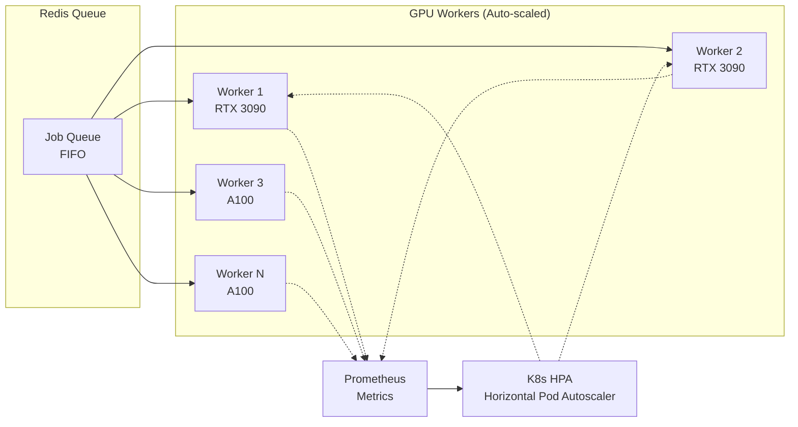

### Database Scaling

**Read Replicas:**
- Master: Write operations
- Replica 1-N: Read operations
- Automatic failover with PostgreSQL streaming replication

**Caching Strategy:**
- Redis for frequently accessed metrics
- TTL: 5 minutes for dashboard data
- Invalidation on metric updates

**Partitioning:**
- Session data partitioned by date
- Monthly partitions for historical data
- Automatic archive after 6 months

---

## Security Architecture

### Authentication Flow

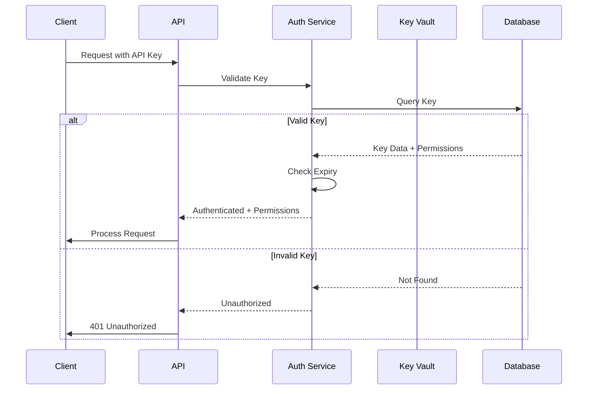

### Security Layers

1. **Network Security:**
   - HTTPS/TLS 1.3 for all communications
   - Web Application Firewall (WAF)
   - DDoS protection via Azure Front Door
   - VPN for admin access

2. **Application Security:**
   - API key authentication
   - Rate limiting (per endpoint)
   - Input validation and sanitization
   - SQL injection prevention (ORM)
   - XSS protection (React escaping)
   - CSRF tokens for state-changing operations

3. **Data Security:**
   - Encryption at rest (Azure Storage)
   - Encryption in transit (TLS)
   - Sensitive data in Azure Key Vault
   - No credentials in code/version control
   - Regular security audits

4. **AI/ML Security:**
   - Content filtering on AI feedback
   - Age-appropriate safety checks (U13+)
   - PII redaction in training data
   - Model access control

---

## Performance Optimization

### Caching Strategy

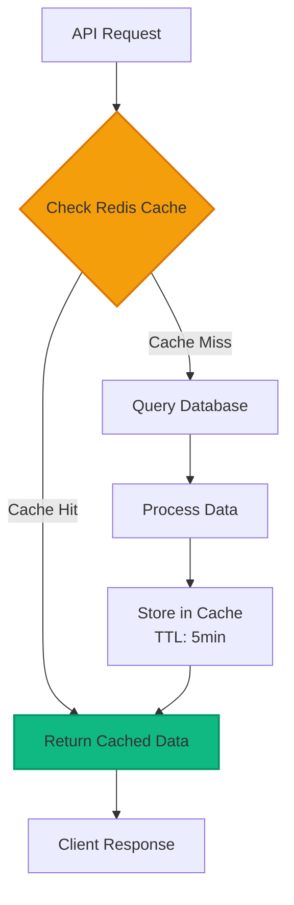

### Database Query Optimization

**Indexes:**
```sql
CREATE INDEX idx_session_player_date ON sessions(player_id, created_at DESC);
CREATE INDEX idx_metrics_session ON metrics(session_id);
CREATE INDEX idx_tracking_session_frame ON tracking_data(session_id, frame_number);
```

**Query Optimization:**
- Use SELECT specific columns, not SELECT *
- Implement pagination for list endpoints
- Use database views for complex aggregations
- Connection pooling (max 20 connections)

### Video Processing Optimization

**Batching:**
- Process frames in batches of 32
- GPU memory: 8GB for batch processing
- Parallel tracking across multiple videos

**Model Optimization:**
- Use YOLOv8n (nano) for real-time (30 FPS)
- Use YOLOv8s (small) for accuracy (20 FPS)
- TensorRT optimization for production
- FP16 precision for 2x speedup

**Frame Sampling:**
- Training analysis: Process all frames (60 FPS)
- Quick preview: Sample 15 FPS
- Highlights: Sample 30 FPS

---

## Monitoring & Observability

### Metrics Collection

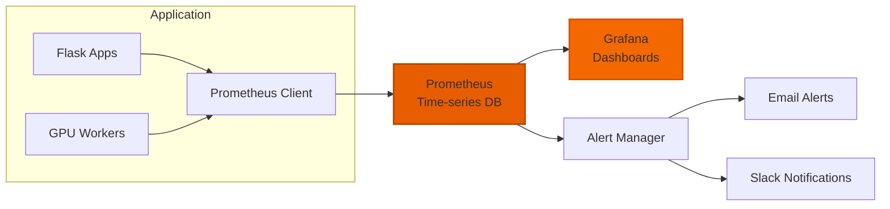

### Key Metrics

**Application Metrics:**
- Request rate (requests/second)
- Response time (p50, p95, p99)
- Error rate (errors/total requests)
- Active WebSocket connections

**Processing Metrics:**
- Video processing time (seconds/video)
- GPU utilization (%)
- Queue depth (jobs waiting)
- Job success/failure rate

**Business Metrics:**
- Daily active users
- Videos analyzed per day
- AI feedback requests per hour
- Session duration average

---

## Related Documentation

- [Backend Architecture Details](documentation/architecture/backend.md)
- [Frontend Architecture Details](documentation/architecture/frontend.md)
- [Database Schema](documentation/architecture/database.md)
- [API Reference](API.md)
- [Deployment Guide](DEPLOYMENT.md)
