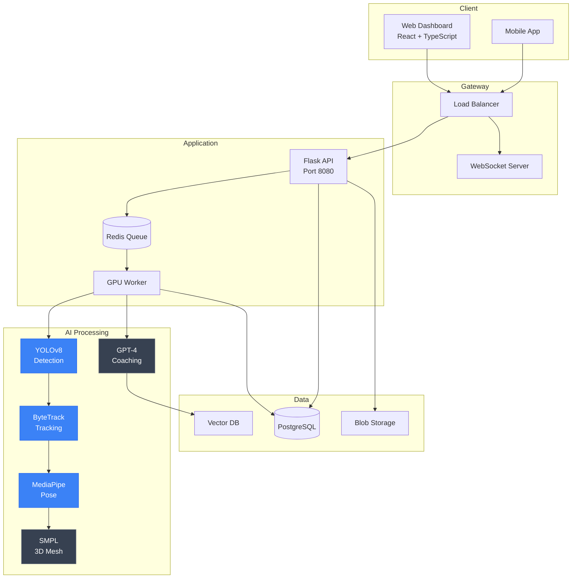

# Axolotl

**AI-Powered Football Analytics Platform**

<div align="center">

[](#)
[](#)
[](/LICENSE)
[](#)

</div>

---

## Overview

**Axolotl** democratizes professional-level sports analytics by bringing AI-powered performance tracking to grassroots football. Using advanced computer vision techniques including YOLOv8 detection, ByteTrack multi-object tracking, and MediaPipe pose estimation, Axolotl transforms standard match footage into actionable insights—providing real-time tactical feedback, personalized athlete metrics, and long-term progress visualization previously exclusive to elite teams.

### Key Metrics

| Metric | Value |
|--------|-------|
| Detection Accuracy | 92% |
| Processing Speed | 45 FPS |
| Metric Categories | 15+ |
| Body Keypoints | 33 (MediaPipe) |

---

## Platform Screenshots

### Interactive Dashboard


*Real-time performance metrics dashboard with heat maps, sprint analysis, and KPI visualization*

### Live Analysis Interface


*Real-time video analysis with player tracking, pose estimation, and instant feedback*

### Session Management


*Browse and analyze historical training sessions with detailed metrics*

### AI-Powered Training Calendar


*Intelligent training planning with AI recommendations and scheduling*

### Player Performance Analytics


*Detailed player-specific metrics, trends, and improvement tracking*

### Mobile Pairing


*QR code-based device pairing for seamless multi-platform integration*

---

## WHY

### The Problem

Elite football teams spend $50,000+ per season on performance analytics systems. Specialized hardware, professional analysts, and proprietary software create barriers to entry. Grassroots athletes lack access to data-driven insights that separate good from great players.

Current solutions require extensive manual annotation and are not real-time capable. No affordable platform provides comprehensive technical, physical, AND tactical analysis.

### Why It Matters

Athletic excellence should be determined by talent and dedication, not financial resources. Thousands of gifted athletes worldwide never reach their potential simply because they lack access to professional-grade performance feedback. 

By democratizing sports analytics, we enable coaches at every level to provide the same quality of data-driven coaching that professional teams enjoy, creating genuine equal opportunity in athletic development.

### Target Users

- Grassroots football coaches seeking data-driven training insights
- Amateur and semi-professional athletes tracking personal development
- Youth academies without budgets for expensive analytics systems
- Sports scientists and researchers studying athletic performance
- Individual players committed to self-improvement

---

## HOW

### Technical Architecture

GPU-accelerated multi-model computer vision pipeline designed for real-time processing:

**Detection and Tracking**
- **YOLOv8** — State-of-the-art object detection for player/ball identification
- **ByteTrack** — Multi-object tracking with trajectory analysis
- **MediaPipe** — 33-keypoint pose estimation for biomechanical analysis

**3D Reconstruction**
- **SMPL Body Mesh** — Full body reconstruction for detailed movement analysis
- **Three.js Visualization** — Interactive 3D rendering in browser

**AI Coaching**
- **GPT-4 + RAG** — Context-aware coaching recommendations
- **Knowledge Base** — Coaching literature and training methodologies

**Infrastructure**
- **Redis + Celery** — Asynchronous task processing
- **Docker** — Containerized microservices
- **WebSocket** — Real-time bidirectional communication

### System Architecture



### Processing Pipeline

```mermaid
graph LR
    A[Video Input] --> B[Frame Extraction]
    B --> C[Player Detection]
    C --> D[Multi-Object Tracking]
    D --> E[Pose Estimation]
    E --> F[3D Reconstruction]
    F --> G[Metrics Computation]
    G --> H[AI Analysis]
    H --> I[Dashboard Output]
    
    style C fill:#3b82f6,stroke:#2563eb,color:#fff
    style D fill:#3b82f6,stroke:#2563eb,color:#fff
    style E fill:#3b82f6,stroke:#2563eb,color:#fff
    style H fill:#374151,stroke:#6b7280,color:#fff
```



---

## WHAT

### Features

| Feature | Description | Status |
|---------|-------------|--------|
| Real-time Video Analysis | 45 FPS processing with GPU acceleration | Complete |
| Player Detection and Tracking | YOLOv8 + ByteTrack multi-object tracking | Complete |
| 2D/3D Pose Estimation | MediaPipe integration with 33 keypoints | Complete |
| SMPL Body Mesh | 3D biomechanical reconstruction | Complete |
| Performance Metrics | 15+ technical, physical, tactical KPIs | Complete |
| AI Coaching Feedback | GPT-4 powered recommendations with RAG | Complete |
| Training Calendar | AI-powered planning and scheduling | Complete |
| Session History | Historical tracking and trend analysis | Complete |
| Mobile Pairing | QR code device synchronization | Complete |
| Event Spotting | Automatic detection of passes, shots, tackles | In Progress |
| Multi-Camera Support | Synchronized 3D reconstruction | Planned |
| Wearable Integration | GPS and heart rate sensor data fusion | Planned |

### Performance Metrics

**Technical Metrics**
- Ball control success rate
- Pass accuracy and completion
- Shot placement and power
- Dribbling efficiency
- First touch quality

**Physical Metrics**
- Sprint distance and speed
- Acceleration/deceleration patterns
- Total distance covered
- High-intensity running zones
- Recovery time analysis

**Tactical Metrics**
- Positioning heat maps
- Movement patterns
- Space utilization
- Defensive positioning
- Offensive runs

### Results

| Metric | Achievement |
|--------|-------------|
| Detection Accuracy | 92% on live match footage |
| Processing Speed | 45 FPS on consumer GPU (RTX 3080) |
| Tracking Consistency | 95%+ identity preservation |
| Pose Estimation | Real-time 33-keypoint extraction |
| Metrics Coverage | 50+ individual performance indicators |

---

## Tech Stack

### Backend

| Technology | Purpose |
|------------|---------|
| Python 3.11+ | Core language |
| Flask 3.0+ | Web framework |
| PyTorch | Deep learning |
| YOLOv8 | Object detection |
| MediaPipe | Pose estimation |
| Redis | Task queue |
| Celery | Background workers |
| PostgreSQL | Data storage |

### Frontend

| Technology | Purpose |
|------------|---------|
| React 18 | UI framework |
| TypeScript | Type safety |
| Vite | Build tool |
| TailwindCSS | Styling |
| Three.js | 3D visualization |
| Socket.IO | Real-time updates |
| Recharts | Data visualization |

### Infrastructure

| Technology | Purpose |
|------------|---------|
| Docker | Containerization |
| NVIDIA CUDA | GPU acceleration |
| Azure Blob Storage | Video storage |
| Azure Cognitive Search | RAG vector database |

---

## Installation

### Prerequisites

- Python 3.11+
- Node.js 18+
- Docker and Docker Compose
- NVIDIA GPU with CUDA support (recommended)

### Quick Start

```bash
# Clone repository
git clone https://github.com/THEDIFY/axolotl.git
cd axolotl

# Backend setup
cd code
pip install -r requirements.txt

# Frontend setup
cd ../frontend
npm install

# Environment configuration
cp .env.example .env
# Edit .env with your configuration

# Start services
docker-compose up -d

# Access application
# Backend: http://localhost:8080
# Frontend: http://localhost:3000
```

### Docker Deployment

```bash
cd code
docker build -t axolotl:latest .
docker run -p 8080:8080 --gpus all axolotl:latest
```

---

## Documentation

| Document | Description |
|----------|-------------|
| [Architecture](./ARCHITECTURE.md) | System design and components |
| [API Reference](./API.md) | REST API documentation |
| [Deployment](./DEPLOYMENT.md) | Production deployment guide |
| [Contributing](./CONTRIBUTING.md) | Contribution guidelines |
| [Troubleshooting](./TROUBLESHOOTING.md) | Common issues and solutions |

### Reproducibility

See [reproducibility/reproduce.md](./reproducibility/reproduce.md) for step-by-step validation instructions.

---

## Project Structure

```
Axolotl/
├── README.md              # This file
├── ABSTRACT.md            # Research abstract
├── ARCHITECTURE.md        # Technical architecture
├── API.md                 # API documentation
├── DEPLOYMENT.md          # Deployment guide
├── STATUS.md              # Project status
├── assets/
│   ├── diagrams/          # Architecture diagrams
│   ├── screenshots/       # UI screenshots
│   └── videos/            # Demo videos
├── code/
│   ├── Dockerfile
│   └── requirements.txt
├── documentation/
│   ├── ai-ml/             # ML model documentation
│   ├── architecture/      # System design docs
│   └── getting-started/   # Onboarding guides
├── paper/                 # Research papers
└── reproducibility/
    └── reproduce.md       # Reproduction guide
```

---

## License

This project is licensed under the MIT License. See [LICENSE](/LICENSE) for details.

---

## Contact

For questions or collaboration inquiries, please reach out through:

- GitHub Issues for bug reports and feature requests
- Email for partnership opportunities

---

<div align="center">

*Part of the [THEDIFY](/) project portfolio*

**Democratizing sports analytics through AI innovation**

</div>
