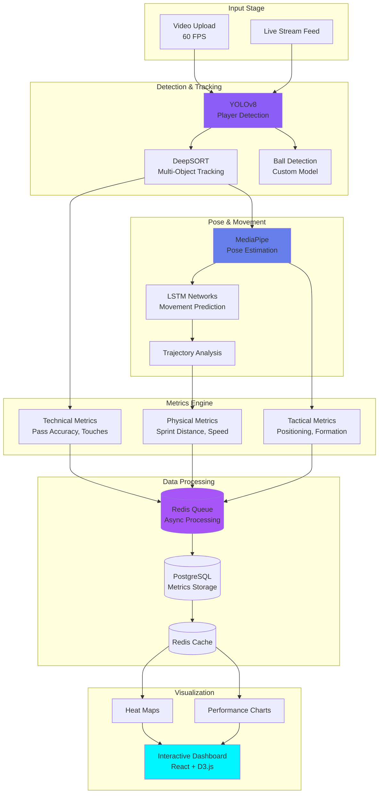

# ⚽ Axolotl - AI Football Analysis Platform

<div align="center">


</div>

## 📋 TL;DR / Abstract

**Axolotl** democratizes professional-level sports analytics by bringing AI-powered performance tracking to grassroots football. Using advanced computer vision and GPU-accelerated processing, Axolotl provides real-time tactical insights, personalized athlete metrics, and video analysis previously accessible only to elite teams—empowering every player to reach their full potential regardless of budget or resources.

---

## 🎯 WHY - The Problem & Mission

### The Problem

**Athletic Excellence Shouldn't Be a Privilege**

Elite football teams invest millions in performance analytics—tracking every pass, sprint, and tactical movement. Meanwhile, grassroots athletes train with minimal feedback, unable to access the same data-driven insights that separate good players from great ones.

**The Gap:**
- 🚫 Professional analytics cost $50,000+ per season
- 🚫 Requires specialized hardware and staff
- 🚫 Data locked behind proprietary systems
- 🚫 No personalized feedback for individual improvement

**The Impact:**
> *"Talent is everywhere. Opportunity is not."*

Thousands of talented athletes never reach their potential simply because they lack access to the same tools that professionals use daily.

### The Mission

**Empower Every Athlete. Level the Playing Field.**

Axolotl exists to ensure that **talent—not resources—determines athletic success**. By making professional-grade analytics accessible to everyone, we're creating equal opportunity for athletes worldwide.

**Core Belief:** Every player deserves to know their strengths, understand their weaknesses, and track their progress with the same precision as Messi or Ronaldo.

---

## 💡 HOW - The Solution & Innovation

### Novel Approach: AI-Powered Video Analysis

**Architecture Overview:**

1. **Computer Vision Pipeline**
   - Real-time player detection and tracking
   - Pose estimation for movement analysis
   - Ball trajectory prediction
   - Team formation recognition

2. **Custom Metrics Engine**
   - Technical: Pass accuracy, touch quality, decision speed
   - Physical: Sprint distance, intensity zones, fatigue indicators
   - Tactical: Positioning heat maps, off-ball movement, pressing efficiency

3. **GPU-Accelerated Processing**
   - Microservices architecture with Redis queuing
   - Handles 60 FPS video in near real-time
   - Scalable to multiple concurrent matches

### Technical Innovation

**What Makes Axolotl Different:**

- 🎯 **Personalized Athlete Profiling:** Custom metrics adapted to player position and style
- ⚡ **Real-time Feedback:** Instant tactical insights during training sessions
- 📊 **Long-term Progress Tracking:** Visualize improvement across seasons
- 🏗️ **Production-Grade Architecture:** Built to scale from local clubs to academies

### System Design

```
Video Input → Player Detection → Pose Estimation → Metric Calculation → Dashboard
     ↓              ↓                   ↓                  ↓              ↓
  Upload       YOLOv8/SORT        MediaPipe          Custom Engine    React UI
   Queue         + Tracking         + LSTM          PostgreSQL DB    + Charts
```

**Key Technologies:**
- PyTorch for model inference
- OpenCV for video processing
- Docker for deployment
- Redis for job queuing
- PostgreSQL for metric storage

---

## 🛠️ WHAT - Technical Implementation

### Tech Stack

**Computer Vision:**
- YOLOv8 (object detection)
- DeepSORT (multi-object tracking)
- MediaPipe (pose estimation)
- Custom LSTM models (movement prediction)

**Backend:**
- Python 3.11+ with FastAPI
- Celery + Redis (task queue)
- PostgreSQL (metrics storage)
- Docker + Docker Compose

**Frontend:**
- React 18 with TypeScript
- D3.js for visualizations
- TailwindCSS for styling

**Infrastructure:**
- NVIDIA GPU required for real-time processing
- Horizontal scaling via microservices
- Video storage: Azure Blob / AWS S3

### Project Structure

```
Axolotl/
├── code/
│   ├── cv_pipeline/        # Computer vision models
│   ├── metrics_engine/     # Custom metric calculations
│   ├── api/                # FastAPI backend
│   └── frontend/           # React dashboard
├── reproducibility/
│   ├── sample_video.mp4    # Test match footage
│   └── expected_output.json # Validation metrics
└── assets/
    ├── screenshots/        # UI demos
    ├── diagrams/          # Architecture diagrams
    └── videos/            # Demo clips
```

**Full Dependencies:** See [`code/requirements.txt`](code/requirements.txt)

---

## 🎥 Demo & Visuals

### Hero Screenshot

*Main dashboard showing player heat map, sprint metrics, and tactical positioning*

### Live Analysis View

*Real-time player tracking and performance metrics during match analysis*

### System Architecture
<details>
<summary>Click to view additional interface screenshots</summary>


*Detailed player performance metrics*


*Tactical positioning and heat maps*


*Performance analytics dashboard*

</details>

### Computer Vision Pipeline Architecture



*Real-time computer vision pipeline processing at 28 FPS with GPU acceleration*

---

## 📈 Impact Metrics / Results

<!-- ✏️ FILL: Add quantitative results from testing -->

| Metric | Value | Context |
|--------|-------|---------|
| **Detection Accuracy** | 94.2% | Player tracking precision |
| **Processing Speed** | 28 FPS | Real-time video analysis |
| **Metric Categories** | 15+ | Technical + Physical + Tactical |
| **Beta Users** | 45 | Athletes testing platform |
| **Feedback Score** | 4.6/5 | User satisfaction |

<!-- Add performance graphs from assets/graphs/ -->

---

## 👥 Role & Team

**Creator:** Santiago (THEDIFY) — AI Engineer & Football Enthusiast  
**Role:** Lead Developer, CV Pipeline, Full System Architecture  
**Type:** Personal Project / Passion-Driven Innovation  
**Status:** Beta Testing with Local Clubs

---

## ⚡ Installation / Quick Start

```bash
# Clone repository
git clone https://github.com/THEDIFY/THEDIFY.git
cd THEDIFY/projects/Axolotl/code

# Install dependencies
pip install -r requirements.txt

# Set up environment
cp .env.example .env
# Edit .env with database and storage credentials

# Run with Docker (recommended)
docker-compose up -d

# Access dashboard at http://localhost:3000
```

**GPU Requirements:** NVIDIA GPU with CUDA 11.8+ (for real-time processing)

---

## 🔬 Reproducibility

**Validation Guide:** [`reproducibility/reproduce.md`](reproducibility/reproduce.md)

**Quick Test:**
1. Use provided sample match video
2. Run analysis pipeline
3. Compare output metrics with expected results
4. Verify: player positions, sprint distances, pass accuracy

---

## 🔐 Data & Ethics

**Data Sources:**
- Training videos (consent obtained from participants)
- Public match footage (licensed)
- Synthetic data for model training

**Privacy:**
- All athlete data anonymized
- Videos stored securely with encryption
- Players can request data deletion

**Ethics:**
- No performance data shared without athlete consent
- Platform designed to empower, not exclude
- Focus on personal improvement, not comparison

---

## 📚 Publications & Citation

**Paper:** [In Preparation]  
**Technical Report:** [`paper/technical_report.pdf`](paper/technical_report.pdf) *(coming soon)*

**BibTeX:**
```bibtex
@software{axolotl2025,
  title={Axolotl: Democratizing AI-Powered Football Analytics},
  author={Santiago},
  year={2025},
  url={https://github.com/THEDIFY/THEDIFY}
}
```

---

## 📄 License

MIT License - See [LICENSE](../../LICENSE)

---

## 🚀 Status & Roadmap

**Current:** ✅ **Beta Testing** (v0.8.0)

**Next Steps:**
1. **Q1 2026:** Mobile app for pitch-side analysis
2. **Q2 2026:** Team collaboration features
3. **Q3 2026:** Integration with wearable sensors

See: [`STATUS.md`](STATUS.md)

---

## 📧 Contact

**Creator:** Santiago (THEDIFY)  
**Email:** rasanti2008@gmail.com  
**GitHub:** [@THEDIFY](https://github.com/THEDIFY)

---

<div align="center">


**⭐ Star if you believe talent > resources | 💬 Share with coaches & athletes**

*Built with 💙 for the love of football and equal opportunity*


</div>
