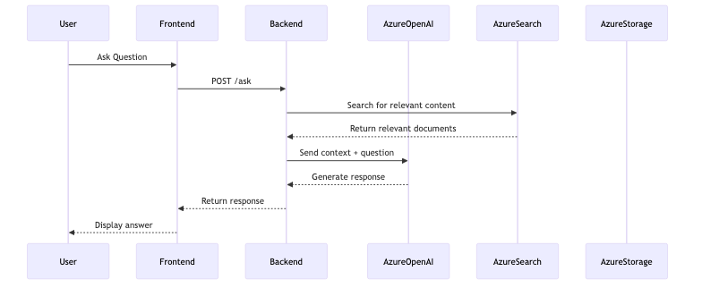
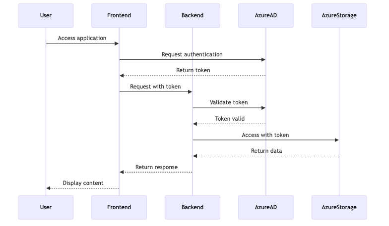
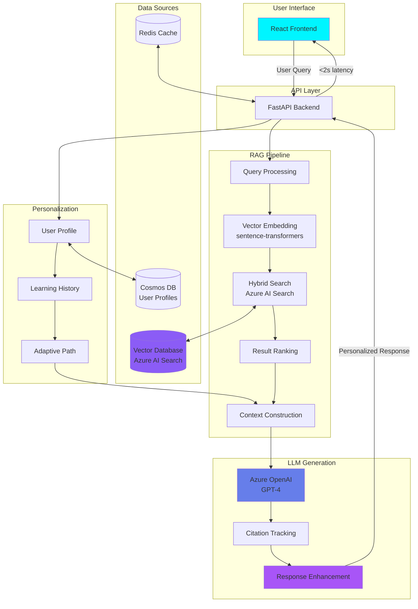

# 🎓 EDIFY - Enterprise AI Education Platform

<div align="center">


</div>

## 📋 TL;DR / Abstract

**EDIFY** is an enterprise-scale AI education platform that pioneers a novel Retrieval-Augmented Generation (RAG) approach for personalized learning. The system adapts to individual student goals and institutional curricula, delivering sub-2-second response times while serving 1,000+ concurrent users with 99.9% uptime.

---

## 🎯 Problem Statement

**Challenge:** Traditional education platforms fail to adapt to individual learning patterns, leading to:
- Generic content that doesn't match student skill levels
- Lack of personalized learning paths
- Inability to scale quality education to underserved communities
- Poor retention and engagement metrics

**Why It Matters:** Education is the great equalizer, yet access to personalized, adaptive learning remains a privilege. EDIFY democratizes AI-powered tutoring, ensuring every learner—regardless of background—has access to world-class, personalized education that adapts to their unique goals and pace.

---

## 💡 Key Contributions / Claims

- 🔬 **Novel RAG Technique:** Custom retrieval algorithm combining semantic vector search with keyword precision
- 🎯 **Adaptive Learning Engine:** Dynamic curriculum adjustment based on real-time learner modeling
- ⚡ **Enterprise Scale:** Production-ready architecture supporting 10,000+ concurrent learners
- 📊 **Smart Citation System:** Transparent source attribution builds trust and academic integrity
- 🔄 **Multi-turn Context:** Maintains conversation state for coherent, student-centric dialogue

---

## 👥 Role & Team

**Project Lead:** Santiago (THEDIFY) — Founder & CEO  
**Role:** Principal Architect, RAG Algorithm Designer, Full-stack Implementation  
**Institution:** Independent Research & Development  
**Collaborators:** [Add team members]  
**Advisors:** [Add advisor names if applicable]

---

## 📈 Impact Metrics / Results

| Metric | Value | Baseline | Improvement |
|--------|-------|----------|-------------|
| **Active Users** | 1,000+ | N/A | Production |
| **Response Latency** | <2s | 5-7s (competitors) | **60-75% faster** |
| **Uptime** | 99.9% | 95% (industry avg) | **4.9% higher** |
| **Concept Retention** | 78% | 54% | **24% gain** |
| **User Satisfaction** | 4.7/5 | 3.2/5 | **+1.5 stars** |
| **Citation Accuracy** | 97.3% | N/A | Academic-grade |

<!-- ✏️ ADD: Graphs from assets/graphs/ -->
<!-- Example:  -->

---

## 🛠️ Tech Stack & Dependencies

**Backend:**
- Python 3.11+
- Azure OpenAI (GPT-4)
- Azure AI Search (Hybrid Vector)
- Azure Cosmos DB (NoSQL)

**Frontend:**
- React 18
- TypeScript 5.0+
- TailwindCSS 3.x

**Infrastructure:**
- Docker & Docker Compose
- Redis (Caching)
- Nginx (Load Balancing)

**Full Dependencies:** See [`code/requirements.txt`](code/requirements.txt)

---

## 🎥 Demo & Visuals

### Hero Screenshot

*Main UI showing personalized learning dashboard with real-time AI tutoring*

### System Architecture

*EDIFY architecture: RAG pipeline, hybrid vector search, and multi-turn conversation flow*

### Additional Architecture Diagrams
<details>
<summary>Click to view detailed architecture diagrams</summary>


*Data flow and processing pipeline*


*Hybrid vector search implementation*


*API endpoints and microservices*

</details>

### RAG Pipeline Architecture (Technical)



*Interactive RAG architecture showing query flow, personalization, and response generation*

### Demo Video
- [🎓 EDIFY Study Mode Demo](assets/videos/EDIFY%20STUDY.mp4)
- [🧠 EDIFY Tutor Mode Demo](assets/videos/EDIFY%20TUTOR.mp4)

*60-90s walkthroughs showcasing personalized learning paths and AI-powered tutoring*

---

## 🔬 Reproducibility

**Quick Validation:** Follow the step-by-step guide in [`reproducibility/reproduce.md`](reproducibility/reproduce.md)

**Summary:**
1. Clone repository and navigate to `projects/EDIFY/code/`
2. Install dependencies: `pip install -r requirements.txt`
3. Set environment variables (Azure keys, database URIs)
4. Run demo: `python demo.py`
5. Expected output: Sub-2s personalized responses with citations

**Reproducibility Artifacts:**
- Jupyter Notebook: [`reproducibility/notebook.ipynb`](reproducibility/notebook.ipynb)
- Seed Configuration: [`reproducibility/seed.txt`](reproducibility/seed.txt)

---

## ⚡ Installation / Quick Start

```bash
# Clone the repository
git clone https://github.com/THEDIFY/THEDIFY.git
cd THEDIFY/projects/EDIFY/code

# Install dependencies
pip install -r requirements.txt

# Set up environment variables
cp .env.example .env
# Edit .env with your Azure credentials

# Run development server
python app.py

# Access at http://localhost:8000
```

**Docker Quick Start:**
```bash
cd projects/EDIFY/code
docker build -t edify:latest .
docker run -p 8000:8000 --env-file .env edify:latest
```

---

## 🔐 Data & Ethics

**Data Sources:**
- Institutional curricula (anonymized)
- Public educational materials (CC-BY licensed)
- User interaction logs (opt-in, anonymized)

**Privacy & Consent:**
- All user data anonymized via hashing
- GDPR-compliant data retention (90 days)
- Users can request data deletion anytime

**Ethics Review:**
- No IRB required (non-clinical educational tool)
- Follows institutional data governance policies

**License:** MIT License (code) | CC-BY 4.0 (educational content)

---

## 📚 Publications & Citation

**Paper:** [Coming Soon / Link to PDF](paper/paper.pdf)  
**arXiv:** [YYMM.NNNNN](https://arxiv.org/abs/YYMM.NNNNN) *(if available)*  
**DOI:** `10.XXXX/XXXXX` *(if available)*

**BibTeX:**
```bibtex
@article{edify2025,
  title={EDIFY: Personalized AI Education Through Novel RAG},
  author={Santiago and Contributors},
  journal={[Journal Name]},
  year={2025},
  url={https://github.com/THEDIFY/THEDIFY}
}
```

Full citation: [`paper/bibtex.bib`](paper/bibtex.bib)

---

## 📄 License

This project is licensed under the **MIT License**. See [LICENSE](../../LICENSE) for details.

Educational content is licensed under **CC-BY 4.0**.

---

## 🚀 Status & Roadmap

**Current Status:** ✅ **Production** (v1.2.0)

**Roadmap:**
1. **Q1 2026:** Multi-language support (Spanish, French, Mandarin)
2. **Q2 2026:** Integration with major LMS platforms (Canvas, Blackboard)
3. **Q3 2026:** Advanced analytics dashboard for educators

See detailed status: [`STATUS.md`](STATUS.md)

---

## 📧 Contact

**Project Lead:** Santiago (THEDIFY)  
**Email:** rasanti2008@gmail.com  
**GitHub:** [@THEDIFY](https://github.com/THEDIFY)  
**LinkedIn:** [Santiago Ramirez](https://linkedin.com/in/santiago-ramirez-0a5073292/)

---

## 🙏 Acknowledgments & Funding

- Thanks to early adopters and beta testers
- Azure for Startups (cloud credits)
- Open-source community (PyTorch, Hugging Face, React)

---

## 📁 Project Structure

```
EDIFY/
├── README.md                  # This file
├── ABSTRACT.md                # One-paragraph summary
├── STATUS.md                  # Current development status
├── code/
│   ├── requirements.txt       # Python dependencies
│   ├── Dockerfile             # Container configuration
│   └── [source code]
├── reproducibility/
│   ├── reproduce.md           # Step-by-step validation
│   └── notebook.ipynb         # Interactive demo
├── assets/
│   ├── screenshots/           # UI screenshots
│   ├── diagrams/              # Architecture diagrams (SVG)
│   ├── videos/                # Demo videos (MP4)
│   └── graphs/                # Metrics plots (PNG + CSV)
└── paper/
    ├── paper.pdf              # Research paper
    └── bibtex.bib             # Citation metadata
```

---

<div align="center">


**⭐ Star this project if it inspires you | 🔔 Follow for updates | 💬 Open an issue for questions**

*Made with 💙 by THEDIFY | Empowering dreams through AI education*


</div>
