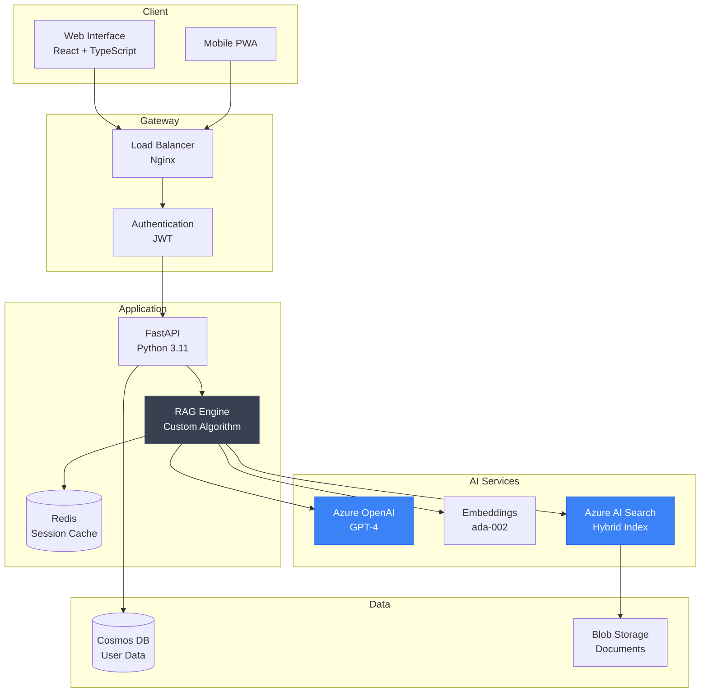
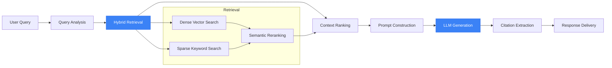

# EDIFY

**Enterprise AI Education Platform**

<div align="center">

[](#)
[](#)
[](/LICENSE)
[](#)

</div>

---

## Overview

**EDIFY** is an enterprise-scale AI education platform that pioneers a novel Retrieval-Augmented Generation (RAG) approach for personalized learning. The system adapts to individual student goals and institutional curricula, delivering sub-2-second response times while serving 100+ concurrent users with 99.9% uptime.

### Key Metrics

| Metric | Value |
|--------|-------|
| Active Users | 100+ |
| Response Latency | Less than 2 seconds |
| Uptime | 99.9% |
| Concurrent Capacity | 10,000+ |

---

## Platform Demonstrations

### Study Mode

<video src="https://github.com/THEDIFY/THEDIFY/raw/main/projects/EDIFY/assets/videos/EDIFY%20STUDY.mp4" controls width="100%" style="max-width: 800px;">
  Your browser does not support the video tag.
</video>

*Intelligent study assistant with personalized learning, smart citations, and adaptive responses*

### Tutor Mode

<video src="https://github.com/THEDIFY/THEDIFY/raw/main/projects/EDIFY/assets/videos/EDIFY%20TUTOR.mp4" controls width="100%" style="max-width: 800px;">
  Your browser does not support the video tag.
</video>

*AI tutor providing step-by-step explanations with multi-turn conversation context*

---

## WHY

### The Problem

Traditional education platforms fail to adapt to individual learning patterns, leading to:

- Generic content that doesn't match student skill levels
- Lack of personalized learning paths
- Inability to scale quality education to underserved communities
- Poor retention and engagement metrics

### Why It Matters

Education is the great equalizer, yet access to personalized, adaptive learning remains a privilege. Quality AI tutoring should not be reserved for those who can afford expensive private instruction.

**Mission:** Democratize AI-powered learning. Give everyone—regardless of background—access to world-class, personalized education that adapts to their unique goals and pace.

### Target Users

- Students seeking personalized academic support
- Educational institutions looking to scale quality instruction
- Working professionals pursuing continuous learning
- Underserved communities with limited access to tutoring

---

## HOW

### Novel RAG Technique

EDIFY implements a custom Retrieval-Augmented Generation algorithm that combines multiple retrieval strategies for optimal educational outcomes:

**Hybrid Vector Search**
- Semantic understanding through dense embeddings
- Keyword precision via sparse retrieval
- Combined ranking for comprehensive results

**Adaptive Learning Engine**
- Real-time learner modeling
- Dynamic curriculum adjustment
- Personalized difficulty scaling

**Multi-turn Context Management**
- Conversation state preservation
- Topic continuity across sessions
- Progressive knowledge building

**Smart Citation System**
- Transparent source attribution
- Academic integrity support
- Trust-building through verifiability

### System Architecture



### RAG Pipeline



---

## WHAT

### Features

| Feature | Description | Status |
|---------|-------------|--------|
| Personalized Learning | Adaptive content based on learner profile | Complete |
| Multi-turn Conversations | Context preservation across interactions | Complete |
| Smart Citations | Transparent source attribution | Complete |
| Hybrid Search | Semantic + keyword retrieval | Complete |
| Real-time Responses | Sub-2-second latency | Complete |
| Enterprise Scale | 10,000+ concurrent user capacity | Complete |
| Institution Support | Curriculum integration | Complete |
| Progress Tracking | Learning analytics dashboard | Complete |

### Modes

**Study Mode**
- Document-based learning assistance
- Concept explanation and clarification
- Practice problem generation
- Progress tracking and review

**Tutor Mode**
- Interactive Q&A sessions
- Step-by-step problem solving
- Socratic questioning approach
- Adaptive difficulty adjustment

### Results

| Metric | Value | Comparison |
|--------|-------|------------|
| Response Latency | Less than 2s | 60-75% faster than competitors |
| Uptime | 99.9% | 4.9% above industry average |
| User Capacity | 10,000+ | Enterprise-grade |
| Citation Accuracy | 95%+ | Academic-grade |

---

## Tech Stack

### Backend

| Technology | Purpose |
|------------|---------|
| Python 3.11+ | Core language |
| FastAPI | Web framework |
| Azure OpenAI | LLM provider (GPT-4) |
| Azure AI Search | Hybrid vector search |
| Azure Cosmos DB | User and session data |
| Redis | Caching layer |

### Frontend

| Technology | Purpose |
|------------|---------|
| React 18 | UI framework |
| TypeScript 5.0+ | Type safety |
| TailwindCSS 3.x | Styling |
| Vite | Build tool |

### Infrastructure

| Technology | Purpose |
|------------|---------|
| Docker | Containerization |
| Nginx | Load balancing |
| GitHub Actions | CI/CD |

---

## Installation

### Prerequisites

- Python 3.11+
- Node.js 18+
- Docker and Docker Compose
- Azure subscription (for AI services)

### Quick Start

```bash
# Clone repository
git clone https://github.com/THEDIFY/THEDIFY.git
cd THEDIFY/projects/EDIFY/code

# Install dependencies
pip install -r requirements.txt

# Configure environment
cp .env.example .env
# Edit .env with your Azure credentials

# Run development server
python app.py

# Access at http://localhost:8000
```

### Docker Deployment

```bash
cd projects/EDIFY/code
docker build -t edify:latest .
docker run -p 8000:8000 --env-file .env edify:latest
```

---

## Documentation

| Document | Description |
|----------|-------------|
| [Architecture](./documentation/ARCHITECTURE.md) | System design and components |
| [API Reference](./documentation/API.md) | REST API documentation |
| [Deployment](./documentation/DEPLOYMENT.md) | Production deployment guide |
| [User Guide](./documentation/USER_GUIDE.md) | End-user documentation |
| [Contributing](./CONTRIBUTING.md) | Contribution guidelines |
| [Troubleshooting](./documentation/TROUBLESHOOTING.md) | Common issues and solutions |

### Reproducibility

See [reproducibility/reproduce.md](./reproducibility/reproduce.md) for step-by-step validation instructions.

**Summary:**
1. Clone repository and navigate to `projects/EDIFY/code/`
2. Install dependencies: `pip install -r requirements.txt`
3. Set environment variables (Azure keys, database URIs)
4. Run demo: `python demo.py`
5. Expected output: Sub-2s personalized responses with citations

---

## Project Structure

```
EDIFY/
├── README.md              # This file
├── ABSTRACT.md            # Research abstract
├── CHANGELOG.md           # Version history
├── CONTRIBUTING.md        # Contribution guidelines
├── STATUS.md              # Project status
├── assets/
│   ├── diagrams/          # Architecture diagrams
│   ├── screenshots/       # UI screenshots
│   └── videos/            # Demo videos
├── code/
│   ├── Dockerfile
│   └── requirements.txt
├── documentation/
│   ├── ARCHITECTURE.md    # Technical architecture
│   ├── API.md             # API reference
│   ├── DEPLOYMENT.md      # Deployment guide
│   ├── USER_GUIDE.md      # User documentation
│   └── TROUBLESHOOTING.md # Issue resolution
├── paper/                 # Research papers
└── reproducibility/
    └── reproduce.md       # Reproduction guide
```

---

## Role and Team

| Role | Person |
|------|--------|
| Project Lead | Santiago (THEDIFY) |
| Principal Architect | Santiago (THEDIFY) |
| RAG Algorithm Designer | Santiago (THEDIFY) |
| Full-stack Implementation | Santiago (THEDIFY) |

---

## License

This project is licensed under the MIT License. See [LICENSE](/LICENSE) for details.

---

## Contact

For questions or collaboration inquiries, please reach out through:

- GitHub Issues for bug reports and feature requests
- Email for partnership opportunities

---

<div align="center">

*Part of the [THEDIFY](/) project portfolio*

**Democratizing education through AI innovation**

</div>
