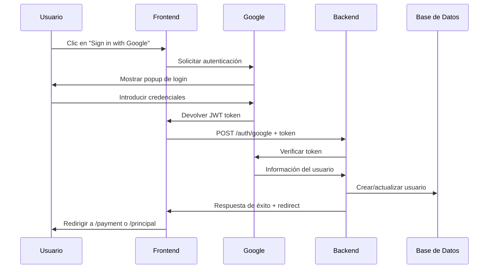

# 🔐 Google OAuth Setup Guide para EDIFY

Esta guía te ayudará a configurar Google OAuth para el sistema de autenticación de EDIFY.

## � Prerrequisitos

- Cuenta de Google
- Acceso a [Google Cloud Console](https://console.cloud.google.com)

## 🚀 Configuración Paso a Paso

### Paso 1: Crear un Proyecto en Google Cloud Console

1. Ve a [Google Cloud Console](https://console.cloud.google.com/)
2. Haz clic en el selector de proyectos (arriba a la izquierda)
3. Clic en "NEW PROJECT"
4. Nombre del proyecto: `edify-azure-app`
5. Clic en "CREATE"

### Paso 2: Habilitar APIs Necesarias

Ve a **APIs & Services** → **Library** y habilita:
- **Google+ API** (información básica del perfil)
- **People API** (acceso a datos del usuario)
- **Google Identity Services** (autenticación moderna)

### Paso 3: Configurar Pantalla de Consentimiento OAuth

Ve a **APIs & Services** → **OAuth consent screen**

**Configuración requerida:**
- **User Type**: `External` (para uso público)
- **App name**: `EDIFY Azure App`
- **User support email**: `tu-email@ejemplo.com`
- **App domain**: (opcional en desarrollo)
- **Developer contact information**: `tu-email@ejemplo.com`

**Scopes requeridos:**
- `.../auth/userinfo.email`
- `.../auth/userinfo.profile`
- `openid`

### Paso 4: Crear Client ID OAuth 2.0

Ve a **APIs & Services** → **Credentials** → **+ CREATE CREDENTIALS** → **OAuth 2.0 Client IDs**

**Configuración:**
- **Application type**: `Web application`
- **Name**: `EDIFY Web Client`

### Paso 5: Configurar URLs Autorizadas

**Authorized JavaScript origins**:
```
http://localhost:5173
http://localhost:50510
http://127.0.0.1:5173
http://127.0.0.1:50510
https://tu-dominio.azurewebsites.net
```

**Authorized redirect URIs**:
```
http://localhost:50510/auth/google/callback
http://127.0.0.1:50510/auth/google/callback
http://localhost:5173/auth/google/callback
http://127.0.0.1:5173/auth/google/callback
https://tu-dominio.azurewebsites.net/auth/google/callback
```

⚠️ **IMPORTANTE**: Agrega tanto `localhost` como `127.0.0.1` porque algunos navegadores/configuraciones pueden usar uno u otro.

### Paso 6: Obtener y Copiar Credenciales

Después de crear las credenciales, obtendrás:
- **Client ID**: `123456789-abcdefghijklmnop.apps.googleusercontent.com`
- **Client Secret**: `GOCSPX-abcdefghijklmnopqrstuvwxyz`

⚠️ **IMPORTANTE**: Guarda estas credenciales de forma segura.

## 🔑 Configuración de Variables de Entorno

### 1. Desarrollo Local (Docker)

Actualiza tu archivo `.env.docker`:

```bash
# Google OAuth Configuration (supports both localhost and 127.0.0.1)
GOOGLE_CLIENT_ID=tu-client-id-real.apps.googleusercontent.com
GOOGLE_CLIENT_SECRET=tu-client-secret-real
GOOGLE_REDIRECT_URI=http://localhost:50510/auth/google/callback
GOOGLE_REDIRECT_URI_ALT=http://127.0.0.1:50510/auth/google/callback
GOOGLE_OAUTH_ENABLED=true
DEVELOPMENT_MODE=true
```

### 2. Backend Development

Actualiza `app/backend/.env.development`:
```bash
# Google OAuth Configuration (supports both localhost and 127.0.0.1)
GOOGLE_CLIENT_ID=tu-client-id-real.apps.googleusercontent.com
GOOGLE_CLIENT_SECRET=tu-client-secret-real
GOOGLE_REDIRECT_URI=http://localhost:50510/auth/google/callback
GOOGLE_REDIRECT_URI_ALT=http://127.0.0.1:50510/auth/google/callback
GOOGLE_OAUTH_ENABLED=true
```

### 3. Verificar Configuración

Para verificar que todo esté configurado correctamente:

```bash
# En el directorio raíz del proyecto
./docker-start.sh

# Verificar que las variables estén cargadas
docker exec -it edify-backend-dev env | grep GOOGLE
```

Deberías ver algo como:
```
GOOGLE_CLIENT_ID=123456789-abcdefghijklmnop.apps.googleusercontent.com
GOOGLE_CLIENT_SECRET=GOCSPX-abcdefghijklmnopqrstuvwxyz
```

## 🚀 Pruebas

### En Desarrollo

1. **Con credenciales reales**:
   - Configura las variables de entorno reales
   - Los usuarios podrán iniciar sesión con sus cuentas de Google reales

2. **Sin credenciales (modo desarrollo)**:
   - Si no configuras `GOOGLE_CLIENT_ID`, se creará un usuario mock
   - Email: `google_user@example.com`
   - Útil para desarrollo sin configuración

### Verificar Funcionamiento

1. Ve a http://localhost:5173/login
2. Haz clic en el botón de Google
3. Deberías ver:
   - **Con credenciales reales**: Popup de Google OAuth
   - **Sin credenciales**: Login automático con usuario mock

## 🔧 Troubleshooting

### Error: "Invalid Client ID"
- Verifica que el `GOOGLE_CLIENT_ID` sea correcto
- Asegúrate de que el dominio esté en **Authorized JavaScript origins**

### Error: "Redirect URI mismatch"
- Verifica que la URL de callback esté en **Authorized redirect URIs**
- El formato debe ser exacto: `http://localhost:50510/auth/google/callback`

### Botón de Google no aparece
- Revisa la consola del navegador para errores
- Verifica que el script de Google se cargue correctamente
- Comprueba la configuración del endpoint `/config/google`

## 🔧 Troubleshooting Común

### Error: "redirect_uri_mismatch"
**Descripción**: El URI de redirección no está autorizado en Google Cloud Console.

**Solución**:
1. Ve a [Google Cloud Console](https://console.cloud.google.com/)
2. Navega a **APIs & Services > Credentials**
3. Encuentra tu OAuth 2.0 Client ID
4. En **Authorized redirect URIs**, asegúrate de tener:
   ```
   http://localhost:50510/auth/google/callback
   http://127.0.0.1:50510/auth/google/callback
   ```
5. En **Authorized JavaScript origins**, asegúrate de tener:
   ```
   http://localhost:50510
   http://127.0.0.1:50510
   ```

⚠️ **IMPORTANTE**: Algunos navegadores/configuraciones usan `127.0.0.1` en lugar de `localhost`, por eso ambos son necesarios.

### Error: "unauthorized_client"
- Verifica que el Client ID sea correcto
- Asegúrate de que la pantalla de consentimiento esté configurada
- Verifica que las APIs necesarias estén habilitadas

### Error: "access_denied"
- El usuario canceló el proceso de autorización
- Verifica los scopes solicitados

## 📱 Flujo de Autenticación



## ✅ Beneficios Implementados

1. **Autenticación Dual**: Email/password + Google OAuth
2. **Registro Automático**: Usuarios de Google se crean automáticamente
3. **Integración con Pagos**: Usuarios de Google también van a la página de pago
4. **Modo Desarrollo**: Funciona sin configuración para desarrollo
5. **Seguridad**: Verificación de tokens del lado del servidor
6. **UX Mejorado**: Botones nativos de Google con diseño coherente

## 🎯 Próximos Pasos

Si quieres agregar más proveedores OAuth:

1. **Facebook**: Similar proceso con Facebook Developer Console
2. **GitHub**: Usar GitHub OAuth Apps
3. **Microsoft**: Azure AD / Microsoft Account
4. **Apple**: Sign in with Apple (para iOS/web)

Cada uno seguiría un patrón similar:
- Endpoint `/auth/{provider}`
- JavaScript específico del proveedor
- Verificación de tokens en el backend
- Integración con la base de datos existente

## 🔒 Consideraciones de Seguridad

- **NUNCA** compartas tu `client_secret` públicamente
- Usa variables de entorno para credenciales sensibles
- En producción, restringe dominios autorizados
- Revisa regularmente los accesos OAuth en tu cuenta Google

## 📋 Checklist de Configuración

- [ ] Proyecto creado en Google Cloud Console
- [ ] APIs habilitadas (Google+ API, People API)
- [ ] Pantalla de consentimiento configurada
- [ ] Client ID OAuth 2.0 creado
- [ ] URLs autorizadas configuradas
- [ ] Variables de entorno actualizadas en `.env.docker`
- [ ] Variables de entorno actualizadas en `.env.development`
- [ ] Configuración verificada con Docker

## 🚀 Próximos Pasos

Una vez completada esta configuración:

1. **Reinicia Docker**: `./docker-start.sh`
2. **Verifica el backend**: http://localhost:50510/health
3. **Prueba Google OAuth**: http://localhost:5173 → botón "Sign in with Google"

---

**Nota**: Mantén este archivo seguro y no lo versiones en repositorios públicos.
