# GUIRA - System Architecture Documentation

<div align="center">


**Detailed Technical Architecture Guide**

</div>

---

## Table of Contents

1. [System Overview](#system-overview)
2. [Architectural Patterns](#architectural-patterns)
3. [Component Architecture](#component-architecture)
4. [Data Flow Design](#data-flow-design)
5. [AI Model Architecture](#ai-model-architecture)
6. [Geospatial System Design](#geospatial-system-design)
7. [API Architecture](#api-architecture)
8. [Database Schema](#database-schema)
9. [Deployment Architecture](#deployment-architecture)
10. [Security Architecture](#security-architecture)
11. [Scalability Considerations](#scalability-considerations)
12. [Performance Optimization](#performance-optimization)

---

## System Overview

GUIRA employs a microservices-based architecture with five specialized AI models working in parallel to provide comprehensive wildfire monitoring and prediction capabilities.

### High-Level Architecture

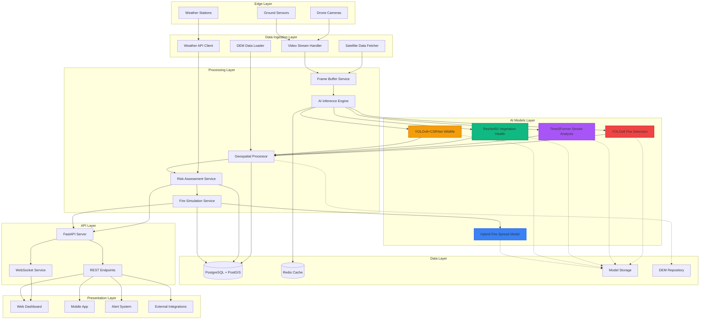

### Key Architectural Decisions

**1. Microservices Architecture**
- **Rationale:** Enables independent scaling and deployment of components
- **Trade-offs:** Increased complexity vs. flexibility and maintainability
- **Implementation:** Docker containers with Kubernetes orchestration

**2. Parallel AI Processing**
- **Rationale:** Multiple models process frames simultaneously for comprehensive analysis
- **Trade-offs:** Higher computational cost vs. complete environmental awareness
- **Implementation:** GPU parallelization with batch processing

**3. Event-Driven Communication**
- **Rationale:** Decouples services and enables real-time responsiveness
- **Trade-offs:** Eventual consistency vs. immediate processing
- **Implementation:** Redis pub/sub with Celery task queue

---

## Architectural Patterns

### Design Patterns Used

#### 1. **Pipeline Pattern**
The system implements a pipeline pattern for sequential data processing:

```python
Frame → Detection → Projection → Assessment → Prediction → Alert
```

**Benefits:**
- Clear separation of concerns
- Easy to add/remove stages
- Parallel processing opportunities

#### 2. **Strategy Pattern**
Multiple detection strategies for different scenarios:

```python
class DetectionStrategy(ABC):
    @abstractmethod
    def detect(self, image):
        pass

class FireDetectionStrategy(DetectionStrategy):
    def detect(self, image):
        return yolov8_model.predict(image)

class SmokeDetectionStrategy(DetectionStrategy):
    def detect(self, image_sequence):
        return timesformer_model.predict(image_sequence)
```

**Benefits:**
- Swappable algorithms
- Easy testing and benchmarking
- Model versioning support

#### 3. **Observer Pattern**
Alert system observers monitor risk assessment changes:

```python
class RiskAssessmentSubject:
    def __init__(self):
        self._observers = []
    
    def attach(self, observer):
        self._observers.append(observer)
    
    def notify(self, risk_data):
        for observer in self._observers:
            observer.update(risk_data)
```

**Benefits:**
- Loose coupling between components
- Multiple alert channels
- Easy to add new notification methods

#### 4. **Factory Pattern**
Model factory for creating different AI model instances:

```python
class ModelFactory:
    @staticmethod
    def create_model(model_type, config):
        if model_type == "fire_detection":
            return FireDetectionModel(config)
        elif model_type == "smoke_detection":
            return SmokeDetectionModel(config)
        # ... more models
```

**Benefits:**
- Centralized model creation
- Configuration management
- Easy to extend with new models

---

## Component Architecture

### 1. Video Processing Pipeline

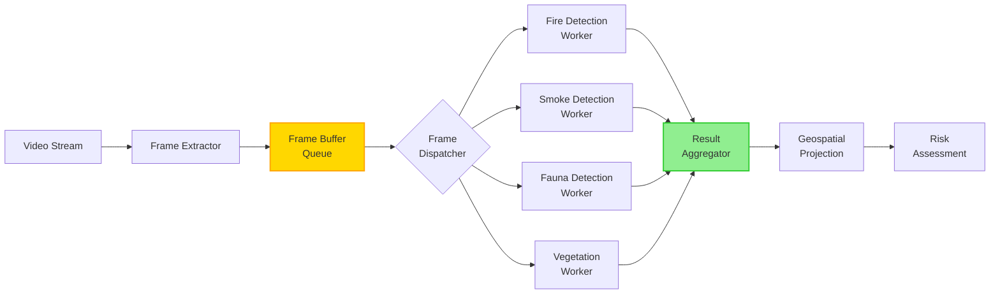

**Frame Extractor:**
- Reads video at configurable frame rate (default: 30 FPS)
- Handles multiple stream formats (RTMP, HLS, MP4)
- Implements frame buffering for temporal models

**Frame Buffer Queue:**
- Redis-based FIFO queue
- Configurable buffer size (default: 30 frames)
- Supports temporal sequence extraction

**Model Workers:**
- Independent Celery workers per model
- GPU-accelerated inference
- Batch processing for efficiency

### 2. AI Inference Engine

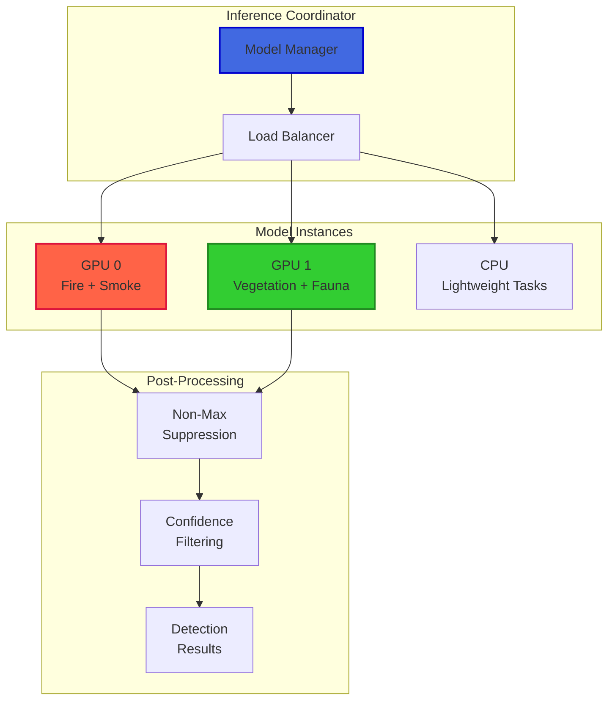

**Model Manager Responsibilities:**
- Model loading and initialization
- GPU memory management
- Batch size optimization
- Fallback to CPU if GPU unavailable

**Load Balancer:**
- Distributes inference tasks across GPUs
- Monitors GPU utilization
- Dynamic batch sizing

### 3. Geospatial Processing System

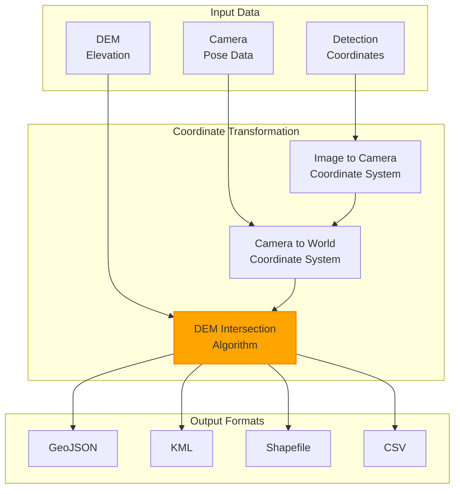

**Transformation Pipeline:**

1. **Image to Camera Coordinates:**
   ```python
   X_camera = (x_pixel - cx) / fx
   Y_camera = (y_pixel - cy) / fy
   Z_camera = 1  # normalized
   ```

2. **Camera to World Coordinates:**
   ```python
   [X_world]   [R | t]   [X_camera]
   [Y_world] = [--|--] * [Y_camera]
   [Z_world]   [0 | 1]   [Z_camera]
   ```

3. **DEM Intersection:**
   - Ray-casting from camera through pixel
   - Intersection with terrain surface
   - Accurate ground position

---

## Data Flow Design

### Real-Time Processing Flow

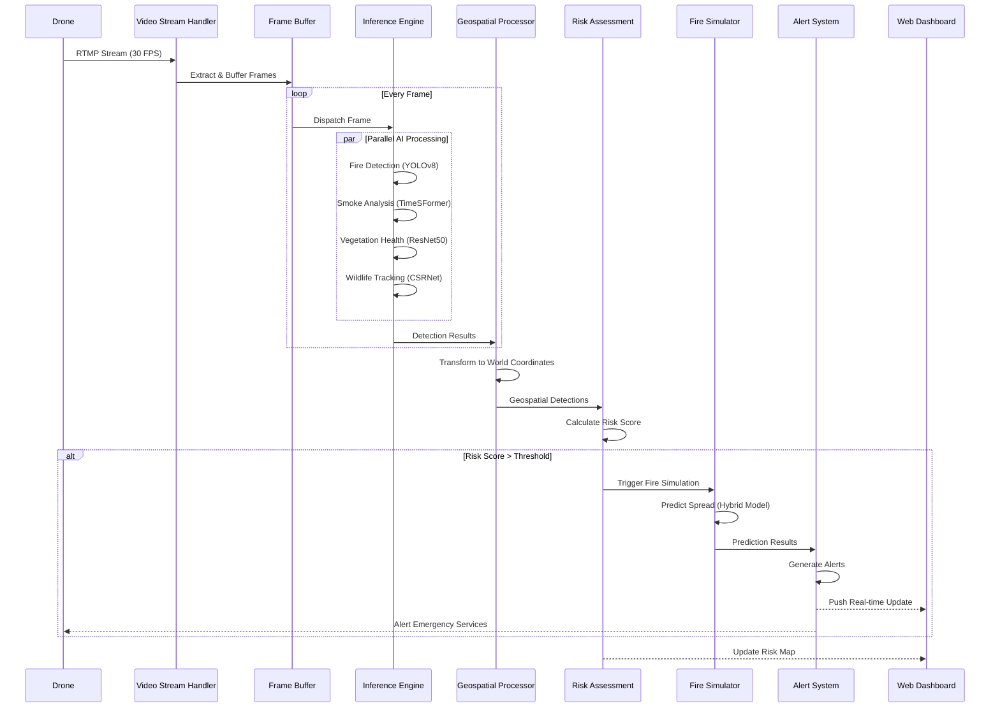

### Batch Processing Flow

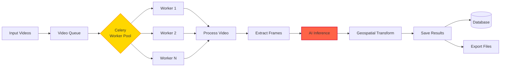

---

## AI Model Architecture

### 1. YOLOv8 Fire Detection

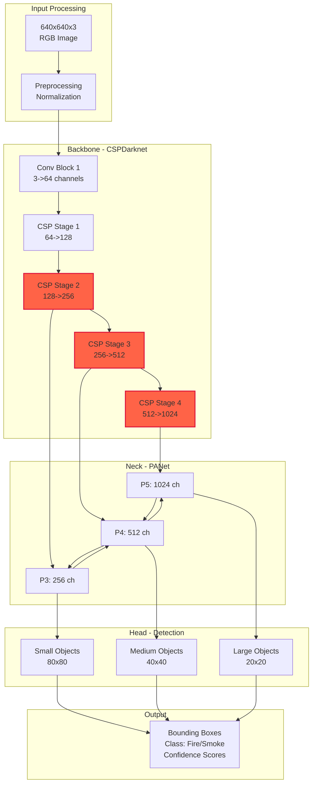

**Key Features:**
- **Multi-scale detection:** Detects fires at various distances
- **CSP connections:** Reduces computation while maintaining accuracy
- **PANet fusion:** Combines features from different scales

### 2. TimeSFormer Smoke Detection

```mermaid
graph LR
    subgraph "Input"
        I[8 Frames<br/>224x224x3] --> P[Patch<br/>Embedding]
    end
    
    subgraph "Transformer Encoder"
        P --> T1[Temporal<br/>Attention 1]
        T1 --> S1[Spatial<br/>Attention 1]
        S1 --> T2[Temporal<br/>Attention 2]
        T2 --> S2[Spatial<br/>Attention 2]
        S2 --> TN[... x12 blocks]
    end
    
    subgraph "Classification"
        TN --> GAP[Global Average<br/>Pooling]
        GAP --> FC[Fully Connected<br/>768 -> 2]
        FC --> SM[Softmax]
    end
    
    subgraph "Output"
        SM --> O[Smoke: Yes/No<br/>Confidence Score]
    end
    
    style T1 fill:#A855F7,stroke:#9333EA,stroke-width:2px
    style T2 fill:#A855F7,stroke:#9333EA,stroke-width:2px
```

**Divided Space-Time Attention:**
- Temporal attention across frames
- Spatial attention within frames
- Efficient computation vs. full 3D attention

### 3. ResNet50 + VARI Vegetation Health

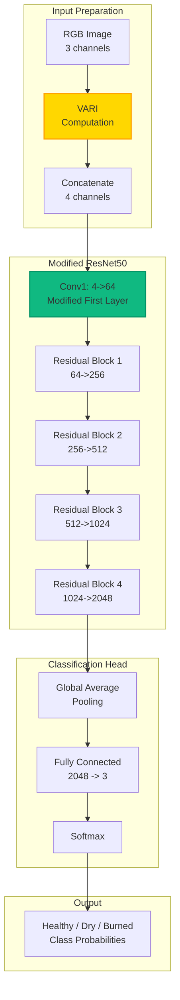

**VARI Enhancement:**
- Additional spectral information
- Sensitive to vegetation health
- Improves classification accuracy

### 4. Fire Spread Hybrid Model

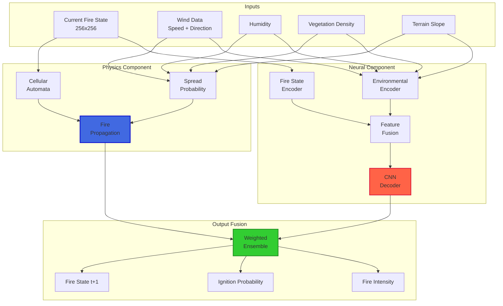

**Hybrid Approach:**
- **Physics:** Interpretable, based on fire behavior science
- **Neural:** Data-driven, captures complex patterns
- **Ensemble:** Combines strengths of both approaches

---

## Geospatial System Design

### Coordinate Transformation Pipeline

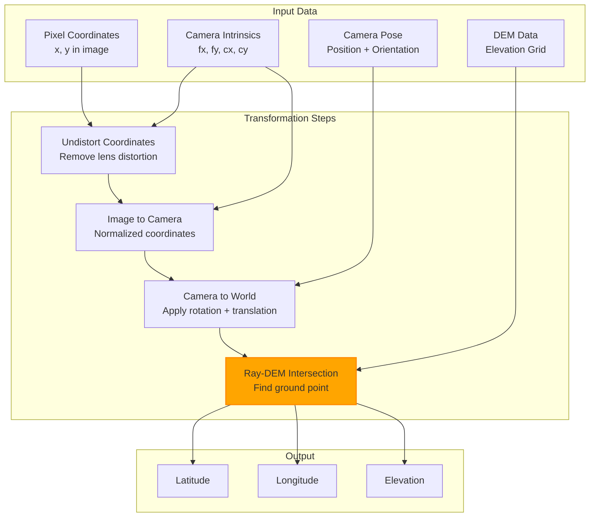

### DEM Integration

**Digital Elevation Model Processing:**

1. **DEM Loading:**
   - GeoTIFF format support
   - 30m resolution (SRTM/USGS)
   - Spatial indexing for fast lookup

2. **Ray-Terrain Intersection:**
   ```python
   def intersect_ray_dem(ray_origin, ray_direction, dem):
       # Step along ray until terrain intersection
       step_size = 1.0  # meters
       max_distance = 10000  # meters
       
       for distance in range(0, max_distance, step_size):
           point = ray_origin + distance * ray_direction
           terrain_height = dem.get_elevation(point.lat, point.lon)
           
           if point.elevation <= terrain_height:
               return point  # Intersection found
       
       return None  # No intersection
   ```

3. **Accuracy Optimization:**
   - Binary search for precise intersection
   - Bilinear interpolation of DEM values
   - Error correction for GPS/IMU noise

---

## API Architecture

### RESTful API Design

```mermaid
graph TB
    subgraph "API Gateway"
        AG[FastAPI<br/>Application]
    end
    
    subgraph "Routers"
        R1[/detection<br/>Fire & Smoke]
        R2[/vegetation<br/>Health Monitoring]
        R3[/fauna<br/>Wildlife Tracking]
        R4[/simulation<br/>Fire Spread]
        R5[/alerts<br/>Alert Management]
        R6[/maps<br/>Geospatial Data]
    end
    
    subgraph "Services"
        S1[Detection<br/>Service]
        S2[Vegetation<br/>Service]
        S3[Fauna<br/>Service]
        S4[Simulation<br/>Service]
        S5[Alert<br/>Service]
        S6[Mapping<br/>Service]
    end
    
    subgraph "Data Access"
        D1[(PostgreSQL)]
        D2[(Redis)]
        D3[File Storage]
    end
    
    AG --> R1
    AG --> R2
    AG --> R3
    AG --> R4
    AG --> R5
    AG --> R6
    
    R1 --> S1
    R2 --> S2
    R3 --> S3
    R4 --> S4
    R5 --> S5
    R6 --> S6
    
    S1 --> D1
    S1 --> D2
    S2 --> D1
    S3 --> D1
    S4 --> D1
    S5 --> D1
    S5 --> D2
    S6 --> D1
    S6 --> D3
    
    style AG fill:#009688,stroke:#00796B,stroke-width:2px
```

### API Endpoints

**Detection Endpoints:**
```
POST   /api/v1/detection/fire          - Detect fire in image
POST   /api/v1/detection/smoke         - Analyze smoke in video
POST   /api/v1/detection/batch         - Batch processing
GET    /api/v1/detection/{id}          - Get detection results
```

**Vegetation Endpoints:**
```
POST   /api/v1/vegetation/analyze      - Analyze vegetation health
GET    /api/v1/vegetation/history      - Get historical data
GET    /api/v1/vegetation/risk-zones   - Get high-risk areas
```

**Simulation Endpoints:**
```
POST   /api/v1/simulation/predict      - Predict fire spread
GET    /api/v1/simulation/{id}         - Get simulation results
GET    /api/v1/simulation/parameters   - Get simulation config
```

**WebSocket Endpoints:**
```
WS     /ws/live-feed                   - Real-time detection stream
WS     /ws/alerts                      - Alert notifications
WS     /ws/simulation                  - Live simulation updates
```

---

## Database Schema

### PostgreSQL + PostGIS Schema

```sql
-- Detection Results Table
CREATE TABLE detections (
    id SERIAL PRIMARY KEY,
    timestamp TIMESTAMPTZ NOT NULL,
    detection_type VARCHAR(50) NOT NULL,  -- fire, smoke, fauna, vegetation
    confidence FLOAT NOT NULL,
    location GEOGRAPHY(POINT, 4326),
    bounding_box GEOMETRY(POLYGON, 4326),
    metadata JSONB,
    created_at TIMESTAMPTZ DEFAULT NOW()
);

CREATE INDEX idx_detections_location ON detections USING GIST(location);
CREATE INDEX idx_detections_timestamp ON detections(timestamp);
CREATE INDEX idx_detections_type ON detections(detection_type);

-- Fire Events Table
CREATE TABLE fire_events (
    id SERIAL PRIMARY KEY,
    start_time TIMESTAMPTZ NOT NULL,
    last_updated TIMESTAMPTZ NOT NULL,
    status VARCHAR(20) NOT NULL,  -- active, contained, extinguished
    perimeter GEOMETRY(POLYGON, 4326),
    severity INTEGER CHECK (severity >= 1 AND severity <= 5),
    estimated_area FLOAT,  -- square meters
    metadata JSONB
);

CREATE INDEX idx_fire_events_perimeter ON fire_events USING GIST(perimeter);

-- Risk Zones Table
CREATE TABLE risk_zones (
    id SERIAL PRIMARY KEY,
    zone_name VARCHAR(100),
    geometry GEOMETRY(POLYGON, 4326),
    risk_level INTEGER CHECK (risk_level >= 1 AND risk_level <= 5),
    vegetation_type VARCHAR(50),
    last_assessment TIMESTAMPTZ,
    factors JSONB
);

CREATE INDEX idx_risk_zones_geometry ON risk_zones USING GIST(geometry);

-- Fire Spread Predictions Table
CREATE TABLE fire_predictions (
    id SERIAL PRIMARY KEY,
    fire_event_id INTEGER REFERENCES fire_events(id),
    prediction_time TIMESTAMPTZ NOT NULL,
    time_offset INTEGER,  -- minutes into future
    predicted_perimeter GEOMETRY(POLYGON, 4326),
    confidence FLOAT,
    environmental_conditions JSONB
);

-- Alerts Table
CREATE TABLE alerts (
    id SERIAL PRIMARY KEY,
    alert_type VARCHAR(50) NOT NULL,
    severity INTEGER CHECK (severity >= 1 AND severity <= 5),
    location GEOGRAPHY(POINT, 4326),
    affected_area GEOMETRY(POLYGON, 4326),
    message TEXT,
    status VARCHAR(20) DEFAULT 'pending',
    created_at TIMESTAMPTZ DEFAULT NOW(),
    acknowledged_at TIMESTAMPTZ,
    resolved_at TIMESTAMPTZ
);

CREATE INDEX idx_alerts_location ON alerts USING GIST(location);
CREATE INDEX idx_alerts_created ON alerts(created_at);
```

### Redis Cache Structure

```
# Detection cache (TTL: 5 minutes)
detection:{id} -> JSON{
    "type": "fire",
    "confidence": 0.95,
    "location": [lat, lon],
    "timestamp": "2025-12-17T22:00:00Z"
}

# Frame buffer (FIFO queue)
frames:buffer -> QUEUE[frame1, frame2, ..., frameN]

# Model cache (TTL: 1 hour)
model:fire:predictions:{image_hash} -> JSON{...}

# Alert queue
alerts:pending -> QUEUE[alert1, alert2, ...]

# Session data (TTL: 1 day)
session:{session_id} -> JSON{...}
```

---

## Deployment Architecture

### Container Orchestration

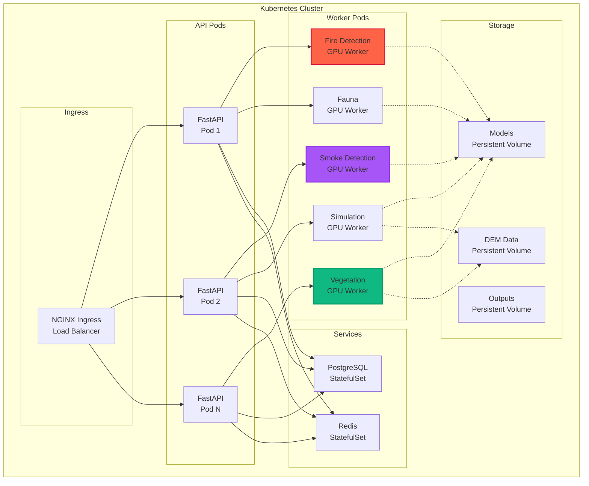

### Cloud Deployment (Azure)

```yaml
# Azure Resources
Resource Group: guira-production
  
Compute:
  - AKS Cluster (3 nodes)
    - Standard_NC12s_v3 (GPU nodes)
    - Standard_D8s_v3 (CPU nodes)
  
Storage:
  - Azure Blob Storage (model weights)
  - Azure Files (shared data)
  - Premium SSD (databases)
  
Database:
  - Azure Database for PostgreSQL
    - PostGIS extension enabled
    - Geo-replication
  
Cache:
  - Azure Cache for Redis
    - Standard tier
    - Persistence enabled
  
Networking:
  - Application Gateway
  - Virtual Network
  - Private Endpoints
```

---

## Security Architecture

### Authentication & Authorization

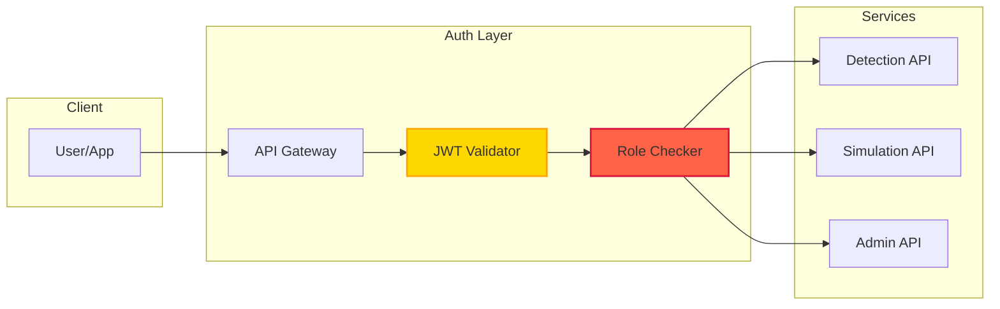

**Security Measures:**

1. **API Authentication:**
   - JWT tokens with RS256 signing
   - Token expiration: 1 hour
   - Refresh tokens: 7 days

2. **Role-Based Access Control:**
   ```yaml
   Roles:
     - admin: Full system access
     - operator: Detection and simulation
     - viewer: Read-only access
     - api_client: Programmatic access
   ```

3. **Data Encryption:**
   - TLS 1.3 for data in transit
   - AES-256 for data at rest
   - Field-level encryption for sensitive data

4. **Network Security:**
   - Private subnets for databases
   - Security groups with minimal access
   - DDoS protection
   - Rate limiting

---

## Scalability Considerations

### Horizontal Scaling

**Auto-scaling Policies:**

```yaml
API Pods:
  Min replicas: 2
  Max replicas: 10
  Target CPU: 70%
  Target Memory: 80%
  Scale up: +2 pods when threshold exceeded for 2 min
  Scale down: -1 pod when under threshold for 5 min

GPU Workers:
  Min replicas: 1
  Max replicas: 5
  Target GPU: 85%
  Scale based on queue length
```

### Vertical Scaling

**Resource Allocation:**

```yaml
API Pod:
  CPU: 2-4 cores
  Memory: 4-8 GB
  
Fire Detection Worker:
  CPU: 4 cores
  Memory: 16 GB
  GPU: 1x NVIDIA T4/V100
  
Smoke Detection Worker:
  CPU: 4 cores
  Memory: 24 GB
  GPU: 1x NVIDIA V100
```

### Performance Optimization

**Optimization Strategies:**

1. **Model Optimization:**
   - TensorRT for inference acceleration
   - ONNX runtime for cross-platform
   - Quantization (FP16/INT8)

2. **Caching:**
   - Redis for frequently accessed data
   - CDN for static assets
   - Model prediction caching

3. **Database Optimization:**
   - Read replicas for queries
   - Connection pooling
   - Spatial indexing
   - Query optimization

4. **Batch Processing:**
   - Group similar requests
   - Dynamic batch sizing
   - Asynchronous processing

---

## Technology Decisions & Trade-offs

### Key Decisions

**1. PyTorch over TensorFlow**
- ✅ More flexible for research
- ✅ Better debugging experience
- ✅ Strong community support
- ❌ Slower deployment historically (improved with TorchScript)

**2. PostgreSQL + PostGIS over MongoDB**
- ✅ Strong geospatial capabilities
- ✅ ACID compliance
- ✅ Complex query support
- ❌ Requires careful schema design

**3. FastAPI over Flask/Django**
- ✅ Built-in async support
- ✅ Automatic API documentation
- ✅ Type hints and validation
- ❌ Newer ecosystem

**4. Kubernetes over Docker Swarm**
- ✅ Industry standard
- ✅ Rich ecosystem
- ✅ Better scaling capabilities
- ❌ Higher complexity

---

<div align="center">

**Architecture Version:** 0.4.0  
**Last Updated:** December 2025  
**Status:** Research & Testing

*This architecture document is actively maintained and updated as the system evolves.*

</div>
