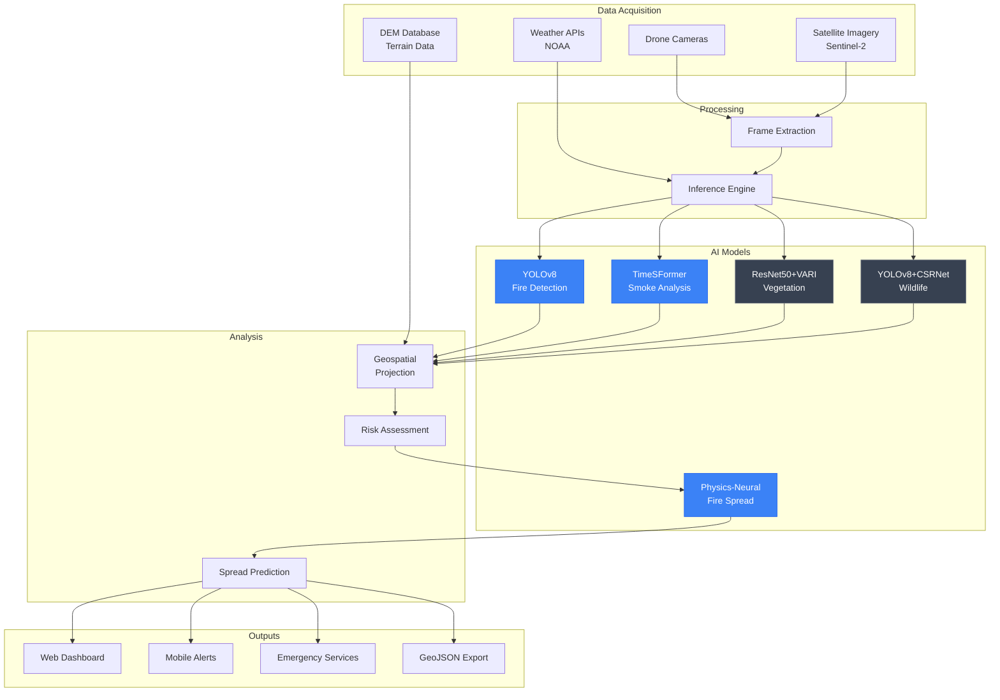
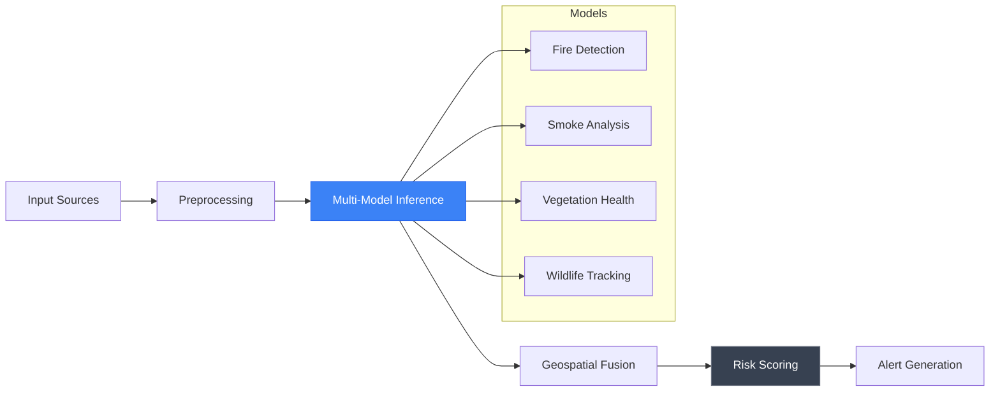
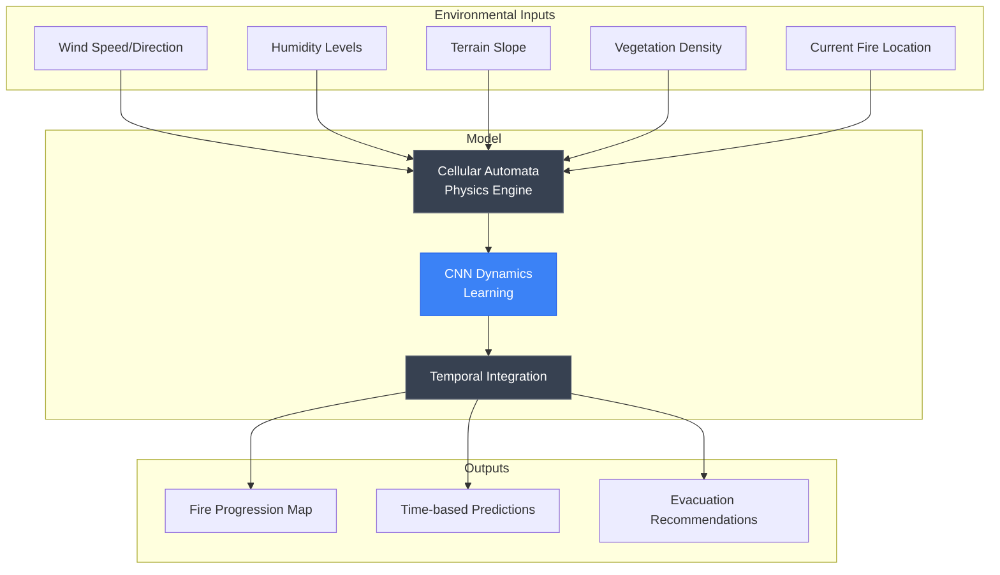

# GUIRA

**Wildfire Prevention and Disaster AI System**

*Geospatial Unified Intelligence for Risk Assessment*

<div align="center">

[](#)
[](#)
[](/LICENSE)
[](#)

</div>

---

## Overview

**GUIRA** is an advanced multi-modal AI platform that combines computer vision, geospatial intelligence, and physics-based modeling to predict and prevent wildfire disasters in underserved communities. By integrating five specialized deep learning models with real-time environmental data, GUIRA provides critical 30-60 minute advance warnings, enabling communities to prepare and evacuate safely.

### Key Metrics

| Metric | Value |
|--------|-------|
| Detection Accuracy | 95%+ |
| Early Warning Lead Time | 35 minutes |
| AI Models | 5 specialized |
| Spatial Resolution | 100m precision |

---

## WHY

### The Problem

The world faces a critical disparity in wildfire preparedness and response capabilities:

- **84% of wildfires** are detected only after significant spread has occurred
- **Rural communities** receive warnings 2-3 hours later than urban areas
- **Resource-limited areas** lack access to predictive technologies
- **Advanced systems** cost thousands, accessible only to wealthy regions
- **Preventable losses** of lives, homes, and ecosystems continue annually

### Why It Matters

Wildfires devastate small communities that lack resources for advanced warning systems. While wealthy regions invest in satellite monitoring and AI prediction, rural and underserved areas remain vulnerable—often receiving alerts only when it's too late to evacuate safely.

> *"By the time we saw the smoke, it was already too late. We lost everything."*
> — Small community resident, 2024 wildfire season

**Mission:** Use AI for environmental justice. Provide small communities with the same advanced fire prediction technology that wealthy areas have. Every life matters.

### Target Users

- Rural and underserved communities in high fire-risk zones
- Emergency response teams and fire departments
- Environmental protection agencies
- Wildlife conservation organizations
- Community safety coordinators

---

## HOW

### Multi-Modal AI Architecture

GUIRA employs a 5-model ensemble combining computer vision, temporal analysis, and geospatial intelligence:

**Fire Detection (YOLOv8)**
- Real-time fire identification from aerial imagery
- Multi-scale detection (small flames to large fires)
- Custom data augmentation for aerial perspectives
- 95%+ accuracy across diverse conditions

**Smoke Analysis (TimeSFormer)**
- Video transformer for temporal pattern recognition
- 8-frame sequence processing
- Fire spread direction prediction
- 30-60 minute advance warning capability

**Vegetation Health (ResNet50 + VARI)**
- Sentinel-2 satellite imagery analysis
- VARI index computation: `(Green - Red) / (Green + Red - Blue)`
- Classification: Healthy, Dry/Stressed, Burned/Dead
- High-risk zone identification

**Wildlife Tracking (YOLOv8 + CSRNet)**
- Species identification and population counting
- Behavioral analysis for early danger indicators
- Fauna displacement monitoring
- Health assessment classification

**Fire Spread Simulation**
- Cellular automata physics model
- CNN dynamics learning
- Environmental inputs: wind, humidity, slope, vegetation
- 30m spatial resolution predictions

### System Architecture



### Detection Pipeline



### Fire Spread Prediction



---

## WHAT

### Features

| Feature | Description | Status |
|---------|-------------|--------|
| Fire Detection | Real-time fire identification with YOLOv8 | Complete |
| Smoke Detection | Temporal video analysis with TimeSFormer | Complete |
| Vegetation Monitoring | Health assessment via ResNet50 + VARI | Complete |
| Wildlife Tracking | Fauna displacement detection with CSRNet | Complete |
| Spread Prediction | Physics-neural hybrid fire simulation | Complete |
| Geospatial Mapping | DEM-based coordinate projection | Complete |
| Mobile Alerts | Real-time community notification system | In Progress |
| Satellite Integration | Automated Sentinel-2 data processing | In Progress |

### Model Specifications

**YOLOv8 Fire Detection**
| Parameter | Value |
|-----------|-------|
| Architecture | CSPDarknet backbone |
| Input Size | 640x640 RGB |
| Output | Bounding boxes + confidence |
| Speed | 30 FPS on RTX 3080 |

**TimeSFormer Smoke Analysis**
| Parameter | Value |
|-----------|-------|
| Architecture | Vision Transformer |
| Input | 8-frame sequences, 224x224 |
| Temporal Modeling | Divided space-time attention |
| Prediction Window | 30-60 minutes |

**ResNet50 Vegetation Health**
| Parameter | Value |
|-----------|-------|
| Architecture | Modified ResNet50 (4-channel) |
| Input | RGB + VARI index |
| Classes | Healthy, Stressed, Burned |
| Data Source | Sentinel-2 multispectral |

**CSRNet Wildlife Tracking**
| Parameter | Value |
|-----------|-------|
| Detection | YOLOv8 species ID |
| Counting | CSRNet density estimation |
| Species | Deer, elk, bears, birds |
| Assessment | Binary health classification |

**Fire Spread Simulator**
| Parameter | Value |
|-----------|-------|
| Physics Model | Cellular automata |
| Neural Model | CNN dynamics |
| Resolution | 30m spatial |
| Inputs | Wind, humidity, slope, vegetation |

### Results

| Metric | Achievement |
|--------|-------------|
| Fire Detection Accuracy | 95%+ identification rate |
| Smoke Detection | Reliable in varied weather |
| Early Warning Time | 35 minutes average lead |
| Spatial Precision | 100m geospatial accuracy |
| Processing Speed | Real-time inference (30 FPS) |

---

## Tech Stack

### AI/ML

| Technology | Purpose |
|------------|---------|
| PyTorch | Deep learning framework |
| YOLOv8 | Object detection |
| TimeSFormer | Video analysis |
| ResNet50 | Image classification |
| CSRNet | Crowd/density counting |

### Geospatial

| Technology | Purpose |
|------------|---------|
| GDAL | Raster/vector processing |
| PostGIS | Spatial database |
| Rasterio | Geospatial raster I/O |
| Shapely | Geometric operations |

### Data Sources

| Source | Data Type |
|--------|-----------|
| Sentinel-2 | Multispectral satellite imagery |
| NOAA | Weather and climate data |
| USGS | Digital Elevation Models |
| Custom Drones | High-resolution aerial footage |

### Infrastructure

| Technology | Purpose |
|------------|---------|
| Docker | Containerization |
| NVIDIA CUDA | GPU acceleration |
| Flask/FastAPI | API services |
| PostgreSQL | Data storage |

---

## Installation

### Prerequisites

- Python 3.11+
- Docker and Docker Compose
- NVIDIA GPU with CUDA support
- PostGIS database

### Quick Start

```bash
# Clone repository
git clone https://github.com/THEDIFY/THEDIFY.git
cd THEDIFY/projects/GUIRA/code

# Install dependencies
pip install -r requirements.txt

# Configure environment
cp .env.example .env
# Edit .env with your configuration

# Initialize database
python scripts/init_db.py

# Run inference server
python app.py

# Access at http://localhost:8080
```

### Docker Deployment

```bash
cd projects/GUIRA/code
docker build -t guira:latest .
docker run -p 8080:8080 --gpus all guira:latest
```

---

## Documentation

| Document | Description |
|----------|-------------|
| [Architecture](./ARCHITECTURE.md) | System design and components |
| [Deployment](./DEPLOYMENT.md) | Production deployment guide |
| [Contributing](./CONTRIBUTING.md) | Contribution guidelines |
| [Troubleshooting](./TROUBLESHOOTING.md) | Common issues and solutions |

### Technical Guides

| Guide | Description |
|-------|-------------|
| [Fire Detection](./documentation/fire_detection.md) | YOLOv8 fire model details |
| [Smoke Detection](./documentation/smoke_detection.md) | TimeSFormer implementation |
| [Vegetation Health](./documentation/vegetation_health.md) | ResNet50 + VARI analysis |
| [Fauna Detection](./documentation/fauna_detection.md) | Wildlife tracking system |
| [Fire Spread](./documentation/fire_spread.md) | Simulation methodology |

### Reproducibility

See [reproducibility/reproduce.md](./reproducibility/reproduce.md) for step-by-step validation instructions.

---

## Project Structure

```
GUIRA/
├── README.md              # This file
├── ABSTRACT.md            # Research abstract
├── ARCHITECTURE.md        # Technical architecture
├── DEPLOYMENT.md          # Deployment guide
├── STATUS.md              # Project status
├── assets/
│   ├── diagrams/          # Architecture diagrams
│   ├── screenshots/       # UI screenshots
│   └── videos/            # Demo videos
├── code/
│   ├── Dockerfile
│   └── requirements.txt
├── documentation/
│   ├── fire_detection.md
│   ├── smoke_detection.md
│   ├── vegetation_health.md
│   ├── fauna_detection.md
│   ├── fire_spread.md
│   └── TECHNICAL_ALGORITHMS_GUIDE.md
├── paper/                 # Research papers
└── reproducibility/
    └── reproduce.md       # Reproduction guide
```

---

## Dataset Licenses

GUIRA uses publicly available datasets with appropriate licensing:

- [FLAME RGB License](./documentation/flame_rgb_license.md)
- [FLAME2 RGB-IR License](./documentation/flame2_rgb_ir_license.md)
- [SFGDN Fire License](./documentation/sfgdn_fire_license.md)
- [WAID Fauna License](./documentation/waid_fauna_license.md)

---

## License

This project is licensed under the MIT License. See [LICENSE](/LICENSE) for details.

---

## Contact

For questions or collaboration inquiries, please reach out through:

- GitHub Issues for bug reports and feature requests
- Email for partnership opportunities

---

<div align="center">

*Part of the [THEDIFY](/) project portfolio*

**Protecting communities through AI-powered disaster prevention**

</div>
