# GUIRA System Architecture

This document provides a detailed technical overview of GUIRA's architecture, component interactions, data flows, and design decisions.

## 📋 Table of Contents

- [System Overview](#system-overview)
- [Architectural Principles](#architectural-principles)
- [Component Diagrams](#component-diagrams)
- [Data Flow Architecture](#data-flow-architecture)
- [Model Pipeline](#model-pipeline)
- [Deployment Architecture](#deployment-architecture)
- [Database Schema](#database-schema)
- [Security Architecture](#security-architecture)
- [Scalability Considerations](#scalability-considerations)

---

## System Overview

GUIRA is a distributed multi-tier system designed for real-time wildfire detection, prediction, and risk assessment.

**Core Architecture:**
- **Presentation Layer:** Web dashboard, mobile apps, API endpoints
- **Application Layer:** FastAPI services, business logic, orchestration
- **Processing Layer:** AI models, geospatial processing, simulation engines
- **Data Layer:** PostgreSQL/PostGIS, Redis cache, object storage
- **Integration Layer:** External APIs, satellite data sources, weather services

**Design Philosophy:**
1. **Modularity:** Loose coupling between components
2. **Scalability:** Horizontal scaling for all services
3. **Resilience:** Fault tolerance and graceful degradation
4. **Accessibility:** Low-cost deployment for resource-limited communities

---

## Architectural Principles

### 1. Microservices Architecture

Each major component operates as an independent service:
- **Detection Service:** Fire/smoke/wildlife detection
- **Prediction Service:** Fire spread simulation
- **Geospatial Service:** Coordinate transformation, mapping
- **Alert Service:** Notification and emergency response
- **Data Service:** Satellite imagery, weather data integration

**Benefits:**
- Independent scaling and deployment
- Technology flexibility per service
- Fault isolation
- Easier testing and maintenance

### 2. Event-Driven Processing

Asynchronous event handling using Celery + Redis:
- **Event Queue:** Decouples producers and consumers
- **Task Workers:** Parallel processing of detection jobs
- **Result Backend:** Redis stores intermediate results
- **Priority Queues:** Critical alerts get higher priority

### 3. Data-Oriented Design

Optimize for data locality and efficient processing:
- **Batch Processing:** Group similar operations
- **Caching Strategy:** Multi-level caching (Redis, CDN)
- **Data Partitioning:** Spatial and temporal partitioning
- **Compression:** Reduce storage and bandwidth

---

## Component Diagrams

### High-Level System Architecture


### Container Architecture


---

## Data Flow Architecture

### Real-Time Detection Flow


### Satellite Processing Pipeline


---

## Model Pipeline

### Parallel Model Execution

```mermaid
graph TB
    INPUT[Input Frame<br/>640×640×3] --> BUFFER{Frame Buffer}
    
    BUFFER --> FIRE[YOLOv8<br/>Fire Detection<br/>45 FPS]
    BUFFER --> SEQ[Sequence Builder<br/>8 frames]
    BUFFER --> FAUNA[YOLOv8+CSRNet<br/>Wildlife]
    
    SEQ --> SMOKE[TimeSFormer<br/>Smoke Analysis<br/>12 FPS]
    
    SAT[Satellite Image<br/>Sentinel-2] --> VARI[VARI Computation]
    VARI --> VEG[ResNet50<br/>Vegetation<br/>100 img/s]
    
    FIRE --> AGG[Result Aggregator]
    SMOKE --> AGG
    FAUNA --> AGG
    VEG --> AGG
    
    AGG --> PROJ[Geospatial<br/>Projection]
    PROJ --> RISK[Risk Assessment]
    
    RISK --> SIM[Fire Spread<br/>Simulation]
    
    SIM --> OUTPUT[Predictions &<br/>Risk Maps]
    
    style FIRE fill:#EF4444,color:#fff
    style SMOKE fill:#F59E0B,color:#fff
    style VEG fill:#10B981,color:#fff
    style FAUNA fill:#3B82F6,color:#fff
    style SIM fill:#A855F7,color:#fff
```



### Model Orchestration Logic

```python
async def process_frame(frame: np.ndarray, metadata: dict):
    """Orchestrate parallel model execution."""
    
    # Start all models in parallel
    tasks = [
        detect_fire_async(frame),
        detect_smoke_async(get_sequence(frame)),
        detect_fauna_async(frame),
    ]
    
    # Run concurrently
    fire_result, smoke_result, fauna_result = await asyncio.gather(*tasks)
    
    # Aggregate results
    detections = aggregate_detections([fire_result, smoke_result, fauna_result])
    
    # Geospatial projection
    world_coords = project_to_world(detections, metadata['camera_pose'])
    
    # Risk assessment
    risk_score = assess_risk(world_coords, weather_data, vegetation_health)
    
    # Trigger simulation if high risk
    if risk_score > RISK_THRESHOLD:
        predictions = await simulate_spread(world_coords, environmental_state)
        await generate_alerts(predictions)
    
    return {
        'detections': world_coords,
        'risk_score': risk_score,
        'predictions': predictions
    }
```

---

## Deployment Architecture

### Cloud Deployment (Azure)


### Edge Deployment (On-Premises)


---

## Database Schema

### PostgreSQL/PostGIS Schema

```sql
-- Detections table with geospatial support
CREATE TABLE detections (
    id SERIAL PRIMARY KEY,
    timestamp TIMESTAMPTZ NOT NULL DEFAULT NOW(),
    detection_type VARCHAR(50) NOT NULL, -- 'fire', 'smoke', 'fauna'
    confidence FLOAT NOT NULL,
    bbox JSONB,
    geom GEOMETRY(Point, 4326), -- WGS84 coordinates
    metadata JSONB,
    camera_id INTEGER REFERENCES cameras(id),
    processed BOOLEAN DEFAULT FALSE,
    created_at TIMESTAMPTZ DEFAULT NOW()
);

-- Spatial index for fast geographic queries
CREATE INDEX idx_detections_geom ON detections USING GIST(geom);
CREATE INDEX idx_detections_timestamp ON detections(timestamp DESC);
CREATE INDEX idx_detections_type ON detections(detection_type);

-- Fire spread predictions
CREATE TABLE fire_predictions (
    id SERIAL PRIMARY KEY,
    detection_id INTEGER REFERENCES detections(id),
    prediction_time TIMESTAMPTZ NOT NULL,
    time_offset_minutes INTEGER NOT NULL,
    fire_perimeter GEOMETRY(Polygon, 4326),
    area_hectares FLOAT,
    intensity_level VARCHAR(20),
    confidence FLOAT,
    metadata JSONB,
    created_at TIMESTAMPTZ DEFAULT NOW()
);

CREATE INDEX idx_predictions_geom ON fire_predictions USING GIST(fire_perimeter);
CREATE INDEX idx_predictions_detection ON fire_predictions(detection_id);

-- Vegetation health assessments
CREATE TABLE vegetation_health (
    id SERIAL PRIMARY KEY,
    assessment_date TIMESTAMPTZ NOT NULL,
    area_geom GEOMETRY(Polygon, 4326),
    health_distribution JSONB, -- {"healthy": 0.45, "dry": 0.35, ...}
    vari_mean FLOAT,
    risk_level VARCHAR(20),
    satellite_source VARCHAR(50),
    created_at TIMESTAMPTZ DEFAULT NOW()
);

-- Cameras/sensors registry
CREATE TABLE cameras (
    id SERIAL PRIMARY KEY,
    name VARCHAR(100) NOT NULL,
    location GEOMETRY(Point, 4326),
    intrinsics JSONB, -- Camera calibration parameters
    active BOOLEAN DEFAULT TRUE,
    last_seen TIMESTAMPTZ,
    metadata JSONB
);

-- Alert history
CREATE TABLE alerts (
    id SERIAL PRIMARY KEY,
    detection_id INTEGER REFERENCES detections(id),
    alert_type VARCHAR(50) NOT NULL,
    severity VARCHAR(20) NOT NULL,
    location GEOMETRY(Point, 4326),
    message TEXT,
    notified_users JSONB,
    status VARCHAR(20) DEFAULT 'active',
    created_at TIMESTAMPTZ DEFAULT NOW(),
    resolved_at TIMESTAMPTZ
);
```

### Redis Cache Strategy

```python
# Cache structure
CACHE_KEYS = {
    'detection:latest': 'detection:latest:{camera_id}',  # TTL: 60s
    'vegetation:health': 'vegetation:health:{area_id}',  # TTL: 1 hour
    'weather:current': 'weather:current:{location}',     # TTL: 15 min
    'model:ready': 'model:ready:{model_name}',           # TTL: Infinite
}

# Task queue priorities
QUEUE_PRIORITIES = {
    'critical': 10,  # Fire detected
    'high': 5,       # Smoke detected
    'medium': 3,     # Routine monitoring
    'low': 1,        # Batch processing
}
```

---

## Security Architecture

### Authentication & Authorization


### Data Security

**Encryption:**
- **In Transit:** TLS 1.3 for all API communications
- **At Rest:** AES-256 for database and object storage
- **API Keys:** Bcrypt hashing with salt

**Privacy:**
- **Camera Locations:** Anonymized in public-facing maps
- **Personal Data:** GDPR-compliant, minimal collection
- **Audit Logs:** All access logged for 90 days

**Security Best Practices:**
- Regular dependency updates
- OWASP Top 10 compliance
- Penetration testing (quarterly)
- Secure model deployment (no code injection)

---

## Scalability Considerations

### Horizontal Scaling

**API Tier:**
- **Load Balancing:** Round-robin across multiple instances
- **Auto-Scaling:** CPU/memory-based triggers
- **Stateless Design:** No session state in API servers

**Worker Tier:**
- **Dynamic Workers:** Scale based on queue depth
- **GPU Pooling:** Shared GPU resources across workers
- **Priority Queues:** Critical tasks get priority

**Database Tier:**
- **Read Replicas:** Distribute read queries
- **Partitioning:** Spatial and temporal partitioning
- **Connection Pooling:** PgBouncer for connection management

### Performance Optimization

**Caching Strategy:**
1. **L1 - In-Memory:** Model weights, configuration
2. **L2 - Redis:** API responses, intermediate results
3. **L3 - CDN:** Static assets, map tiles

**Model Optimization:**
- **Quantization:** INT8 for edge deployment
- **Pruning:** Remove redundant parameters
- **TensorRT:** Optimize NVIDIA GPU inference
- **Batch Processing:** Group similar tasks

**Database Optimization:**
- **Spatial Indexes:** GIST indexes for geospatial queries
- **Materialized Views:** Pre-compute risk scores
- **Partial Indexes:** Index only active alerts
- **VACUUM:** Regular maintenance

---

## Technology Decisions

### Why FastAPI?
- **Async Support:** Native async/await for concurrent operations
- **Performance:** Faster than Flask, Django
- **Auto Documentation:** OpenAPI/Swagger generation
- **Type Safety:** Pydantic validation

### Why PostgreSQL + PostGIS?
- **Spatial Queries:** Native geography/geometry types
- **ACID Compliance:** Strong consistency guarantees
- **JSON Support:** Flexible metadata storage
- **Mature Ecosystem:** Battle-tested at scale

### Why Redis?
- **Speed:** In-memory, <1ms latency
- **Data Structures:** Lists, sets, sorted sets for queues
- **Pub/Sub:** Real-time event broadcasting
- **Persistence:** RDB/AOF for durability

### Why Docker + Kubernetes?
- **Portability:** Deploy anywhere (cloud, on-prem, edge)
- **Orchestration:** Auto-scaling, self-healing
- **Resource Efficiency:** Better utilization than VMs
- **CI/CD Integration:** Seamless deployment pipelines

---

## Monitoring & Observability

**Metrics:**
- **System:** CPU, memory, disk, network
- **Application:** Request rate, latency, error rate
- **Business:** Detections/hour, prediction accuracy, alert response time

**Logging:**
- **Structured Logs:** JSON format with context
- **Centralized:** ELK stack (Elasticsearch, Logstash, Kibana)
- **Log Levels:** DEBUG, INFO, WARNING, ERROR, CRITICAL

**Tracing:**
- **Distributed Tracing:** OpenTelemetry for request tracking
- **Performance Profiling:** Identify bottlenecks
- **Dependency Mapping:** Service interaction visualization

---

## Disaster Recovery

**Backup Strategy:**
- **Database:** Daily full backups, hourly incremental
- **Models:** Versioned storage in object store
- **Configuration:** Git-based infrastructure as code

**Recovery Objectives:**
- **RTO (Recovery Time Objective):** 4 hours
- **RPO (Recovery Point Objective):** 1 hour

**Failover Plan:**
1. Automated health checks every 30 seconds
2. Failover to standby region triggered at 3 consecutive failures
3. DNS update to redirect traffic
4. Data sync from primary to secondary

---

## Future Architecture Enhancements

**Planned Improvements:**
- **Multi-Region Deployment:** Global coverage with regional instances
- **Edge AI:** Deploy lightweight models on drones
- **Federated Learning:** Privacy-preserving collaborative training
- **GraphQL API:** More flexible data querying
- **Service Mesh:** Istio for advanced traffic management

---

*Last Updated: December 17, 2025*
*Architecture Version: 2.0*
