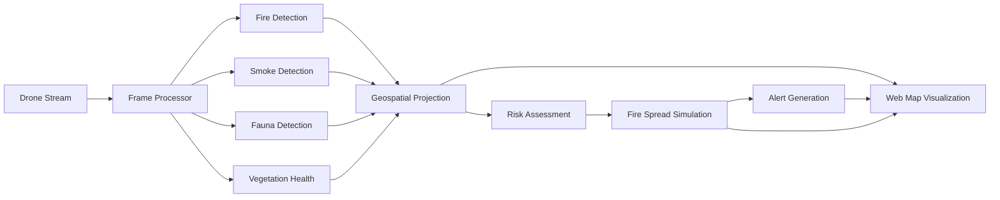
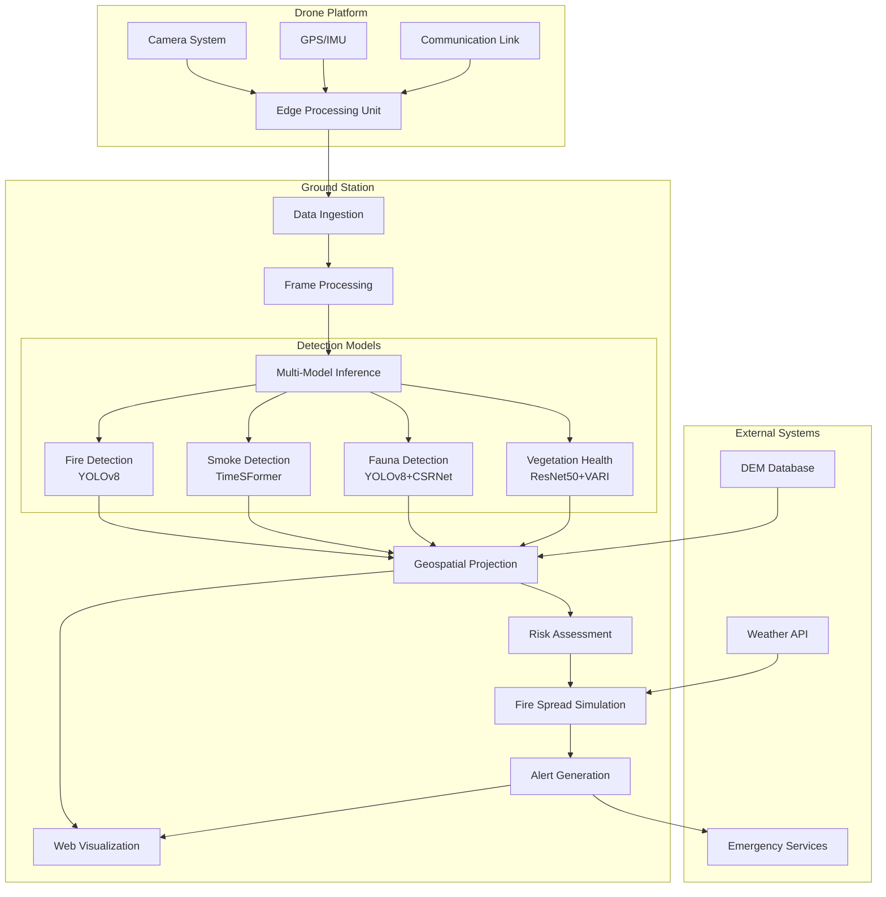
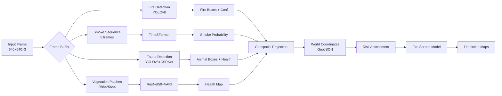
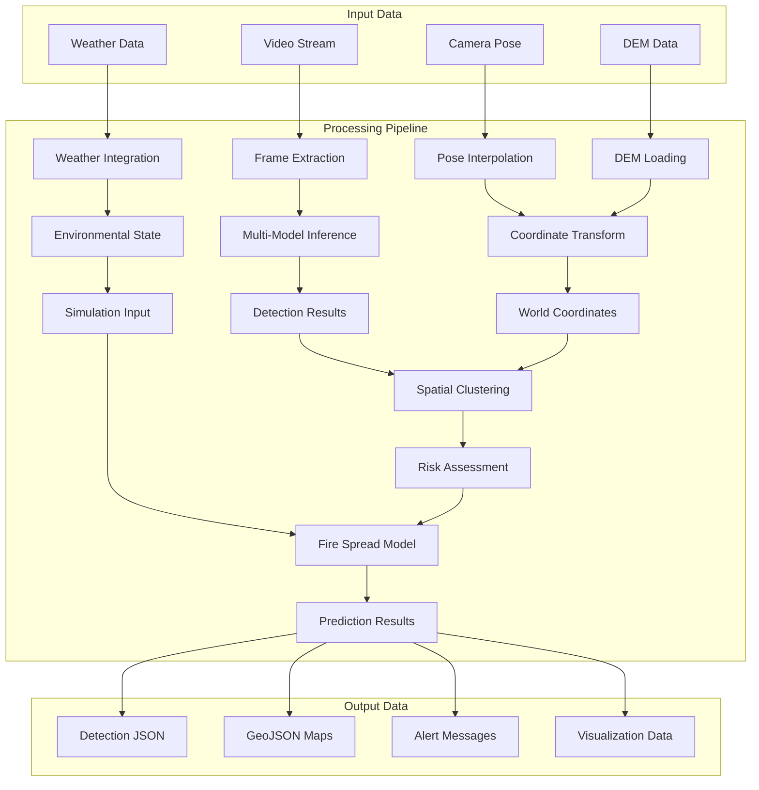

# Fire Prevention System - Project Overview

## Table of Contents
- [System Overview](#system-overview)
- [Techniques & Architectures](#techniques--architectures)
- [Dataset Descriptions](#dataset-descriptions)
- [Integration Workflow](#integration-workflow)
- [Training Strategy & Limitations](#training-strategy--limitations)
- [Architecture Diagrams](#architecture-diagrams)
- [Codebase References](#codebase-references)
- [Usage & Next Steps](#usage--next-steps)

## System Overview

The Fire Prevention System is a comprehensive AI-powered aerial surveillance platform designed for wildfire prevention and monitoring. The system integrates multiple specialized deep learning models to provide real-time detection, analysis, and prediction capabilities for fire-related events.

### Core Capabilities
- **Real-time Fire Detection**: Identifies active fires and smoke plumes in aerial imagery
- **Wildlife Monitoring**: Tracks fauna health and population density for ecosystem assessment
- **Vegetation Analysis**: Evaluates vegetation health and fire risk using spectral indices
- **Geospatial Mapping**: Projects detections to world coordinates using camera calibration and DEM data
- **Fire Spread Prediction**: Simulates fire propagation using physics-based and neural models

### Key Features
- Multi-modal AI integration (vision, temporal analysis, geospatial processing)
- Real-time video stream processing
- Automated alert generation and response coordination
- Comprehensive data logging and visualization
- Scalable cloud deployment architecture

## Techniques & Architectures

### 1. Fire Detection & Segmentation (YOLOv8)

**Architecture**: Enhanced YOLOv8 with CSPDarknet backbone and PANet feature pyramid

**Technical Details**:
- **Backbone**: CSPDarknet53 with Cross Stage Partial connections for efficient feature extraction
- **Neck**: PANet (Path Aggregation Network) for multi-scale feature fusion
- **Head**: Decoupled detection head for classification and regression
- **Input Size**: 640×640 pixels with dynamic scaling
- **Classes**: Fire (class 0) and Smoke (class 1)

**Loss Functions**:
- **Classification**: Binary Cross-Entropy (BCE) loss
- **Bounding Box**: Complete Intersection over Union (CIoU) loss
- **Objectness**: BCE loss for object confidence

**Data Augmentation**:
- Mosaic augmentation (combines 4 images)
- HSV color space jittering (H±0.015, S±0.7, V±0.4)
- Random horizontal flipping (50% probability)
- Geometric transformations (scaling, translation, rotation)

**Implementation**: `src/fire/fire_detection.py`
- `FireDataset`: Handles YOLO format annotations and augmentation
- `FireYOLOv8`: Custom YOLOv8 wrapper with modified head
- `FireDetectionTrainer`: Training pipeline with validation metrics
- `FireDetectionInference`: Real-time inference with batch processing

### 2. Smoke Detection (TimeSFormer)

**Architecture**: Vision Transformer with temporal attention mechanisms

**Technical Details**:
- **Model**: TimeSFormer (Time-Space Transformer)
- **Input**: 8-frame video sequences at 224×224 resolution
- **Patch Size**: 16×16 pixels with temporal stride
- **Embedding Dimension**: 768
- **Attention Heads**: 12 multi-head attention layers
- **Depth**: 12 transformer blocks

**Temporal Modeling**:
- **Divided Space-Time Attention**: Separates spatial and temporal attention
- **Temporal Jittering**: Random frame sampling for robustness
- **Sequence Aggregation**: Global average pooling over spatial dimensions

**Data Processing**:
- **Preprocessing**: Frame normalization and resizing
- **Augmentation**: Color jittering, temporal jittering, random cropping
- **Output**: Binary classification (smoke/no-smoke) with confidence scores

**Implementation**: `src/smoke/smoke_detection.py`
- `SmokeVideoDataset`: Temporal sequence loading and preprocessing
- `TimeSFormerSmokeModel`: Custom TimeSFormer with smoke-specific head
- `SmokeDetectionTrainer`: Training with temporal consistency loss
- `SmokeDetectionInference`: Video stream processing with sliding window

### 3. Fauna Detection & Health Assessment (YOLOv8 + CSRNet)

**Dual Architecture Approach**:

**Detection Component (YOLOv8)**:
- **Species Detection**: Deer, elk, bear, bird, other wildlife
- **Bounding Box Regression**: Precise animal localization
- **Modified Head**: Additional health classification branch

**Density Estimation (CSRNet)**:
- **Backbone**: VGG-16 for feature extraction
- **Dilated Convolutions**: Multi-scale receptive fields
- **Density Map**: Pixel-wise animal count estimation
- **Output**: Population density heatmaps

**Health Assessment Network**:
- **Feature Extractor**: ResNet-50 backbone
- **Health Classifier**: Binary classification (healthy/distressed)
- **Multi-task Learning**: Joint optimization of detection and health assessment

**Technical Implementation**:
- **Data Format**: COCO annotations with health and species metadata
- **Training Strategy**: Multi-stage training with progressive fine-tuning
- **Inference**: Real-time processing with health status overlay

**Implementation**: `src/fauna/fauna_detection.py`
- `FaunaDataset`: COCO format with health annotations
- `FaunaDetectionModel`: Multi-head YOLOv8 with health classification
- `CSRNetDensity`: Crowd counting network adapted for wildlife
- `FaunaDetectionInference`: Integrated detection and density estimation

### 4. Vegetation Health Classification (ResNet50 + VARI)

**Multi-Channel Architecture**:
- **Backbone**: ResNet-50 modified for 4-channel input (RGB + VARI)
- **Input Channels**: RGB (3) + VARI index (1) = 4 total channels
- **Classes**: Healthy (0), Dry (1), Burned (2)

**VARI Index Computation**:
```
VARI = (Green - Red) / (Green + Red - Blue + ε)
```
Where ε = 1e-8 to prevent division by zero

**Architecture Modifications**:
- **First Convolution**: Modified from 3→64 to 4→64 channels
- **Weight Initialization**: RGB weights copied, VARI initialized from red channel
- **Feature Fusion**: Early fusion at input level

**Segmentation Capability**:
- **Dual Output**: Image-level classification + pixel-level segmentation
- **Segmentation Head**: Upsampling layers for dense prediction
- **Multi-scale Processing**: Patch-based analysis for large images

**Implementation**: `src/vegetation/vegetation_health.py`
- `VegetationDataset`: RGB+VARI preprocessing with VARI computation
- `VegetationHealthCNN`: ResNet50 with 4-channel input and dual heads
- `VegetationHealthInference`: Patch-based inference with health mapping

### 5. Fire Spread Simulation (Hybrid Neural-Physics Model)

**Dual Modeling Approach**:

**Physics-Based Component**:
- **Cellular Automata**: Grid-based fire propagation
- **Environmental Factors**: Wind, humidity, slope, vegetation density
- **Spread Probability**: Sigmoid function of combined environmental factors
- **Temporal Dynamics**: Explicit time integration with decay

**Neural Component (FireSpreadNet)**:
- **Architecture**: Convolutional neural network with environmental state fusion
- **Input Channels**: Environmental state (6 channels) + current fire state (1 channel)
- **Environmental Features**: RGB/thermal imagery, wind vectors, humidity, vegetation
- **Output**: Ignition probability + fire intensity maps

**Physics Model Equations**:
```
P_spread = σ(α·|W| + β·|∇h| - γ·H + δ·V)
where:
- W: wind vector
- ∇h: terrain slope
- H: humidity
- V: vegetation density
- σ: sigmoid function
```

**Neural Architecture**:
- **Encoder**: Environmental state processing (6→64 channels)
- **Fire Processor**: Current fire state encoding (1→32 channels)
- **Fusion Network**: Combined feature processing
- **Dual Heads**: Ignition probability + intensity prediction

**Implementation**: `src/spread/fire_spread_simulation.py`
- `FireSpreadDataset`: Time-series satellite imagery with fire perimeters
- `FireSpreadNet`: CNN for dynamics learning
- `PhysicsBasedFireModel`: Cellular automata with environmental factors
- `FireSpreadSimulator`: Hybrid model combining neural and physics approaches

### 6. Geospatial Projection System

**Camera Model**:
- **Intrinsic Parameters**: Focal length (fx, fy), principal point (cx, cy)
- **Distortion Correction**: Radial and tangential distortion compensation
- **Projection Matrix**: 3×4 camera-to-world transformation

**Coordinate Transformations**:
- **Image → Camera**: Intrinsic matrix inverse projection
- **Camera → World**: Extrinsic parameters (pose) transformation
- **DEM Integration**: Terrain intersection for accurate ground projection

**Implementation**: `src/geospatial/geospatial_projection.py`
- `CameraModel`: Intrinsic parameter handling and distortion correction
- `GeospatialProjector`: Complete image-to-world coordinate transformation
- **Output Formats**: GeoJSON, KML, CSV with geographic coordinates

## Dataset Descriptions

### Fire Detection Datasets

**FLAME_UAV Dataset**:
- **Source**: [Fire-Detection-UAV-Aerial-Image-Classification-Segmentation](https://github.com/AlirezaShamsoshoara/Fire-Detection-UAV-Aerial-Image-Classification-Segmentation)
- **Content**: Aerial fire images from UAV perspectives
- **Format**: YOLO annotation format with bounding boxes
- **Classes**: Fire, smoke, background
- **Size**: ~5,000 images with annotations

**Flame_2 RGB-Thermal Dataset**:
- **Source**: [Flame_2_dataset](https://github.com/xiwenc1/Flame_2_dataset)
- **Content**: Dual-modal RGB and thermal imagery
- **Applications**: Thermal-assisted fire detection
- **Format**: Paired RGB-thermal images with segmentation masks

**SFGDN Flame Detection**:
- **Source**: [Flame-detection](https://github.com/mi-luo/Flame-detection)
- **Content**: Ground-level and aerial flame imagery
- **Preprocessing**: Image normalization, YOLO label conversion

### Smoke Detection Datasets

**Video Sequences**:
- **Format**: MP4 video files with frame-level annotations
- **Annotation**: CSV format with `video_name, frame_index, smoke_flag`
- **Temporal Length**: 8-16 frame sequences for TimeSFormer
- **Resolution**: 1080p downsampled to 224×224 for processing

**Data Directory Structure**:
```
data/smoke/
├── videos/
│   ├── train/
│   ├── val/
│   └── test/
└── annotations_train.csv
```

### Fauna Detection Datasets

**WAID (Wildlife Aerial Images Dataset)**:
- **Source**: [WAID](https://github.com/xiaohuicui/WAID)
- **Content**: Aerial wildlife imagery with species labels
- **Species**: Deer, elk, bear, birds, other mammals
- **Format**: COCO annotations with health status extension

**Wildlife Aerial Kaggle Dataset**:
- **Source**: [Wildlife Aerial Imagery Dataset](https://www.kaggle.com/datasets/sugamg/wildlife-aerial-imagery-dataset)
- **Content**: Labeled aerial wildlife photographs
- **Applications**: Population monitoring, health assessment

**Annotation Format**:
```json
{
  "id": 1,
  "image_id": 1,
  "category_id": 1,
  "bbox": [x, y, width, height],
  "health": "healthy|distressed",
  "species": "deer|elk|bear|bird|other"
}
```

### Vegetation Health Datasets

**Forest Health Imagery**:
- **Content**: Multispectral satellite and aerial imagery
- **Spectral Bands**: RGB + NIR for VARI computation
- **Health Classes**: Healthy, dry/stressed, burned/dead
- **Format**: GeoTIFF images with pixel-level health masks

**VARI Index Data**:
- **Computation**: `(Green - Red) / (Green + Red - Blue)`
- **Range**: [-1, 1] normalized to [0, 1] for neural networks
- **Applications**: Drought stress detection, fire risk assessment

**Data Structure**:
```
data/vegetation/
├── images/          # RGB imagery
├── masks/           # Health segmentation masks
└── health/          # VARI index files
```

### Geospatial Reference Data

**Camera Intrinsics** (`config/intrinsics.json`):
```json
{
  "fx": 800.0,
  "fy": 800.0,
  "cx": 320.0,
  "cy": 240.0,
  "distortion": {
    "k1": -0.1,
    "k2": 0.05,
    "p1": 0.001,
    "p2": 0.001
  }
}
```

**Pose Data** (`data/pose/pose.csv`):
```csv
frame,lat,lon,alt,yaw,pitch,roll
0,40.7128,-74.0060,100.0,0.0,-10.0,2.0
1,40.7129,-74.0061,101.0,1.0,-9.5,1.8
```

**Digital Elevation Models**:
- **Format**: GeoTIFF (.tif) with elevation values in meters
- **Sources**: USGS, NASA SRTM, OpenTopography
- **Resolution**: 30m cell size for fire spread modeling

### Fire Spread Simulation Data

**Historical Fire Events**:
- **Format**: Time-series satellite imagery with fire perimeter annotations
- **Temporal Resolution**: Daily to hourly progression data
- **Spatial Resolution**: 30m Landsat/Sentinel imagery
- **Metadata**: Weather conditions, ignition sources, suppression activities

**Environmental Layers**:
- **Wind Data**: Speed and direction at 10m height
- **Humidity**: Relative humidity percentage
- **Vegetation**: Fuel load and moisture content
- **Topography**: Slope and aspect from DEM

## Integration Workflow

### Pipeline Architecture



### Step-by-Step Workflow

**1. Data Ingestion**:
- **Input**: RTMP video stream from drone camera
- **Processing**: Frame extraction at configurable intervals (default: every 30 frames)
- **Buffering**: Temporal buffer for smoke detection sequences

**2. Multi-Model Inference**:
- **Parallel Processing**: All detection models run simultaneously on each frame
- **Fire Detection**: YOLOv8 processes individual frames
- **Smoke Detection**: TimeSFormer analyzes 8-frame sequences
- **Fauna Detection**: YOLOv8+CSRNet for detection and density
- **Vegetation Health**: ResNet50+VARI for patch-based analysis

**3. Geospatial Transformation**:
- **Camera Pose**: Extract position and orientation from pose data
- **Image Projection**: Transform detection coordinates to world coordinates
- **DEM Integration**: Account for terrain elevation in projections
- **Coordinate Systems**: Output in standard geographic projections (WGS84)

**4. Risk Assessment & Integration**:
- **Fire Risk Scoring**: Combine detection confidence with environmental factors
- **Spatial Clustering**: Group nearby detections for coherent event mapping
- **Temporal Tracking**: Maintain detection history for trend analysis

**5. Fire Spread Simulation**:
- **Trigger Conditions**: Activate simulation on confirmed fire detection
- **Environmental State**: Integrate weather data and vegetation conditions
- **Model Selection**: Choose between physics-based or neural prediction
- **Temporal Projection**: Generate multi-timestep spread predictions

**6. Alert Generation & Visualization**:
- **Alert Criteria**: Configurable thresholds for automatic alert generation
- **Notification Systems**: Integration with emergency response protocols
- **Web Interface**: Real-time map updates with detection overlays
- **Data Export**: GeoJSON, KML, and CSV formats for external systems

### CLI Commands & Automation

**Training Pipeline**:
```bash
# Train all models sequentially
python train_fire.py --config config.yaml --epochs 50
python train_smoke.py --config config.yaml --epochs 30  
python train_fauna.py --config config.yaml --epochs 40
python train_veg.py --config config.yaml --epochs 35
python simulate_spread.py --config config.yaml --epochs 50
```

**Real-time Processing**:
```bash
# Main pipeline with video stream
python run_pipeline.py --input rtmp://localhost/live/stream --output outputs/

# Batch processing mode
python run_pipeline.py --input video.mp4 --batch-mode --save-all
```

**Individual Model Inference**:
```bash
# Fire detection on single image
python src/fire/fire_detection.py --mode infer --input image.jpg

# Vegetation health mapping
python src/vegetation/vegetation_health.py --mode infer --input field.tif --output health_map.png
```

### Scheduling & Automation

**Cron Job Example** (Linux/WSL):
```bash
# Process accumulated data every hour
0 * * * * cd /path/to/FIREPREVENTION && python run_pipeline.py --batch-mode --input data/incoming/

# Generate daily reports
0 6 * * * cd /path/to/FIREPREVENTION && python generate_reports.py --timeframe 24h
```

**Windows Task Scheduler**:
- **Trigger**: Daily at 6:00 AM
- **Action**: Run PowerShell script for batch processing
- **Settings**: Run whether user is logged on or not

## Training Strategy & Limitations

### Training Approach

**Multi-Stage Training Strategy**:

1. **Individual Model Training**:
   - **Phase 1**: Train each model independently on respective datasets
   - **Phase 2**: Fine-tune on domain-specific aerial imagery
   - **Phase 3**: Joint optimization with shared feature extractors

2. **Data Splits**:
   - **Training**: 70% of available data
   - **Validation**: 15% for hyperparameter tuning
   - **Testing**: 15% for final evaluation

3. **Hyperparameter Configuration**:

**Fire Detection (YOLOv8)**:
- **Learning Rate**: 1e-3 with cosine annealing
- **Batch Size**: 16 (adjustable based on GPU memory)
- **Epochs**: 50 with early stopping (patience=10)
- **Optimizer**: AdamW with weight decay 1e-4

**Smoke Detection (TimeSFormer)**:
- **Learning Rate**: 1e-4 with linear warmup
- **Batch Size**: 8 (memory-intensive due to temporal sequences)
- **Epochs**: 30 with gradient accumulation
- **Optimizer**: AdamW with β₁=0.9, β₂=0.999

**Fauna Detection**:
- **Learning Rate**: 1e-3 for detection, 1e-4 for density estimation
- **Multi-task Loss**: α·detection_loss + β·density_loss + γ·health_loss
- **Batch Size**: 12 with mixed precision training

**Vegetation Health**:
- **Learning Rate**: 1e-3 with ReduceLROnPlateau scheduler
- **VARI Integration**: End-to-end training with RGB+VARI channels
- **Class Weights**: Balanced sampling for imbalanced health classes

**Fire Spread Simulation**:
- **Physics-Neural Hybrid**: Pretrain physics model, then neural refinement
- **Sequence Length**: 5 timesteps for temporal consistency
- **Loss Function**: MSE for regression + BCE for ignition probability

### Compute Requirements

**Hardware Specifications**:
- **GPU**: NVIDIA RTX 3080/4080 or better (≥10GB VRAM)
- **CPU**: Intel i7/AMD Ryzen 7 (≥8 cores for parallel processing)
- **RAM**: 32GB (16GB minimum)
- **Storage**: 1TB SSD for data and model storage

**Azure Cloud Resources** (Recommended):
- **Virtual Machine**: Standard_NC12s_v3 (12 vCPUs, 112GB RAM, K80 GPU)
- **Storage**: Premium SSD (P30: 1TB) for datasets and models
- **Estimated Cost**: ~$2-3/hour for training, $0.50/hour for inference

**Google Colab**:
- **GPU**: Tesla T4/V100 with high-RAM runtime
- **Limitations**: 12-hour session limit, periodic disconnections
- **Workarounds**: Checkpoint saving every 10 epochs

### Known Limitations & Challenges

**Dataset Limitations**:

1. **Fire Detection**:
   - **Limited Diversity**: Most datasets focus on ground-level fires
   - **Aerial Perspective**: Insufficient high-altitude fire imagery
   - **Weather Conditions**: Limited representation of smoke in various weather
   - **Resolution Variability**: Inconsistent image quality across sources

2. **Smoke Detection**:
   - **Temporal Annotation**: Expensive to manually label video sequences
   - **Atmospheric Conditions**: Confusion with clouds, fog, and dust
   - **Dataset Scarcity**: Limited availability of annotated smoke videos

3. **Fauna Detection**:
   - **Health Assessment**: Subjective health labels, inter-annotator variability
   - **Species Imbalance**: Overrepresentation of common species (deer) vs rare species
   - **Behavioral Factors**: Animal movement and occlusion challenges

4. **Vegetation Health**:
   - **Spectral Limitations**: VARI index sensitive to atmospheric conditions
   - **Seasonal Variation**: Model performance varies across growing seasons
   - **Ground Truth**: Expensive field validation for health labels

**Technical Limitations**:

1. **Real-time Processing**:
   - **Latency**: GPU inference time vs real-time requirements
   - **Memory**: Temporal models require significant GPU memory
   - **Throughput**: Processing speed vs video frame rate

2. **Geospatial Accuracy**:
   - **DEM Resolution**: 30m cell size limits precision for small features
   - **Camera Calibration**: Requires accurate intrinsic parameters
   - **Pose Estimation**: GPS/IMU noise affects projection accuracy

3. **Fire Spread Modeling**:
   - **Environmental Data**: Real-time weather integration challenges
   - **Model Validation**: Limited historical fire progression data
   - **Scale Dependencies**: Different dynamics at different spatial scales

**Trade-offs & Design Decisions**:

1. **Thermal vs RGB**:
   - **Advantage**: Thermal imaging superior for fire detection
   - **Limitation**: Higher cost, limited thermal datasets
   - **Decision**: Focus on RGB with thermal as optional enhancement

2. **Model Complexity vs Speed**:
   - **Trade-off**: Larger models (YOLOv8l) vs faster inference (YOLOv8n)
   - **Decision**: Use nano models for real-time, larger for batch processing

3. **Physics vs Neural Modeling**:
   - **Physics**: Interpretable but limited by parameter estimation
   - **Neural**: Data-driven but requires extensive training data
   - **Solution**: Hybrid approach combining both strengths

### Improvement Strategies

**Data Augmentation**:
- **Domain Adaptation**: Style transfer for weather/lighting conditions
- **Synthetic Data**: Procedural generation of fire scenarios
- **Cross-Domain**: Transfer learning from related computer vision tasks

**Model Architecture**:
- **Attention Mechanisms**: Spatial and temporal attention for improved focus
- **Multi-Scale Processing**: Feature pyramids for objects at various scales
- **Uncertainty Quantification**: Bayesian approaches for confidence estimation

**System Integration**:
- **Edge Computing**: Deploy lightweight models on drone hardware
- **Federated Learning**: Collaborative training across multiple drone fleets
- **Active Learning**: Human-in-the-loop annotation for continuous improvement

## Architecture Diagrams

### System-Level Architecture



### Model Pipeline Flow



### Data Flow Architecture



### Fire Spread Simulation Architecture

```mermaid
graph TB
    subgraph "Input State"
        A[Current Fire Map<br/>256×256]
        B[Environmental Layers<br/>Wind, Humidity, Vegetation]
        C[Terrain Data<br/>Slope, Elevation]
    end
    
    subgraph "Hybrid Model"
        D[Physics Model<br/>Cellular Automata]
        E[Neural Model<br/>FireSpreadNet]
        
        subgraph "Physics Components"
            D --> F[Spread Probability<br/>σ(αW + βS - γH + δV)]
            F --> G[Fire Propagation<br/>Convolution + Decay]
        end
        
        subgraph "Neural Components"
            E --> H[Environmental Encoder<br/>6→64 channels]
            E --> I[Fire State Processor<br/>1→32 channels]
            H --> J[Feature Fusion<br/>64+32→64]
            I --> J
            J --> K[Dual Heads<br/>Ignition + Intensity]
        end
    end
    
    subgraph "Output Prediction"
        L[Fire State t+1<br/>256×256]
        M[Ignition Probability<br/>256×256]
        N[Fire Intensity<br/>256×256]
    end
    
    A --> D
    A --> E
    B --> D
    B --> E
    C --> D
    C --> E
    
    G --> L
    K --> M
    K --> N
```

## Codebase References

### Core Model Implementations

**Fire Detection**:
- **Main Module**: `src/fire/fire_detection.py`
- **Key Classes**:
  - `FireDataset` (lines 31-108): YOLO dataset with augmentation pipeline
  - `FireYOLOv8` (lines 109-130): YOLOv8 wrapper with custom modifications
  - `FireDetectionTrainer` (lines 131-203): Training loop with validation
  - `FireDetectionInference` (lines 204-280): Real-time inference engine
- **Configuration**: `config.yaml` → `fire` section
- **Training Script**: `train_fire.py`

**Smoke Detection**:
- **Main Module**: `src/smoke/smoke_detection.py`
- **Key Classes**:
  - `SmokeVideoDataset` (lines 27-150): Temporal sequence processing
  - `TimeSFormerSmokeModel` (lines 151-220): Vision transformer with temporal attention
  - `SmokeDetectionInference` (lines 300-400): Video stream processing
- **Training Script**: `train_smoke.py`

**Fauna Detection**:
- **Main Module**: `src/fauna/fauna_detection.py`
- **Key Classes**:
  - `FaunaDataset` (lines 31-120): COCO format with health extensions
  - `FaunaDetectionModel` (lines 676-750): Multi-head YOLOv8 architecture
  - `CSRNetDensity` (lines 400-500): Density estimation network
- **Training Script**: `train_fauna.py`

**Vegetation Health**:
- **Main Module**: `src/vegetation/vegetation_health.py`
- **Key Classes**:
  - `VegetationDataset` (lines 27-155): RGB+VARI preprocessing
  - `VegetationHealthCNN` (lines 157-250): ResNet50 with 4-channel input
  - `VegetationHealthInference` (lines 461-680): Patch-based health mapping
- **VARI Computation**: `compute_vari()` method (lines 81-102, 493-512)
- **Training Script**: `train_veg.py`

**Fire Spread Simulation**:
- **Main Module**: `src/spread/fire_spread_simulation.py`
- **Key Classes**:
  - `FireSpreadDataset` (lines 32-170): Time-series satellite data
  - `FireSpreadNet` (lines 173-250): CNN for dynamics learning
  - `PhysicsBasedFireModel` (lines 252-350): Cellular automata implementation
  - `FireSpreadSimulator` (lines 596-790): Hybrid model coordinator
- **Training Script**: `simulate_spread.py`

**Geospatial Projection**:
- **Main Module**: `src/geospatial/geospatial_projection.py`
- **Key Classes**:
  - `CameraModel` (lines 25-80): Intrinsic parameters and distortion
  - `GeospatialProjector` (lines 100-400): Complete coordinate transformation
- **Configuration**: `config/intrinsics.json`

### Pipeline Orchestration

**Main Pipeline**:
- **Entry Point**: `run_pipeline.py`
- **Core Class**: `FrameProcessor` (lines 35-150)
- **Real-time Processing**: Video stream handling with frame buffering
- **Parallel Inference**: Multi-model processing coordination

**Command Line Interface**:
- **Main Script**: `cli.py`
- **Core Class**: `FirePreventionCLI` (lines 50-400)
- **Subcommands**: Detection, training, simulation, monitoring

**System Testing**:
- **Test Suite**: `test_system.py`
- **Test Categories**: Unit tests, integration tests, performance benchmarks
- **Validation**: `validate_system.py` for end-to-end testing

### Configuration & Utilities

**Configuration Management**:
- **Main Config**: `config.yaml` - Centralized hyperparameters and paths
- **Camera Intrinsics**: `config/intrinsics.json` - Camera calibration parameters
- **Utility Functions**: `utils/__init__.py` - Helper functions and constants

**Data Management**:
- **Dataset Download**: `download_datasets.py` - Automated dataset acquisition
- **Sample Data Creation**: `create_sample_data.py`, `create_comprehensive_data.py`
- **Data Validation**: Built-in dataset structure verification

**Monitoring & Logging**:
- **System Monitor**: `monitor.py` - Health checks and performance monitoring
- **Benchmarking**: `benchmark.py` - Performance profiling and optimization
- **Logging**: Loguru-based structured logging throughout the system

### Directory Structure Overview

```
FIREPREVENTION/
├── src/                          # Core source code
│   ├── fire/                     # Fire detection module
│   ├── smoke/                    # Smoke detection module
│   ├── fauna/                    # Fauna detection module
│   ├── vegetation/               # Vegetation health module
│   ├── geospatial/              # Coordinate transformation
│   ├── spread/                   # Fire spread simulation
│   └── utils/                    # Shared utilities
├── config/                       # Configuration files
├── data/                         # Training and test data
├── models/                       # Trained model checkpoints
├── outputs/                      # Processing results
├── logs/                         # System logs
└── benchmarks/                   # Performance benchmarks
```

## Usage & Next Steps

### Getting Started

**1. Environment Setup**:
```bash
# Clone repository
git clone <repository-url>
cd FIREPREVENTION

# Install dependencies
pip install -r requirements.txt

# Download datasets
python download_datasets.py --dataset all

# Verify installation
python test_system.py --test-type unit
```

**2. Model Training**:
```bash
# Train individual models
python train_fire.py --epochs 50 --batch-size 16
python train_smoke.py --epochs 30 --batch-size 8
python train_fauna.py --epochs 40 --batch-size 12
python train_veg.py --epochs 35 --batch-size 24
python simulate_spread.py --epochs 50 --batch-size 4

# Monitor training progress
tensorboard --logdir logs/
```

**3. Real-time Processing**:
```bash
# Process video stream
python run_pipeline.py --input rtmp://drone-stream --output results/

# Batch processing
python run_pipeline.py --input video.mp4 --batch-mode

# Individual model inference
python cli.py detect fire --input image.jpg --output detections.json
```

### Regenerating Documentation

**Automated Documentation Update**:
```bash
# Update this documentation file
python update_docs.py --scan-code --update-diagrams --output PROJECT_OVERVIEW.md

# Generate API documentation
python generate_api_docs.py --format markdown --output API_REFERENCE.md

# Create model architecture diagrams
python visualize_models.py --output architecture_diagrams/
```

**Documentation Scripts** (to be implemented):
```python
# update_docs.py - Scan codebase for changes and update documentation
# generate_api_docs.py - Extract docstrings and create API reference
# visualize_models.py - Generate model architecture diagrams
```

### Performance Optimization

**GPU Optimization**:
- **Mixed Precision Training**: Enable with `--fp16` flag
- **Batch Size Tuning**: Use largest batch size that fits in GPU memory
- **Model Parallelism**: Distribute large models across multiple GPUs

**Inference Acceleration**:
- **TensorRT Optimization**: Convert trained models to TensorRT for faster inference
- **ONNX Export**: Cross-platform deployment with ONNX runtime
- **Quantization**: INT8 quantization for edge deployment

**Memory Management**:
- **Gradient Checkpointing**: Trade computation for memory during training
- **Data Loading**: Optimize DataLoader workers and prefetch factors
- **Model Pruning**: Remove redundant parameters for deployment

### Expansion Opportunities

**Model Improvements**:
- **Multi-Modal Fusion**: Integrate RGB, thermal, and LiDAR data
- **Temporal Consistency**: Add temporal smoothing across detection sequences
- **Uncertainty Quantification**: Bayesian neural networks for confidence estimates
- **Few-Shot Learning**: Adapt models to new environments with minimal data

**Dataset Enhancement**:
- **Synthetic Data**: Generate training data using simulation engines
- **Active Learning**: Prioritize annotation of informative samples
- **Cross-Domain Transfer**: Adapt models trained on one region to another
- **Weak Supervision**: Use noisy labels from automatic labeling systems

**System Integration**:
- **Cloud Deployment**: Scalable inference on Azure/AWS/GCP
- **Edge Computing**: Deploy lightweight models on drone hardware
- **API Development**: RESTful API for third-party integration
- **Mobile Applications**: Mobile app for field personnel

**Advanced Features**:
- **Predictive Analytics**: Long-term fire risk assessment
- **Resource Optimization**: Optimal drone routing and deployment
- **Multi-Agent Coordination**: Coordinate multiple drone swarms
- **Human-in-the-Loop**: Expert feedback integration for continuous learning

### Testing & Validation

**Unit Testing**:
```bash
# Test individual components
python -m pytest tests/unit/ -v

# Test specific modules
python -m pytest tests/unit/test_fire_detection.py
```

**Integration Testing**:
```bash
# End-to-end pipeline testing
python test_system.py --test-type integration

# Performance benchmarking
python benchmark.py --category all --output benchmarks/
```

**Continuous Integration**:
- **GitHub Actions**: Automated testing on push/PR
- **Docker Containers**: Consistent testing environments
- **Model Validation**: Automated accuracy checks on validation datasets

### Contributing Guidelines

**Code Standards**:
- **Python Style**: Follow PEP 8 with Black formatting
- **Documentation**: Comprehensive docstrings for all functions and classes
- **Type Hints**: Use type annotations for better code clarity
- **Testing**: Unit tests for new functionality

**Development Workflow**:
1. **Feature Branch**: Create branch for new features
2. **Implementation**: Develop with comprehensive testing
3. **Documentation**: Update relevant documentation
4. **Pull Request**: Submit PR with detailed description
5. **Review**: Code review and testing verification
6. **Merge**: Integration into main branch

**Best Practices**:
- **Modularity**: Keep components loosely coupled and highly cohesive
- **Extensibility**: Design for easy addition of new models and features
- **Reproducibility**: Version control for datasets, models, and environments
- **Monitoring**: Comprehensive logging and error handling

This documentation provides a comprehensive overview of the Fire Prevention System codebase. For specific implementation details, refer to the individual source files and their embedded documentation. The system is designed to be modular and extensible, allowing for continuous improvement and adaptation to new requirements.
