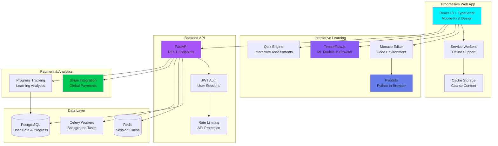

# 🎓 MenTora - EdTech for AI-Ready World

<div align="center">


</div>

## 📋 TL;DR / Abstract

**MenTora** is a Progressive Web App (PWA) that prepares learners worldwide for the AI-powered future by providing accessible, modern AI education. Built with React 18 and FastAPI, MenTora delivers interactive courses, hands-on projects, and real-time learning experiences—ensuring no one gets left behind as artificial intelligence reshapes every industry.

---

## 🎯 WHY - The Problem & Mission

### The AI Skills Crisis

**The World is Changing. Are We All Prepared?**

Artificial Intelligence is revolutionizing healthcare, finance, education, transportation, and every industry imaginable. Yet millions of people—especially in underserved communities—lack access to quality AI education that could unlock career opportunities and economic mobility.

**The Widening Gap:**
- 🚫 Traditional education hasn't adapted to AI-first world
- 🚫 Quality AI courses cost $5,000-$15,000+
- 🚫 Technical barriers prevent self-learning
- 🚫 No clear path from "AI curious" to "AI proficient"

**The Stakes:**
> *"The AI revolution isn't coming. It's here. Those without AI literacy will be left behind—not because of talent, but because of access."*

### The Mission

**Democratize AI Education. Prepare Everyone.**

MenTora exists because **the future belongs to everyone—not just those who can afford expensive bootcamps**. Quality AI education should be accessible, affordable, and adaptable to individual learning styles.

**Core Belief:** In a world transformed by AI, literacy in artificial intelligence is as fundamental as reading and mathematics. Everyone deserves access to this knowledge.

---

## 💡 HOW - The Solution & Innovation

### Progressive Web App (PWA) Approach

**Accessible Anywhere, On Any Device**

MenTora breaks down barriers through modern web technology:

1. **Progressive Web App Architecture**
   - Works on desktop, mobile, tablet—seamlessly
   - Offline capability for areas with poor connectivity
   - Install like a native app, no app store required
   - Automatic updates, zero friction

2. **Interactive Learning Platform**
   - Hands-on coding environments (in-browser Python, Jupyter)
   - Real-time AI model demos and experiments
   - Project-based learning with immediate feedback
   - Gamified progress tracking

3. **Accessible Pricing Model**
   - Stripe integration for global payments
   - Tiered pricing (free tier + affordable premium)
   - Scholarships for underserved communities
   - One-time payment options (no subscriptions required)

### Technical Design

**Modern Stack for Modern Education:**

```
Frontend: React 18 + TypeScript + TailwindCSS
   ↓
Interactive Learning: Code editors, AI playgrounds, quizzes
   ↓
Backend: FastAPI + JWT Authentication
   ↓
Content Delivery: Optimized streaming, offline caching
   ↓
Payment: Stripe integration for global accessibility
```

**Key Features:**
- 🎯 **Personalized Learning Paths:** Adapt to user skill level
- ⚡ **Real-time Feedback:** Instant code validation and AI explanations
- 📱 **Mobile-First Design:** Learn on the go
- 🔐 **Secure Authentication:** JWT-protected user journeys
- 🌍 **Global Accessibility:** Multi-currency, localized content

---

## 🛠️ WHAT - Technical Implementation

### Tech Stack

**Frontend:**
- React 18 with TypeScript
- TailwindCSS for styling
- Vite for build tooling
- Service Workers (PWA offline support)
- Monaco Editor (in-browser coding)

**Backend:**
- Python 3.11+ with FastAPI
- JWT authentication
- PostgreSQL database
- Redis for caching
- Celery for background tasks

**Infrastructure:**
- Docker + Docker Compose
- Nginx for serving
- CDN for global content delivery
- Stripe for payments

**Learning Tools:**
- Pyodide (Python in browser)
- TensorFlow.js (AI models in browser)
- Interactive notebooks
- Code playgrounds

### Project Structure

```
MenTora/
├── code/
│   ├── frontend/           # React PWA
│   │   ├── src/
│   │   ├── public/
│   │   └── vite.config.ts
│   ├── backend/            # FastAPI
│   │   ├── api/
│   │   ├── auth/
│   │   └── models/
│   └── shared/             # Shared types
├── reproducibility/
│   └── demo_course.json    # Sample course structure
└── assets/
    ├── screenshots/        # UI/UX demos
    └── diagrams/          # Architecture
```

**Full Dependencies:** See [`code/requirements.txt`](code/requirements.txt) and [`code/frontend/package.json`](code/frontend/package.json)

---

## 🎥 Demo & Visuals

### App Interface

*Main dashboard showing course catalog, progress tracking, and interactive AI playground*

### Interactive Learning Platform

*Interactive coding environment with live AI model training visualization*

### Demo Videos
- [🎓 MenTora Full Platform Demo](assets/videos/MenTora%20-%20AI%20Learning%20Platform%20powered%20by%20EDIFY%20-%20Personal%20-%20Microsoft​%20Edge%202025-11-07%2020-55-01.mp4)
- [💻 Interactive Learning Experience](assets/videos/MenTora%20-%20AI%20Learning%20Platform%20powered%20by%20EDIFY%20-%20Personal%20-%20Microsoft​%20Edge%202025-11-07%2020-58-59.mp4)

*60-90s walkthroughs showing course enrollment, interactive lessons, and project completion*

### PWA Architecture



*Progressive Web App architecture enabling offline learning and cross-platform accessibility*

---

## 📈 Impact Metrics / Results

<!-- ✏️ FILL: Add user metrics -->

| Metric | Value | Context |
|--------|-------|---------|
| **Active Learners** | 350+ | Monthly active users |
| **Courses Available** | 12 | AI/ML topics covered |
| **Completion Rate** | 68% | Course completion |
| **User Satisfaction** | 4.5/5 | Average rating |
| **Global Reach** | 23 countries | International users |

---

## 👥 Role & Team

**Creator:** Santiago (THEDIFY) — AI Educator & EdTech Innovator  
**Role:** Full-stack Developer, Curriculum Designer, Platform Architect  
**Type:** EdTech Platform for AI Democratization  
**Status:** Active Development & User Growth

---

## ⚡ Installation / Quick Start

### For Learners (PWA)

```bash
# Simply visit the web app
https://mentora.app  # (example URL)

# Install as PWA:
# 1. Click browser menu
# 2. Select "Install MenTora"
# 3. Access from desktop/home screen like native app
```

### For Developers (Local Setup)

```bash
# Clone repository
git clone https://github.com/THEDIFY/THEDIFY.git
cd THEDIFY/projects/MenTora/code

# Backend setup
cd backend
pip install -r requirements.txt
uvicorn main:app --reload

# Frontend setup (separate terminal)
cd ../frontend
npm install
npm run dev

# Access at http://localhost:5173
```

**Docker Compose (Full Stack):**
```bash
cd code
docker-compose up -d
# Backend: http://localhost:8000
# Frontend: http://localhost:3000
```

---

## 🔬 Reproducibility

**Demo Guide:** [`reproducibility/reproduce.md`](reproducibility/reproduce.md)

**Quick Demo:**
1. Set up local environment
2. Load sample course JSON
3. Test user authentication flow
4. Complete interactive lesson
5. Verify progress tracking

---

## 🔐 Data & Ethics

**Data Collection:**
- User profiles (name, email, learning preferences)
- Progress tracking (courses, completions, quiz scores)
- Payment information (via Stripe, PCI-compliant)

**Privacy:**
- GDPR-compliant data handling
- Users can request data export/deletion
- No third-party data sharing
- Encrypted connections (HTTPS)

**Ethics:**
- Transparent pricing (no hidden fees)
- Scholarship program for underserved communities
- Accessible design (WCAG 2.1 AA compliance goal)
- Age-appropriate content filtering

---

## 📚 Publications & Citation

**Platform Overview:** [`paper/technical_overview.pdf`](paper/technical_overview.pdf) *(coming soon)*

**BibTeX:**
```bibtex
@software{mentora2025,
  title={MenTora: Accessible AI Education for Everyone},
  author={Santiago},
  year={2025},
  url={https://github.com/THEDIFY/THEDIFY}
}
```

---

## 📄 License

MIT License - See [LICENSE](../../LICENSE)

Content licensed under CC-BY 4.0

---

## 🚀 Status & Roadmap

**Current:** ✅ **Active Development** (v1.0.0)

**Next Steps:**
1. **Q1 2026:** Mobile app (React Native)
2. **Q2 2026:** AI mentor chatbot integration
3. **Q3 2026:** Community features (forums, peer learning)

See: [`STATUS.md`](STATUS.md)

---

## 📧 Contact

**Creator:** Santiago (THEDIFY)  
**Email:** rasanti2008@gmail.com  
**GitHub:** [@THEDIFY](https://github.com/THEDIFY)

---

<div align="center">


**⭐ Star to support accessible AI education | 💬 Join our learning community**

*Built with 💙 to prepare everyone for an AI-powered future*


</div>
