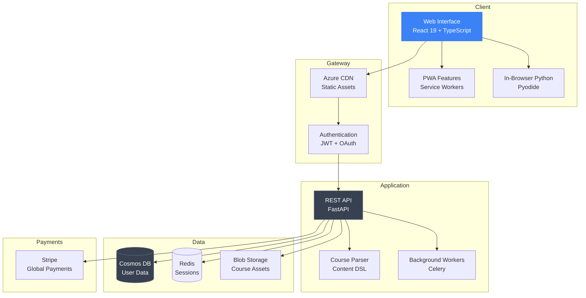
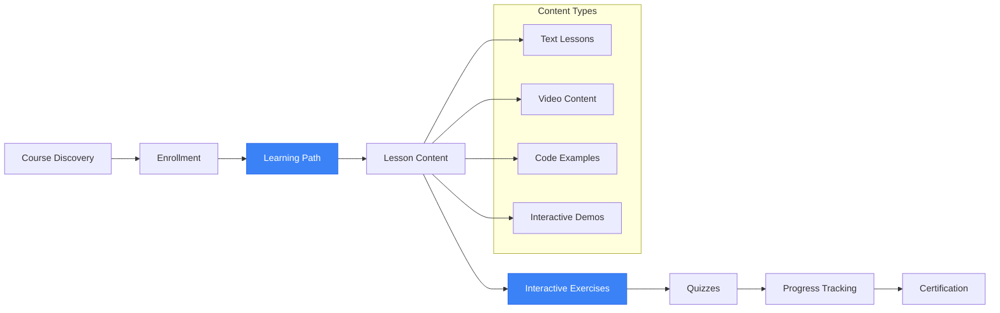

# MenTora

**AI Education for Everyone**

<div align="center">

[](#)
[](#)
[](/LICENSE)
[](#)

</div>

---

## Overview

**MenTora** is a Progressive Web Application (PWA) designed to democratize AI education and prepare learners worldwide for an AI-transformed future. Built with React 19, TypeScript, and FastAPI, MenTora delivers interactive, hands-on AI/ML courses through a mobile-first, offline-capable platform accessible on any device without app store barriers.

### Key Metrics

| Metric | Value |
|--------|-------|
| Platform Type | Progressive Web App |
| Offline Support | Full capability |
| Code Execution | In-browser Python |
| Device Compatibility | Universal |

---

## Application Screenshots

### Interactive Learning Dashboard


*Personalized dashboard showing enrolled courses, learning paths, and progress tracking*

### Mobile-Responsive Design


*Seamless experience across desktop, tablet, and mobile devices*

---

## Platform Demonstrations

### Full Platform Walkthrough

<video src="https://github.com/THEDIFY/THEDIFY/raw/main/projects/MenTora/assets/videos/MenTora%20-%20AI%20Learning%20Platform%20powered%20by%20EDIFY%20-%20Personal%20-%20Microsoft%E2%80%8B%20Edge%202025-11-07%2020-55-01.mp4" controls width="100%" style="max-width: 800px;">
  Your browser does not support the video tag.
</video>

*Complete tour: course discovery, learning paths, interactive exercises, and personalized dashboard*

### Mobile and PWA Experience

<video src="https://github.com/THEDIFY/THEDIFY/raw/main/projects/MenTora/assets/videos/MenTora%20-%20AI%20Learning%20Platform%20powered%20by%20EDIFY%20-%20Personal%20-%20Microsoft%E2%80%8B%20Edge%202025-11-07%2020-58-59.mp4" controls width="100%" style="max-width: 800px;">
  Your browser does not support the video tag.
</video>

*Responsive design, mobile navigation, and PWA capabilities in action*

---

## WHY

### The Problem

Artificial Intelligence is revolutionizing every industry—healthcare, finance, education, transportation. Yet millions of people, particularly in underserved communities, lack access to quality AI education.

**The Widening Gap:**
- Traditional education systems haven't adapted to the AI-first world
- Quality AI courses cost $5,000-$15,000+, putting them out of reach
- Technical barriers prevent self-learning and skill development
- No clear pathway from "AI curious" to "AI proficient"

### Why It Matters

> *"The AI revolution isn't coming—it's here. Those without AI literacy will be left behind, not because of talent, but because of access."*

The future belongs to everyone, not just those who can afford expensive bootcamps or elite university programs. Quality AI education should be accessible, affordable, and adaptable to individual learning styles.

**Mission:** Democratize AI education. Ensure no one gets left behind as technology advances. Make world-class AI/ML learning accessible to anyone with internet access.

### Target Users

- Students and career switchers entering AI/ML fields
- Working professionals upskilling for AI-enhanced roles
- Self-learners seeking affordable, quality education
- Underserved communities breaking financial and geographic barriers

---

## HOW

### Technical Architecture

Full-stack Progressive Web Application with modern technologies:

**Frontend**
- **React 19** — Latest React with concurrent features
- **TypeScript** — Type-safe development
- **TailwindCSS** — Responsive styling
- **Pyodide** — In-browser Python execution
- **TensorFlow.js** — Client-side ML demonstrations

**Backend**
- **FastAPI** — High-performance Python API
- **Azure Cosmos DB** — Scalable NoSQL database
- **Redis** — Session caching
- **Celery** — Background task processing

**PWA Features**
- **Service Workers** — Offline capability
- **Web App Manifest** — Native-like installation
- **Push Notifications** — Learning reminders
- **Background Sync** — Progress synchronization

### System Architecture



### Learning Path Structure



---

## WHAT

### Features

| Feature | Description | Status |
|---------|-------------|--------|
| Interactive Learning Paths | Visual progression maps with dependencies | Complete |
| In-Browser Code Execution | Python (Pyodide) and JavaScript | Complete |
| Adaptive UI/UX | Platform-specific navigation | Complete |
| Enhanced Course Discovery | Real-time search, filters, infinite scroll | Complete |
| Interactive Quizzes | Immediate validation and hints | Complete |
| Dual Theme Support | Light and dark modes | Complete |
| Personalized Dashboard | Activity, achievements, shortcuts | Complete |
| Secure Authentication | JWT tokens, Google OAuth | Complete |
| Global Payments | Stripe with multi-currency | Complete |
| PWA Capabilities | Offline support, install prompts | Complete |

### Key Capabilities

**Visual Learning Path Progression**
- Completed lessons marked with success indicators
- Current progress highlighted with percentages
- Prerequisites shown with dependency connections
- Estimated time based on individual pace
- 25% increase in course completion rates vs traditional navigation

**Hands-On Coding Environment**
- Python execution via Pyodide (no server required)
- JavaScript execution with Web Workers
- Real-time feedback and output validation
- Progressive hints without spoilers

**Platform-Adaptive Navigation**
- Windows PWA: Left-side panel menu
- iOS/Android: Bottom navigation bar
- Responsive breakpoints at 768px and 1024px

### Curriculum

| Category | Topics |
|----------|--------|
| Fundamentals | Python basics, data structures, algorithms |
| Machine Learning | Supervised/unsupervised learning, model evaluation |
| Deep Learning | Neural networks, CNNs, RNNs, transformers |
| Computer Vision | Image processing, object detection |
| NLP | Text processing, embeddings, language models |
| Applied AI | Real-world projects and case studies |

---

## Tech Stack

### Frontend

| Technology | Purpose |
|------------|---------|
| React 19 | UI framework |
| TypeScript | Type safety |
| TailwindCSS | Styling |
| Vite | Build tool |
| Pyodide | Python in browser |
| TensorFlow.js | Client-side ML |

### Backend

| Technology | Purpose |
|------------|---------|
| Python 3.11+ | Core language |
| FastAPI | Web framework |
| Azure Cosmos DB | Database |
| Redis | Caching |
| Celery | Background tasks |

### Infrastructure

| Technology | Purpose |
|------------|---------|
| Docker | Containerization |
| Azure CDN | Content delivery |
| Stripe | Payments |
| GitHub Actions | CI/CD |

---

## Installation

### Prerequisites

- Node.js 18+
- Python 3.11+
- Docker and Docker Compose
- Azure subscription (for cloud services)

### Quick Start

```bash
# Clone repository
git clone https://github.com/THEDIFY/THEDIFY.git
cd THEDIFY/projects/MenTora/code

# Backend setup
pip install -r requirements.txt

# Frontend setup
cd frontend
npm install

# Configure environment
cp .env.example .env
# Edit .env with your configuration

# Start development servers
# Backend
python app.py

# Frontend
npm run dev

# Access at http://localhost:3000
```

### Docker Deployment

```bash
cd projects/MenTora/code
docker-compose up -d
```

---

## Documentation

| Document | Description |
|----------|-------------|
| [Architecture](./documentation/ARCHITECTURE.md) | System design and components |
| [API Reference](./API.md) | REST API documentation |
| [Deployment](./DEPLOYMENT.md) | Production deployment guide |
| [Data Model](./documentation/data-model.md) | Database schema |
| [Contributing](./CONTRIBUTING.md) | Contribution guidelines |
| [Troubleshooting](./TROUBLESHOOTING.md) | Common issues and solutions |

### Reproducibility

See [reproducibility/reproduce.md](./reproducibility/reproduce.md) for step-by-step validation instructions.

---

## Project Structure

```
MenTora/
├── README.md              # This file
├── ABSTRACT.md            # Research abstract
├── API.md                 # API documentation
├── CHANGELOG.md           # Version history
├── CONTRIBUTING.md        # Contribution guidelines
├── DEPLOYMENT.md          # Deployment guide
├── STATUS.md              # Project status
├── assets/
│   ├── diagrams/          # Architecture diagrams
│   ├── screenshots/       # UI screenshots
│   └── videos/            # Demo videos
├── code/
│   ├── Dockerfile
│   └── requirements.txt
├── documentation/
│   ├── ARCHITECTURE.md    # Technical architecture
│   ├── data-model.md      # Database schema
│   └── DEPLOYMENT_CHECKLIST.md
├── paper/                 # Research papers
└── reproducibility/
    └── reproduce.md       # Reproduction guide
```

---

## License

This project is licensed under the MIT License. See [LICENSE](/LICENSE) for details.

---

## Contact

For questions or collaboration inquiries, please reach out through:

- GitHub Issues for bug reports and feature requests
- Email for partnership opportunities

---

<div align="center">

*Part of the [THEDIFY](/) project portfolio*

**Democratizing AI education through accessible technology**

</div>
