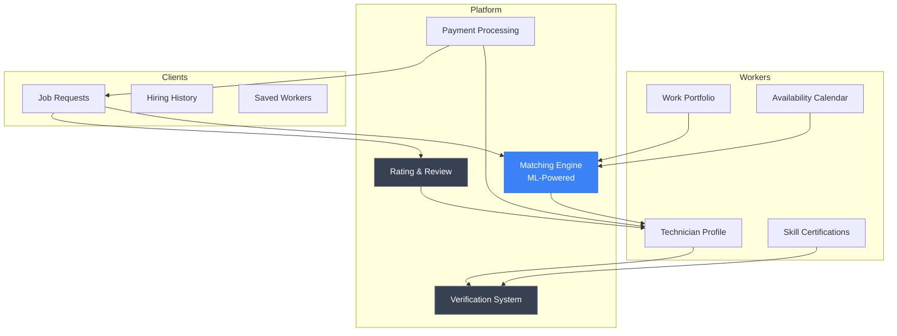
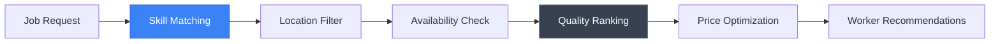

# TalenTo

**Technical Trades Talent Platform**

*Connecting Skilled Workers with Opportunities — Uber meets LinkedIn for Trades*

<div align="center">

[](#)
[](#)
[](/LICENSE)

</div>

---

## Overview

**TalenTo** is an AI-powered platform designed specifically for technical trades workers—technicians, construction workers, plumbers, electricians, welders, and other skilled professionals. By combining the on-demand accessibility of Uber with the professional networking of LinkedIn, TalenTo creates a marketplace that fosters healthy competition, elevates work quality, and connects talent with opportunities.

*This project is currently in early development.*

---

## WHY

### The Problem

The technical trades industry faces a critical disconnect between skilled workers and quality opportunities:

- **Skilled technicians struggle to find consistent, quality work** despite high demand for their services
- **Hiring is relationship-dependent**, favoring those with established networks over competent newcomers
- **No standardized skill verification** makes it difficult to assess worker qualifications
- **Race-to-the-bottom pricing** hurts quality as workers undercut each other
- **Geographic limitations** prevent skilled workers from accessing opportunities in nearby areas
- **No reputation portability**—workers starting fresh lose years of built credibility

### Why It Matters

Every skilled tradesperson deserves recognition for their craftsmanship. The current system perpetuates inequality by favoring those with connections, while countless qualified plumbers, electricians, welders, and technicians remain underemployed despite excellent skills.

**Mission:** Create a fair marketplace where technical skill and work quality determine success—not just who you know. Empower tradespeople to build portable reputations and access opportunities based on merit.

### Target Users

**Workers:**
- Plumbers, electricians, HVAC technicians
- Construction workers, carpenters, masons
- Welders, machinists, mechanics
- Painters, roofers, landscapers
- Appliance repair technicians
- General contractors and handymen

**Clients:**
- Homeowners seeking reliable service
- Property managers with ongoing maintenance needs
- Construction companies needing skilled subcontractors
- Businesses requiring commercial repairs

---

## HOW

### Platform Concept: Uber + LinkedIn for Trades

TalenTo combines the best of both worlds:

**From Uber:**
- On-demand job matching
- Rating and review system
- Transparent pricing
- Real-time availability
- Location-based matching
- Mobile-first experience

**From LinkedIn:**
- Professional profiles showcasing skills
- Verified certifications and licenses
- Work history and portfolio
- Endorsements from clients and peers
- Skill assessments and badges
- Professional networking

### Healthy Competition Model

Instead of a race to the bottom, TalenTo promotes quality:

- **Skill Verification** — Certified assessments validate expertise
- **Quality Ratings** — Detailed reviews on workmanship, punctuality, communication
- **Portfolio Showcase** — Before/after photos demonstrate capabilities
- **Premium Positioning** — Higher-rated workers earn premium placement
- **Specialization Recognition** — Expertise in specific areas highlighted

### System Architecture



### Matching Algorithm



---

## WHAT

### Planned Features

| Feature | Description | Status |
|---------|-------------|--------|
| Worker Profiles | Comprehensive skill and certification showcase | Planned |
| Skill Verification | AI-assisted competency assessments | Planned |
| Job Matching | ML-driven opportunity matching | Planned |
| On-Demand Booking | Real-time availability and scheduling | Planned |
| Rating System | Multi-dimensional quality ratings | Planned |
| Work Portfolio | Project photos and documentation | Planned |
| Payment Integration | Secure, escrowed payments | Planned |
| Mobile App | iOS and Android applications | Planned |
| Client Dashboard | Job posting and worker management | Planned |

### Quality Metrics

| Metric | Purpose |
|--------|---------|
| Workmanship Score | Quality of completed work |
| Punctuality Rating | On-time arrival and completion |
| Communication Score | Responsiveness and clarity |
| Safety Record | Compliance with safety standards |
| Repeat Hire Rate | Client loyalty indicator |

### Roadmap

**Phase 1: Foundation**
- Core profile and verification system
- Basic job matching algorithm
- MVP mobile application
- Initial market: Local area pilot

**Phase 2: Enhancement**
- Advanced ML matching
- Skill assessment platform
- Payment integration
- Expanded geographic coverage

**Phase 3: Scale**
- National marketplace launch
- API for contractor integrations
- Enterprise solutions for property managers
- Certification partnerships

---

## Tech Stack (Planned)

### Backend

| Technology | Purpose |
|------------|---------|
| Python 3.11+ | Core language |
| FastAPI | Web framework |
| PostgreSQL | Primary database |
| Redis | Caching and real-time |
| Celery | Background jobs |

### Frontend

| Technology | Purpose |
|------------|---------|
| React Native | Cross-platform mobile |
| React | Web application |
| TypeScript | Type safety |
| TailwindCSS | Styling |

### ML/AI

| Technology | Purpose |
|------------|---------|
| PyTorch | Model training |
| Scikit-learn | Classical ML algorithms |
| Sentence Transformers | Skill embeddings |

### Infrastructure

| Technology | Purpose |
|------------|---------|
| Docker | Containerization |
| AWS/Azure | Cloud hosting |
| Stripe | Payment processing |

---

## Project Structure

```
TalenTo/
├── README.md              # This file
├── assets/
│   ├── diagrams/          # Architecture diagrams
│   ├── screenshots/       # UI mockups
│   └── videos/            # Demo videos
├── code/
│   └── requirements.txt
├── paper/                 # Research papers
└── reproducibility/
    └── reproduce.md       # Reproduction guide
```

---

## Contributing

This project is in early development. Contributions, ideas, and feedback are welcome—especially from those with experience in the trades industry.

See [CONTRIBUTING](/CONTRIBUTING.md) for general contribution guidelines.

---

## License

This project is licensed under the MIT License. See [LICENSE](/LICENSE) for details.

---

<div align="center">

*Part of the [THEDIFY](/) project portfolio*

**Empowering skilled tradespeople through fair opportunity**

</div>
