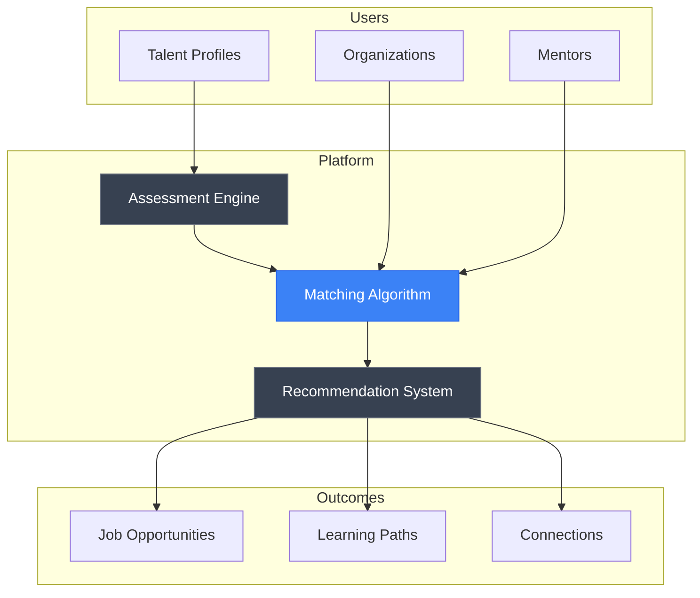

# TalenTo

**Talent Discovery Platform**

<div align="center">

[](#)
[](/LICENSE)

</div>

---

## Overview

**TalenTo** is an AI-powered talent discovery and development platform designed to identify, nurture, and connect emerging talent with opportunities. The platform leverages machine learning to match skills with opportunities, providing personalized development pathways and connecting talent with mentors and organizations.

*This project is currently in early development.*

---

## WHY

### The Problem

Talent identification and development remain largely subjective and relationship-dependent processes:

- Hidden talent in underserved communities goes unrecognized
- Traditional recruitment methods favor candidates with established networks
- Skills-based hiring lacks standardized assessment methodologies
- Career development paths are unclear without proper guidance
- Geographic and socioeconomic barriers limit opportunity access

### Why It Matters

Every individual deserves the opportunity to have their talents recognized and developed. The current system perpetuates inequality by favoring those with access to networks and resources, while countless skilled individuals remain undiscovered.

**Mission:** Create equal opportunity for talent recognition. Connect skills with opportunities regardless of background, geography, or connections.

### Target Users

- Emerging professionals seeking career opportunities
- Students transitioning to the workforce
- Career changers looking to leverage transferable skills
- Organizations seeking diverse, skilled candidates
- Mentors wanting to give back to their communities

---

## HOW

### Planned Architecture

The platform will utilize AI-driven matching and assessment:

**Skill Assessment**
- Competency-based evaluation frameworks
- Portfolio analysis and project assessment
- Peer validation and endorsements

**Matching Algorithm**
- ML-powered skill-opportunity matching
- Cultural fit analysis
- Growth potential prediction

**Development Pathways**
- Personalized learning recommendations
- Mentor matching
- Progress tracking and milestone recognition

### System Concept



---

## WHAT

### Planned Features

| Feature | Description | Status |
|---------|-------------|--------|
| Talent Profiles | Comprehensive skill and experience profiles | Planned |
| Skill Assessment | AI-powered competency evaluation | Planned |
| Opportunity Matching | ML-driven job and project matching | Planned |
| Mentor Network | Connect talent with experienced guides | Planned |
| Learning Paths | Personalized development recommendations | Planned |
| Portfolio Showcase | Project and work sample presentation | Planned |
| Organization Dashboard | Talent discovery for employers | Planned |

### Roadmap

**Phase 1: Foundation**
- Core profile and assessment system
- Basic matching algorithm
- MVP web application

**Phase 2: Enhancement**
- Advanced ML matching
- Mentor network integration
- Learning path recommendations

**Phase 3: Scale**
- Organization partnerships
- API for third-party integrations
- Mobile applications

---

## Tech Stack (Planned)

### Backend

| Technology | Purpose |
|------------|---------|
| Python 3.11+ | Core language |
| FastAPI | Web framework |
| PostgreSQL | Primary database |
| Redis | Caching |

### Frontend

| Technology | Purpose |
|------------|---------|
| React | UI framework |
| TypeScript | Type safety |
| TailwindCSS | Styling |

### ML/AI

| Technology | Purpose |
|------------|---------|
| PyTorch | Model training |
| Scikit-learn | Classical ML |
| Sentence Transformers | Text embeddings |

---

## Project Structure

```
TalenTo/
├── README.md              # This file
├── assets/
│   ├── diagrams/          # Architecture diagrams
│   ├── screenshots/       # UI mockups
│   └── videos/            # Demo videos
├── code/
│   └── requirements.txt
├── paper/                 # Research papers
└── reproducibility/
    └── reproduce.md       # Reproduction guide
```

---

## Contributing

This project is in early development. Contributions, ideas, and feedback are welcome.

See [CONTRIBUTING](/CONTRIBUTING.md) for general contribution guidelines.

---

## License

This project is licensed under the MIT License. See [LICENSE](/LICENSE) for details.

---

## Contact

For questions or collaboration inquiries, please reach out through:

- GitHub Issues for ideas and feature requests
- Email for partnership opportunities

---

<div align="center">

*Part of the [THEDIFY](/) project portfolio*

**Connecting talent with opportunity through AI innovation**

</div>
