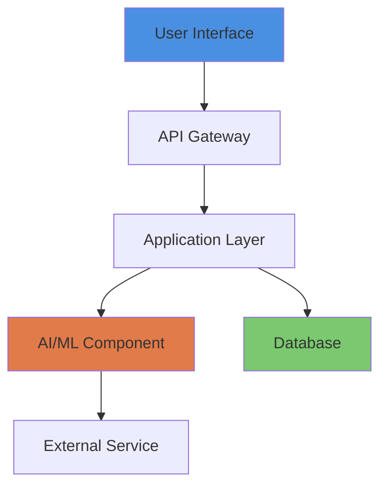

# 🎯 TestProject2 - [Descriptive Tagline]

<div align="center">


<!-- Add more badges as needed -->


</div>

## 📋 TL;DR / Abstract

<!-- ✏️ FILL: 1-2 sentences summarizing the novel technique and measurable impact -->
**TestProject2** is [brief description of what the project does]. The system [key technical achievement] while [performance metric] with [reliability metric].

---

## 🎯 Problem Statement

<!-- ✏️ FILL: 2-3 paragraphs describing the challenge and why it matters -->

**Challenge:** [Describe the core problem you're addressing]
- Pain point 1
- Pain point 2
- Impact of the problem

**Why It Matters:** [1-2 paragraphs on the societal/scientific significance of solving this problem]

---

## 💡 Key Contributions / Claims

<!-- ✏️ FILL: 3-5 bullet points highlighting your innovations -->

- 🔬 **Novel Technique:** [Description of your innovation]
- 🎯 **Adaptive System:** [Description of intelligent component]
- ⚡ **Performance Achievement:** [Measurable outcome]
- 📊 **Transparency Feature:** [Explainability/trust component]
- 🔄 **Scalability Proof:** [Production-ready evidence]

---

## 👥 Role & Team

<!-- ✏️ FILL: Project lead, contributors, institutions, advisors -->

**Project Lead:** [Name] ([GitHub]) — [Title]  
**Role:** [Your specific technical contributions]  
**Institution:** [University/Organization]  
**Collaborators:** [Names and roles]  
**Advisors:** [Names and affiliations, if applicable]

---

## 📈 Impact Metrics / Results

<!-- ✏️ FILL: Quantitative metrics with baselines and comparisons -->

| Metric | Value | Baseline | Improvement |
|--------|-------|----------|-------------|
| **Primary KPI** | [X] | [Y] | **[Z]% gain** |
| **Performance** | [X] | [Y] | **[Z]% faster** |
| **Reliability** | [X]% | [Y]% | **[Z]% higher** |
| **User Metric** | [X] | [Y] | **[Z] increase** |
| **Quality Metric** | [X] | [Y] | **[Z] improvement** |

<!-- ✏️ ADD: Graphs from assets/graphs/ -->
<!-- Example:  -->

---

## 🛠️ Tech Stack & Dependencies

<!-- ✏️ FILL: Detailed stack with versions -->

**Backend:**
- [Language/Framework] ([version])
- [AI/ML Library] ([version])
- [Database] ([version])

**Frontend:**
- [Framework] ([version])
- [Key Library] ([version])
- [Styling] ([version])

**Infrastructure:**
- [Deployment Platform]
- [Container Technology]
- [Monitoring/Logging]

**Full Dependencies:** See [`code/requirements.txt`](code/requirements.txt)

---

## 🎥 Demo & Visuals

<!-- ✏️ FILL: Add screenshots, diagrams, videos -->

### Hero Screenshot
<!-- Add:  -->
**[PLACEHOLDER: Main UI or key feature visualization]**

### System Architecture
<!-- Add:  -->
**[PLACEHOLDER: System architecture diagram showing data flow and components]**



### Demo Video
<!-- Add: [Watch Demo](assets/videos/demo.mp4) -->
**[PLACEHOLDER: 60-90 second walkthrough of key features]**

---

## 🔬 Reproducibility

<!-- ✏️ FILL: Steps to reproduce results -->

**Quick Validation:** Follow the step-by-step guide in [`reproducibility/reproduce.md`](reproducibility/reproduce.md)

**Summary:**
1. Clone repository: `git clone https://github.com/THEDIFY/THEDIFY.git`
2. Navigate to project: `cd THEDIFY/projects/TestProject2/code`
3. Install dependencies: `[installation command]`
4. Configure environment: `cp .env.example .env` and edit with credentials
5. Run validation: `[run command]`
6. Expected output: [Specific measurable result]

**Reproducibility Artifacts:**
- Interactive Notebook: [`reproducibility/notebook.ipynb`](reproducibility/notebook.ipynb)
- Configuration: [`reproducibility/seed.txt`](reproducibility/seed.txt)
- Test Data: [`reproducibility/test_data/`](reproducibility/test_data/)

---

## ⚡ Installation / Quick Start

<!-- ✏️ FILL: Minimal commands to run a demo -->

```bash
# Clone the repository
git clone https://github.com/THEDIFY/THEDIFY.git
cd THEDIFY/projects/TestProject2/code

# Install dependencies
[installation commands, e.g., pip install -r requirements.txt]

# Set up environment variables
cp .env.example .env
# Edit .env with your credentials

# Run development server
[run command, e.g., python app.py]

# Access at [URL, e.g., http://localhost:8000]
```

**Docker Quick Start:**
```bash
cd projects/TestProject2/code
docker build -t project:latest .
docker run -p 8000:8000 --env-file .env project:latest
```

---

## 🔐 Data & Ethics

<!-- ✏️ FILL: Data sources, consent, privacy, IRB -->

**Data Sources:**
- [Source 1] ([license, access method])
- [Source 2] ([anonymization approach])
- [Source 3] ([public/proprietary, justification])

**Privacy & Consent:**
- [Data handling procedures]
- [Retention policies]
- [User rights: deletion, access, portability]

**Ethics Review:**
- [IRB status if applicable, or "No IRB required (non-clinical)"]
- [Compliance frameworks: GDPR, CCPA, etc.]
- [Ethical considerations for AI/ML]

**License:** [License type] (code) | [License type] (data/content)

---

## 📚 Publications & Citation

<!-- ✏️ FILL: Links to papers, arXiv, DOI, BibTeX -->

**Paper:** [Link to PDF or "Coming Soon"](paper/paper.pdf)  
**arXiv:** [arXiv:XXXX.XXXXX](https://arxiv.org/abs/XXXX.XXXXX) *(if available)*  
**DOI:** `10.XXXX/XXXXX` *(if available)*

**BibTeX:**
```bibtex
@article{project2025,
  title={[Project Title]},
  author={[Author Names]},
  journal={[Journal Name or "Preprint"]},
  year={2025},
  url={https://github.com/THEDIFY/THEDIFY}
}
```

Full citation: [`paper/bibtex.bib`](paper/bibtex.bib)

---

## 📄 License

This project is licensed under the **[LICENSE TYPE]**. See [LICENSE](../../LICENSE) for details.

[Additional license info for content/data if different from code]

---

## 🚀 Status & Roadmap

<!-- ✏️ FILL: Current state and next 3-5 milestones -->

**Current Status:** [🔴 Research | 🟡 Beta | ✅ Production] (v[X.Y.Z])

**Roadmap:**
1. **Q[X] 20[YY]:** [Feature/milestone 1]
2. **Q[X] 20[YY]:** [Feature/milestone 2]
3. **Q[X] 20[YY]:** [Feature/milestone 3]

See detailed status: [`STATUS.md`](STATUS.md)

---

## 📧 Contact

**Project Lead:** [Name]  
**Email:** [email address]  
**GitHub:** [@username](https://github.com/username)  
**LinkedIn:** [Profile Link](https://linkedin.com/in/profile)

---

## 🙏 Acknowledgments & Funding

<!-- ✏️ FILL: Thanks, sponsors, institutional support -->

- [Funding sources, if applicable]
- [Institutional support]
- [Key collaborators and their contributions]
- [Open-source dependencies and communities]

---

## 📁 Project Structure

```
TestProject2/
├── README.md                  # This file
├── ABSTRACT.md                # One-paragraph summary
├── STATUS.md                  # Current development status
├── code/
│   ├── requirements.txt       # Dependencies
│   ├── Dockerfile             # Container configuration
│   └── [source code files]
├── reproducibility/
│   ├── reproduce.md           # Step-by-step validation guide
│   ├── notebook.ipynb         # Interactive demonstration
│   └── test_data/             # Sample datasets
├── assets/
│   ├── screenshots/           # UI screenshots (PNG, high-res)
│   ├── diagrams/              # Architecture diagrams (SVG/PNG)
│   ├── videos/                # Demo videos (MP4, 1080p)
│   └── graphs/                # Performance metrics (PNG + CSV)
└── paper/                     # Optional: Research publications
    ├── paper.pdf              # Research paper
    └── bibtex.bib             # Citation metadata
```

---

<div align="center">


**⭐ Star this project if it inspires you | 🔔 Follow for updates | 💬 Open an issue for questions**

*Made with 💙 by THEDIFY | [Your project mission/tagline]*


</div>
