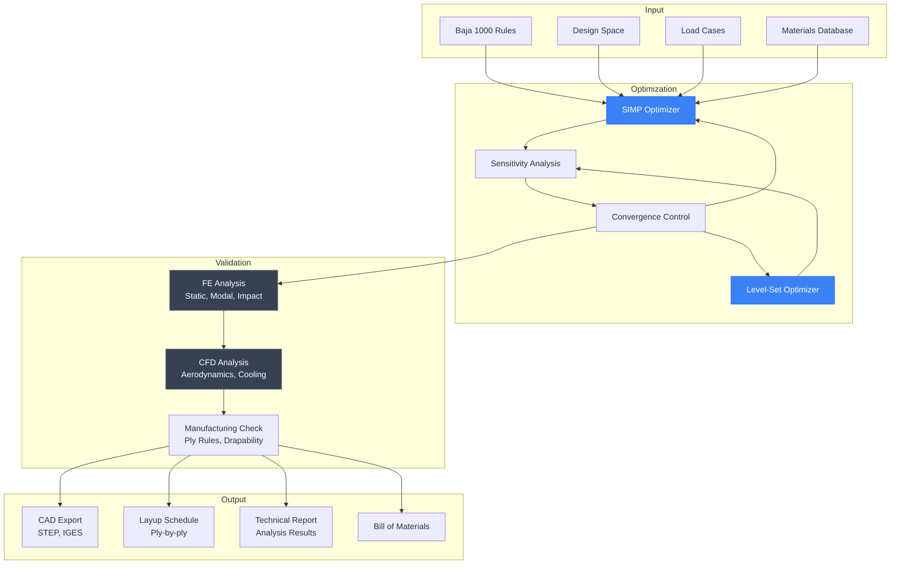
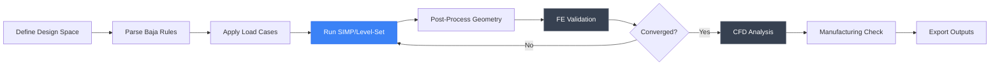
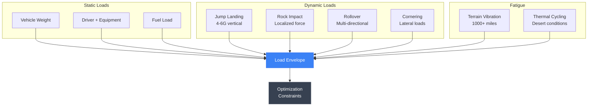
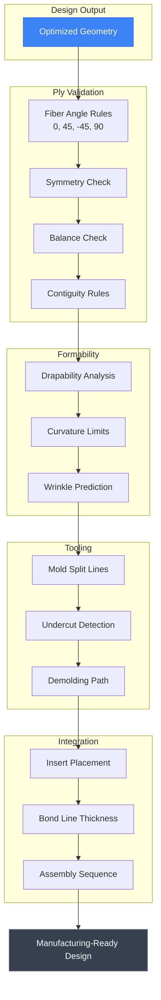

# TrofyTruck

**Trophy Truck Topology Optimizer**

*Designing the Ultimate Carbon Fiber Chassis for Baja 1000*

<div align="center">

[](#)
[](#)
[](#)
[](/LICENSE)

</div>

---

## Overview

**TrofyTruck** is a full-stack topology optimization platform for designing lightweight, high-performance carbon fiber trophy truck chassis. Built to compete in the legendary **Baja 1000**, this system combines advanced structural optimization algorithms, finite element analysis, CFD simulation, and manufacturing validation to produce race-ready designs.

### Key Metrics

| Metric | Target |
|--------|--------|
| Optimization Methods | SIMP, Level-Set |
| Analysis Types | Static, Modal, Impact, CFD |
| Material System | Carbon fiber laminates |
| Target Race | Baja 1000 (2027) |

---

## WHY

### The Dream

I love cars. Not just driving them—understanding every bolt, every curve, every engineering decision that makes a machine exceptional. The **Baja 1000** represents the ultimate test of automotive engineering: 1,000+ miles of brutal desert terrain that destroys anything less than perfect.

Next year, I want to compete. But trophy trucks cost hundreds of thousands of dollars, and traditional chassis design relies on:

- **Intuition over optimization** — Engineers over-build "just in case"
- **Heavy safety margins** — Adding weight that costs speed and fuel
- **Trial and error** — Expensive prototype iterations
- **Outsourced expertise** — Design knowledge locked behind consultants

### Why It Matters

Every extra kilogram costs speed. Every structural weakness risks catastrophic failure in the Sonoran Desert, miles from help. The difference between finishing and DNF (Did Not Finish) often comes down to chassis design.

**Mission:** Design the lightest, strongest carbon fiber trophy truck chassis using AI-driven topology optimization—then build it and race it.

### The Challenge

Designing a Baja 1000 trophy truck chassis requires balancing:

- **Structural integrity** under extreme loads (jumps, rocks, impacts)
- **Weight minimization** for speed and fuel efficiency
- **Aerodynamic performance** at high desert speeds
- **Manufacturability** with carbon fiber composite techniques
- **Regulatory compliance** with Baja 1000 rules and safety requirements

---

## HOW

### Topology Optimization

Instead of starting with a shape and removing material, topology optimization starts with design constraints and lets mathematics discover the optimal structure.

**SIMP Method (Solid Isotropic Material with Penalization)**
- Treats each element as having variable density (0-1)
- Penalizes intermediate densities toward solid/void
- Minimizes compliance (maximizes stiffness)
- Fast convergence for initial exploration

**Level-Set Method**
- Represents structure boundaries as implicit functions
- Allows smooth topology changes
- Better manufacturing-ready surfaces
- Nucleates holes and features naturally

### System Architecture



### Optimization Pipeline



### Load Case Definition

Trophy trucks experience extreme loads during the Baja 1000:



### Manufacturing Validation

Carbon fiber composite manufacturing imposes strict constraints:



---

## WHAT

### Features

| Feature | Description | Status |
|---------|-------------|--------|
| SIMP Optimization | Density-based topology optimization | Complete |
| Level-Set Method | Boundary-based optimization | Complete |
| FE Analysis | Static, modal, impact analysis | Complete |
| CFD Analysis | Aerodynamics and cooling flow | Complete |
| Manufacturing Rules | Composite layup validation | Complete |
| 3D Visualization | WebGL viewer with Three.js | Complete |
| CAD Export | STEP, IGES, STL, glTF | Complete |
| Job Queue | Distributed optimization with Celery | Complete |
| Project Dashboard | Web-based project management | Complete |

### Analysis Capabilities

**Finite Element Analysis**

| Analysis Type | Purpose |
|---------------|---------|
| Static | Stress/strain under load |
| Modal | Natural frequencies |
| Impact | Crash and rock strike |
| Buckling | Stability under compression |

**CFD Analysis**

| Analysis Type | Purpose |
|---------------|---------|
| External Aero | Drag and lift coefficients |
| Cooling Flow | Engine compartment ventilation |
| Dust Ingestion | Air intake optimization |

### Output Formats

| Format | Description | Use Case |
|--------|-------------|----------|
| STEP/IGES | CAD-ready geometry | CAM programming |
| Parasolid | High-precision model | Analysis integration |
| STL/glTF | Mesh formats | 3D printing, visualization |
| CSV Layup | Ply-by-ply schedule | Manufacturing |
| JSON Fasteners | Fastener locations | Assembly |
| PDF Report | Analysis results | Design verification |
| Excel BOM | Material list | Procurement |

### Optimization Results

| Metric | Target | Current |
|--------|--------|---------|
| Weight Reduction | 30%+ vs baseline | In progress |
| Stiffness | Baja rules compliant | Validated |
| Manufacturing Cost | Minimize mold count | Optimizing |
| Analysis Time | Less than 4 hours | Achieved |

---

## Tech Stack

### Backend

| Technology | Purpose |
|------------|---------|
| Python 3.11+ | Core language |
| FastAPI | REST API framework |
| PostgreSQL | Project database |
| Redis | Job queue broker |
| Celery | Distributed tasks |

### Optimization

| Technology | Purpose |
|------------|---------|
| NumPy/SciPy | Numerical computing |
| PyTorch | Neural dynamics |
| Gmsh | Mesh generation |
| FEniCS/CalculiX | FE solver |
| OpenFOAM | CFD solver |

### Frontend

| Technology | Purpose |
|------------|---------|
| React 18 | UI framework |
| TypeScript | Type safety |
| Three.js | WebGL 3D viewer |
| Zustand | State management |
| TailwindCSS | Styling |

### Infrastructure

| Technology | Purpose |
|------------|---------|
| Docker | Containerization |
| Docker Compose | Orchestration |
| Nginx | Reverse proxy |
| Flower | Celery monitoring |

---

## Quick Start

### Prerequisites

- Docker and Docker Compose v1.29+
- 8GB RAM minimum (16GB+ recommended)
- NVIDIA GPU for accelerated solving (optional)

### Running with Docker

```bash
# Clone the repository
git clone https://github.com/THEDIFY/THEDIFY.git
cd THEDIFY/projects/TrofyTruck/code

# Start all services
docker-compose up -d

# Access the application
# Frontend: http://localhost:3000
# API Docs: http://localhost:8000/docs

# View logs
docker-compose logs -f backend
```

### Development Setup

```bash
# Backend
cd backend
python -m venv venv
source venv/bin/activate  # Windows: venv\Scripts\activate
pip install -r requirements.txt
uvicorn app.main:app --reload

# Frontend
cd frontend
npm install
npm run dev
```

---

## Project Structure

```
TrofyTruck/
├── README.md              # This file
├── backend/
│   ├── app/
│   │   ├── api/           # REST endpoints
│   │   ├── optimization/  # SIMP, Level-Set
│   │   ├── fe_solver/     # FE analysis
│   │   ├── cfd/           # CFD analysis
│   │   ├── manufacturing/ # Validation
│   │   └── outputs/       # Export
│   ├── Dockerfile
│   └── requirements.txt
├── frontend/
│   ├── src/
│   │   ├── components/    # UI components
│   │   ├── pages/         # Application pages
│   │   └── api/           # API client
│   └── Dockerfile
├── docs/
│   ├── API.md
│   └── USER_GUIDE.md
└── docker-compose.yml
```

---

## Roadmap

**Phase 1: Core Optimization** (Complete)
- SIMP and Level-Set implementations
- Basic FE integration
- Web-based project management

**Phase 2: Validation** (Current)
- CFD integration
- Manufacturing constraints
- Multi-objective optimization

**Phase 3: Build** (2026)
- Finalize chassis design
- Manufacture carbon fiber components
- Assemble trophy truck

**Phase 4: Race** (2027)
- Test and validate
- Compete in Baja 1000

---

## Documentation

| Document | Description |
|----------|-------------|
| [API Reference](./docs/API.md) | REST API documentation |
| [User Guide](./docs/USER_GUIDE.md) | Platform usage guide |

---

## License

This project is licensed under the MIT License. See [LICENSE](/LICENSE) for details.

---

<div align="center">

*Part of the [THEDIFY](/) project portfolio*

**Engineering the future of off-road racing**

*See you at the Baja 1000.*

</div>
