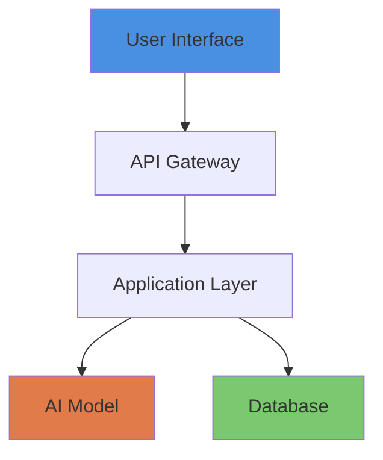

# Documentation Quick Reference

**Quick guide for creating high-quality project documentation**

---

## 🚀 Quick Start

### 1. Create New Project Documentation

```bash
# Navigate to your project directory
cd projects/YOUR_PROJECT/

# Copy templates
cp ../../templates/README-template.md README.md
cp ../../templates/ABSTRACT-template.md ABSTRACT.md
cp ../../templates/STATUS-template.md STATUS.md

# Create reproducibility directory
mkdir -p reproducibility
cp ../../templates/REPRODUCIBILITY-template.md reproducibility/reproduce.md

# Create assets structure
mkdir -p assets/{screenshots,diagrams,videos,graphs}

# Create code directory if needed
mkdir -p code
```

### 2. Fill in Templates

Work through each template, replacing placeholders marked with `<!-- ✏️ FILL: ... -->`:

1. **README.md** (2-4 hours) - Main documentation
2. **ABSTRACT.md** (30 minutes) - One-paragraph summary
3. **STATUS.md** (30 minutes) - Current state and roadmap
4. **reproducibility/reproduce.md** (1-2 hours) - Validation guide

### 3. Add Visual Assets

- **Screenshots:** Capture at 1920x1080 or higher
- **Diagrams:** Create in Mermaid, draw.io, or Figma
- **Videos:** Record 60-90 second demos at 1080p
- **Graphs:** Export as PNG with source CSV data

---

## 📋 Essential Sections Checklist

### README.md Must-Haves

- [ ] Clear title with emoji and tagline
- [ ] Status badges (accurate)
- [ ] TL;DR (2-3 sentences with metrics)
- [ ] Problem statement (why it matters)
- [ ] 3-5 key contributions
- [ ] Impact metrics table (with baseline comparisons)
- [ ] System architecture diagram
- [ ] At least one screenshot
- [ ] Installation instructions (tested)
- [ ] Reproducibility summary
- [ ] Contact information

### ABSTRACT.md

- [ ] 150-250 words
- [ ] Single paragraph covering: what, how, results, impact
- [ ] 5-8 relevant keywords

### STATUS.md

- [ ] Current version and date
- [ ] Development stage checklist
- [ ] Current metrics table
- [ ] Completed milestones
- [ ] In-progress items with percentages
- [ ] Future roadmap
- [ ] Known issues

### Reproducibility Guide

- [ ] Time estimate (realistic)
- [ ] System requirements
- [ ] Step-by-step setup
- [ ] Expected results with tolerances
- [ ] Troubleshooting section

---

## 🎨 Visual Standards

### Screenshots
- **Resolution:** 1920x1080+ for hero, 1280x720+ for features
- **Format:** PNG (lossless)
- **Naming:** `hero.png`, `feature-1.png`, `ui-overview.png`

### Diagrams
- **Format:** SVG (preferred) or PNG
- **Style:** Clean, professional, consistent colors
- **Labels:** Large enough to read when embedded

### Videos
- **Duration:** 60-90 seconds
- **Resolution:** 1080p
- **Format:** MP4
- **Content:** Key features walkthrough

### Graphs
- **Export:** PNG at 300 DPI
- **Include:** Source data (CSV/JSON)
- **Elements:** Clear labels, legend, units, error bars

---

## 📊 Metrics to Include

### AI/ML Projects
- Accuracy, Precision, Recall, F1
- Inference latency (P50, P95, P99)
- Training time and cost
- Model size
- **Always include baseline comparison**

### Web Applications
- Response time (avg, P95, P99)
- Throughput (requests/sec)
- Uptime percentage
- Concurrent users
- Error rate

### Data Systems
- Processing throughput
- Query performance
- Storage efficiency
- Data quality
- Pipeline reliability

---

## ✍️ Writing Tips

### Do's ✅
- Use specific numbers: "95% accuracy", "sub-2s latency"
- Active voice: "The system processes" not "Processed by"
- Define acronyms on first use
- Include baseline comparisons
- Be precise and measurable

### Don'ts ❌
- Avoid vague terms: "cutting-edge", "robust", "leverages"
- Don't claim "revolutionary" without proof
- No jargon without explanation
- Don't oversell - let metrics speak
- Never include secrets or credentials

---

## 🔄 Common Workflows

### Creating Architecture Diagram with Mermaid



### Adding Performance Comparison Table

```markdown
| Metric | This Work | Baseline | Improvement |
|--------|-----------|----------|-------------|
| **Accuracy** | 95.2% | 87.3% | **+7.9pp** |
| **Latency** | 1.8s | 5.2s | **65% faster** |
```

### Creating Status Badges

```markdown


```

---

## 🎯 Project-Specific Examples

### AI/ML Project
- Focus on novel techniques and benchmarks
- Include model architecture diagram
- Show performance vs. baselines
- Provide trained model or training code
- Include reproducibility notebook

### Web Application
- Emphasize user experience and scale
- Show UI screenshots prominently
- Include load testing results
- Provide Docker setup
- Demo video is essential

### Research Project
- Academic rigor is critical
- Include paper PDF and BibTeX
- Detailed methodology section
- Statistical significance testing
- IRB/ethics approval if applicable

---

## 📞 Need Help?

- **Full Guidelines:** See [DOCUMENTATION_GUIDELINES.md](../DOCUMENTATION_GUIDELINES.md)
- **Templates:** Check [templates/](../templates/) directory
- **Examples:** Review EDIFY and GUIRA projects
- **Questions:** Open an issue or contact rasanti2008@gmail.com

---

## 🔍 Pre-Submission Checklist

Before finalizing your documentation:

1. **Accuracy**
   - [ ] All metrics are current and correct
   - [ ] Links work (test every single one)
   - [ ] Code examples are tested
   - [ ] Screenshots reflect current UI

2. **Completeness**
   - [ ] All template sections filled
   - [ ] Visual assets in place
   - [ ] Reproducibility guide tested
   - [ ] Contact info updated

3. **Quality**
   - [ ] No typos or grammar errors
   - [ ] Consistent formatting
   - [ ] Professional appearance
   - [ ] Accessible to target audience

4. **Validation**
   - [ ] Fresh environment test
   - [ ] Third-party review
   - [ ] Spell check
   - [ ] Link checker

---

## 📅 Maintenance Schedule

- **README.md:** Update after major releases
- **ABSTRACT.md:** Update only for fundamental changes
- **STATUS.md:** Update monthly (minimum)
- **Reproducibility:** Update when dependencies change

---

**Last Updated:** December 17, 2025  
**Version:** 1.0

*For comprehensive details, see [DOCUMENTATION_GUIDELINES.md](../DOCUMENTATION_GUIDELINES.md)*
